# 📄 JQuickPDF - Lightweight Java PDF Generator Library

[简体中文](./README.md) | ENGLISH

> A lightweight Java PDF library based on HTML templates, supporting dynamic content, rich styles, and various charts.

---

## 🚀 项目状态

[](https://github.com/paohaijiao/jquick-pdf)
[](https://github.com/paohaijiao/jquick-pdf)
[](https://github.com/paohaijiao/jquick-pdf/issues)
[](https://opensource.org/licenses/Apache-2.0)

---

### 📖 Table of Contents
- [✨ Core Features](#-core-features)
- [📦 Quick Start](#-quick-start)
  - [Installation](#installation)
  - [Basic Usage](#basic-usage)
- [🎨 Style System](#-style-system)
  - [Block Element Styles](#block-element-styles)
  - [Property Styles](#property-styles)
- [🧩 Content Elements](#-content-elements)
  - [Text Elements](#text-elements)
  - [Layout Elements](#layout-elements)
  - [List Elements](#list-elements)
  - [Table Elements](#table-elements)
  - [Form Elements](#form-elements)
  - [Media Elements](#media-elements)
- [📊 Chart Support](#-chart-support)
- [🔧 Special Elements](#-special-elements)
- [💌 Support the Project](#-support-the-project)

---
## ✨ Core Features

JQuickPDF is a lightweight Java library used to generate PDF documents from HTML like templates. Support dynamic data binding, rich style control, and multiple common chart types.

### 🌟 Key Features
- ✅ HTML-like template syntax, easy to get started
- ✅ Support for dynamic data binding
- ✅ Rich style control
- ✅ Support for multiple chart types
- ✅ Lightweight with no redundant dependencies

```java
JQuickPdfXExecutor executor = new JQuickPdfXExecutor();
executor.execute(templateContent);
```

## 📦 📦 Quick Start

```xml
<dependency>
    <groupId>io.github.paohaijiao</groupId>
    <artifactId>jquick-pdf</artifactId>
    <version>最新版本</version>
</dependency>
```

## 📝 Basic Grammar
Create a simple PDF template:
```html
<pdf>
  <body>
    <!-- Write content here -->
    <h1>Hello JQuickPDF</h1>
    <p>This is a sample paragraph.</p>
  </body>
</pdf>
```

### Syntax Rules
```string
<element style="property1:value1; property2:value2; ...">
    Content
</element>
```
#### Elements
##### Text Elements
| Element | Description | Example Code |
|---------|-------------|--------------|
| `<p>` | Paragraph block (Paragraph) | `<p style="text-align:justify">'Paragraph content'</p>` |
| `<h1>-<h6>` | Heading (styled paragraph) | `<h1 style="font-size:24pt">'Heading content'</h1>` |
| `<span>` | Inline text container (Chunk) | `<span style="fontColor:blue">'Inline text'</span>` |
| `<br>` | Line break (Newline) | `<br type="after">` |
| `<tab>` | Tab character | `<p><tab/><tab/><span>'Text after tabs'</span></p>` |

##### Layout Elements
| Element | Description | Example Code |
|---------|-------------|--------------|
| `<div>` | Block container (Div) | `<div style="width:100%">'Block container content'</div>` |
| `<areaBreak>` | Section break (AreaBreak) | `<areaBreak></areaBreak>` |
| `<htmlPageBreak>` | Explicit page break (NewPage) | `<htmlPageBreak style="font-color:blue">next_area</htmlPageBreak>` |
| `<lineSeparator>` | Line separator | `<lineSeparator style="strokeColor:red"></lineSeparator>` |

##### List and Table Elements
| Element | Description | Example Code |
|---------|-------------|--------------|
| `<list>` | Ordered/unordered list (List) | `<list style="symbol:hahaha"><li>'Option 1'</li></list>` |
| `<li>` | List item (ListItem) | `<li style="fontColor:red">'Option 1'</li>` |
| `<table>` | Table container (Table) | `<table><tr><td>'Data'</td></tr></table>` |
| `<tr>` | Table row (TableRow) | `<tr style="height:30px"></tr>` |
| `<td>` | Table data cell (TableCell) | `<td style="fontColor:red">'Data'</td>` |
| `<th>` | Table header cell (TableCell) | `<th style="font-weight:bold">'Header'</th>` |

##### Form Elements
| Element | Description | Example Code |
|---------|-------------|--------------|
| `<button>` | Button (PushbuttonField) | `<button style="fontColor:blue">'Submit'</button>` |
| `<checkbox>` | Checkbox (CheckboxField) | `<checkbox style="font-color:blue" checked>'Submit'</checkbox>` |
| `<inputField>` | Text input field (TextField) | `<inputField style="font-color:blue">'Hello China'</inputField>` |
| `<comboBoxField>` | Combo box (ComboBoxField) | `<comboBoxField style="font-color:blue" checked>'Submit'</comboBoxField>` |
| `<textArea>` | Multi-line text input field (TextAreaField) | `<p><textArea>'Hello China'</textArea></p>` |

##### Media Elements
| Element | Description | Example Code |
|---------|-------------|--------------|
| `<image>` | Embedded image (Image) | `<image src="logo.png" style="width:200px;height:150px"></image>` |
| `<svg>` | Vector graphic (PdfTemplate) | `<svg>${svg}</svg>` or `<svg>&{svg}</svg>` |

##### Special Elements
| Element | Description | Example Code |
|---------|-------------|--------------|
| `<template>` | Reusable template content | `<template>&html</template>` |
| `<tree>` | Tree-structured data | `<tree>${tree}</tree>` or `<tree>tree</tree>` |
| `${variable}` | Data binding placeholder | `<p>Name: ${name}</p>` |
| `<textArea>` | Multi-line text input field (TextAreaField) | `<p><textArea>'Multi-line text'</textArea></p>` |


#### 📋 Complete Property Table (Including Example Code)

| Property | Example Value | Description | Example Code |
|----------|---------------|-------------|--------------|
| **Margin Properties** | | | |
| `marginLeft` | `"1px"` | Left margin value | `<div style="marginLeft:1px">Content</div>` |
| `marginRight` | `"500px"` | Right margin value | `<div style="marginRight:500px">Content</div>` |
| `marginTop` | `"500px"` | Top margin value | `<div style="marginTop:500px">Content</div>` |
| `marginBottom` | `"500px"` | Bottom margin value | `<div style="marginBottom:500px">Content</div>` |
| `commonMargin` | `"100px"` | Uniform margin for all sides | `<div style="commonMargin:100px">Content</div>` |
| `margins` | `"'20px 30px 40px 50px'"` | Top, right, bottom, left margins (clockwise) | `<div style="margins:'20px 30px 40px 50px'">Content</div>` |
| **Padding Properties** | | | |
| `paddingLeft` | `"50px"` | Left padding value | `<div style="paddingLeft:50px">Content</div>` |
| `paddingRight` | `"50px"` | Right padding value | `<div style="paddingRight:50px">Content</div>` |
| `paddingTop` | `"50px"` | Top padding value | `<div style="paddingTop:50px">Content</div>` |
| `paddingBottom` | `"50px"` | Bottom padding value | `<div style="paddingBottom:50px">Content</div>` |
| `commonPadding` | `"50px"` | Uniform padding for all sides | `<div style="commonPadding:50px">Content</div>` |
| `paddings` | `"50px 50px 60px 70px"` | Top, right, bottom, left padding (clockwise) | `<div style="paddings:50px 50px 60px 70px">Content</div>` |
| **Alignment & Layout Properties** | | | |
| `verticalAlignment` | `"top"` | Vertical alignment (top/middle/bottom) | `<div style="verticalAlignment:top">Content</div>` |
| `spacingRatio` | `"30"` | Spacing ratio between elements | `<div style="spacingRatio:30">Content</div>` |
| `keepTogether` | `"true"` | Whether to keep elements together | `<div style="keepTogether:true">Content</div>` |
| `keepWithNext` | `"true"` | Whether to keep with the next element | `<div style="keepWithNext:true">Content</div>` |
| **Dimension Properties** | | | |
| `width` | `"300px"` | Element width | `<div style="width:300px">Content</div>` |
| `height` | `"300px"` | Element height | `<div style="height:300px">Content</div>` |
| `maxHeight` | `"300px"` | Maximum element height | `<div style="maxHeight:300px">Content</div>` |
| `minHeight` | `"300px"` | Minimum element height | `<div style="minHeight:300px">Content</div>` |
| `minWidth` | `"300px"` | Minimum element width | `<div style="minWidth:300px">Content</div>` |
| `maxWidth` | `"300px"` | Maximum element width | `<div style="maxWidth:300px">Content</div>` |
| **Other Properties** | | | |
| `angleInRadians` | `"30"` | Rotation angle (in radians) | `<div style="angleInRadians:30">Content</div>` |

#### 📐 Dimension Properties Table (Including Example Code)

| Property | Example Value | Description | Example Code |
|----------|---------------|-------------|--------------|
| `width` | `"300px"` | Element width | `<div style="width:300px">Content</div>` |
| `height` | `"300px"` | Element height | `<div style="height:300px">Content</div>` |
| `maxHeight` | `"300px"` | Maximum element height | `<div style="maxHeight:300px">Content</div>` |
| `minHeight` | `"300px"` | Minimum element height | `<div style="minHeight:300px">Content</div>` |
| `minWidth` | `"300px"` | Minimum element width | `<div style="minWidth:300px">Content</div>` |
| `maxWidth` | `"300px"` | Maximum element width | `<div style="maxWidth:300px">Content</div>` |

#### Property Styles
## 🎨 Property Styles Table (Including Example Code)

| Property | Example Value | Description | Example Code |
|----------|---------------|-------------|--------------|
| **Position & Layout** | | | |
| `relativePosition` | `"30px 30px 30px 30px"` | Relative position value (left, top, right, bottom) | `<div style="relativePosition:'30px 30px 30px 30px'">Content</div>` |
| **Font Properties** | | | |
| `font` | `"HELVETICA"` | Font type, refer to JFontEnum | `<span style="font:HELVETICA">Text</span>` |
| `fontFamilyNames` | `"Helvetica"` | Font family names (comma-separated) | `<p style="fontFamilyNames:Helvetica,Arial">Text</p>` |
| `fontColor` | `"red"` | Font color, refer to JColorEnums class | `<span style="fontColor:red">Red text</span>` |
| `fontSize` | `"34"` | Font size | `<p style="fontSize:34">Large text</p>` |
| `fontKerning` | `"yes"` | Font kerning setting | `<p style="fontKerning:yes">Text with adjusted kerning</p>` |
| `fontScript` | `"common"` | Font script type | `<p style="fontScript:common">Text</p>` |
| **Text Styles** | | | |
| `textAlignment` | `"left"` | Text alignment, refer to JTextAlignment | `<div style="textAlignment:left">Left-aligned text</div>` |
| `characterSpacing` | `"30"` | Character spacing | `<p style="characterSpacing:30">Text</p>` |
| `wordSpacing` | `"30"` | Word spacing | `<p style="wordSpacing:30">Text</p>` |
| `splitCharacters` | `"24"` | Character spacing (same as characterSpacing) | `<p style="splitCharacters:24">Text</p>` |
| `textRenderingMode` | `"24"` | Text rendering mode | `<p style="textRenderingMode:24">Text</p>` |
| `baseDirection` | `"no_bidi"` | Text base direction | `<p style="baseDirection:no_bidi">Text</p>` |
| **Text Decoration** | | | |
| `bold` | `"true"` | Whether text is bold | `<span style="bold:true">Bold text</span>` |
| `italic` | `"true"` | Whether text is italic | `<span style="italic:true">Italic text</span>` |
| `lineThrough` | `"true"` | Whether text has strikethrough | `<span style="lineThrough:true">Strikethrough text</span>` |
| `underline` | `"true"` | Whether text has underline | `<span style="underline:true">Underlined text</span>` |
| **Background & Border** | | | |
| `backgroundColor` | `"red"` | Background color, refer to JColorEnums class | `<div style="backgroundColor:red">Content</div>` |
| `backgroundImage` | `"D:/pdf/image.png"` | Background image path | `<div style="backgroundImage:'D:/pdf/image.png'">Content</div>` |
| `border` | `"solid 32px red"` | Border style (type, width, color) | `<div style="border:'solid 32px red'">Content</div>` |
| `borderTop` | `"solid 32px red"` | Top border style | `<div style="borderTop:'solid 32px red'">Content</div>` |
| `borderRight` | `"solid 32px red"` | Right border style | `<div style="borderRight:'solid 32px red'">Content</div>` |
| `borderLeft` | `"solid 32px red"` | Left border style | `<div style="borderLeft:'solid 32px red'">Content</div>` |
| `borderBottom` | `"solid 32px red"` | Bottom border style | `<div style="borderBottom:'solid 32px red'">Content</div>` |
| `borderRadius` | `"32px 24px"` | Border radius value | `<div style="borderRadius:'32px 24px'">Content</div>` |
| `borderBottomLeftRadius` | `"32px 24px"` | Bottom-left border radius | `<div style="borderBottomLeftRadius:'32px 24px'">Content</div>` |
| `borderBottomRightRadius` | `"32px 24px"` | Bottom-right border radius | `<div style="borderBottomRightRadius:'32px 24px'">Content</div>` |
| `borderTopRightRadius` | `"32px 24px"` | Top-right border radius | `<div style="borderTopRightRadius:'32px 24px'">Content</div>` |
| `borderTopLeftRadius` | `"32px 24px"` | Top-left border radius | `<div style="borderTopLeftRadius:'32px 24px'">Content</div>` |
| **Effects & Stroke** | | | |
| `opacity` | `"0.5"` | Element opacity | `<div style="opacity:0.5">Semi-transparent content</div>` |
| `strokeColor` | `"red"` | Stroke color | `<div style="strokeColor:red">Content</div>` |
| `strokeWidth` | `"24"` | Stroke width | `<div style="strokeWidth:24">Content</div>` |
| **Anchor & Target** | | | |
| `destination` | `"hello"` | Element target/anchor name | `<div style="destination:hello">Content</div>` |

# 📊 Chart Types
JQuickPDF supports multiple chart types, which can be configured via Java code and embedded into PDFs:

| Enum Value       | Description/Notes |
|------------------|-------------------|
| BAR              | Bar chart               |
| BOXPLOT          | Box plot               |
| HEATMAP          | Heatmap               |
| K                | K-line chart (Candlestick chart)          |
| LINE             | Line chart               |
| PIE              | Pie chart                |
| RADAR            | Radar chart               |
| RELATION         | Relationship chart               |
| SCATTER          | Scatter chart               |
| SUNBURST         | Sunburst chart (1.5.1)        |
| Treemap          | Treemap chart (1.5.1)       |
| Bubble           | Bubble chart (1.5.1)        |
| Calendar         | Calendar activity chart (1.5.3)      |
| Lunar            | Lunar calendar (1.5.3)         |
| Funnel           | Funnel chart (1.5.3)        |
| CorrectionMatrix | Correlation matrix (1.5.3)     |
| Gantt            | Gantt chart (1.5.3)        |
| Gauge            | Gauge chart (1.5.3)        |
| WordsCloud       | Word cloud (1.5.3)         |

## 📈 How to use
### 📉 1.Native way
```string
# Pass SVG XML String to Variable
#1. Define Java Code
      JContext params = new JContext();
      String svg = "<?xml  xxxx ></svg>";
      params.put("svg", svg);
      JReader fileReader = new JReSourceFileReader("sample/svg1.txt");
      JAdaptor context = new JAdaptor(fileReader);
      JQuickPdfXExecutor executor = new JQuickPdfXExecutor(params);
      executor.execute(context.getRuleContent());
#2. Define Template Code
  <pdf>
    <body>
      <svg>${svg}</svg>
    </body>
  </pdf>
```
### 🍩 2.Java implements
```string
# Pass JOption of Related Graphics to JPdfConfig for Rendering
#1. Define Java Code
        JGraphContainer graphContainer = new JGraphContainer();
        JOption option = new JOption();
        graphContainer.setOption(option);
        graphContainer.setType(JChartType.K);
        JGraphConfig graphConfig = new JGraphConfig();
        graphConfig.put("svg", graphContainer);
        JPdfConfig config = new JPdfConfig();
        config.setGraphConfig(graphConfig);
        JReader fileReader = new JReSourceFileReader("sample/svg2.txt");
        JAdaptor context = new JAdaptor(fileReader);
        JQuickPdfXExecutor executor = new JQuickPdfXExecutor(config);
#2. Define Template Code
    <pdf>
        <body>
          <svg>&{svg}</svg>
        </body>
    </pdf>
```
## 📋相关图形的JOption
```string 
// ============================================================================
# 1.柱状图  BAR chart
// ============================================================================
```
<table style="width: 100%; border: none; border-collapse: collapse;">
  <tr>
    <td style="width: 48%; vertical-align: middle; padding-right: 2%; border: none;">
      <strong>柱状图数据</strong><br>
      <pre style="background: #f5f5f5; padding: 10px; border-radius: 4px; font-size: 0.9em; overflow-x: auto;">
          <code class="language-java">// 1. 创建图表配置
          JOption option = new JOption();
          option.title().text("销售数据")
          .subtext("2023年度");
          option.tooltip().trigger(JTrigger.axis);
          // 2. 配置坐标轴
          JCategoryAxis xAxis = new JCategoryAxis();
          xAxis.data("衬衫", "羊毛衫", "雪纺衫", 
          "裤子", "高跟鞋", "袜子");
          option.xAxis(xAxis);
          option.yAxis(new JValueAxis());
          // 3. 配置数据系列
          JBar bar = new JBar();
          bar.name("销量").data(5, 20, 36, 10, 10, 20);
          option.series(bar);</code>
      </pre>
    </td>
    <td style="width: 48%; vertical-align: middle; text-align: center; border: none;">
      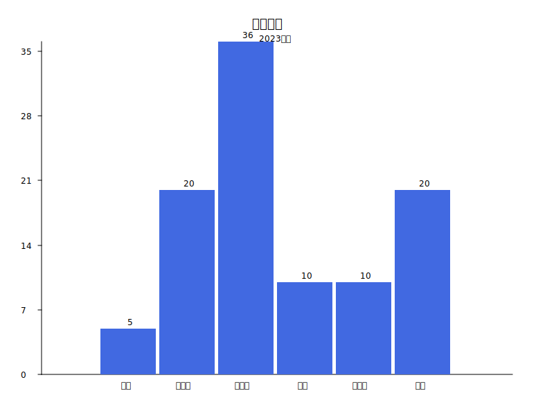
      <div style="font-size: 0.9em; color: #666; margin-top: 10px;">柱状图数据</div>
    </td>
  </tr>
</table>

```string 
// ============================================================================
# 箱线图  BOXPLOT chart
// ============================================================================
```

<table style="width: 100%; border: none; border-collapse: collapse;">
  <tr>
    <td style="width: 30%; vertical-align: middle; padding-right: 2%; border: none;">
      <strong>箱线图数据</strong><br>
      <pre style="background: #f5f5f5; padding: 10px; border-radius: 4px; font-size: 0.9em; overflow-x: auto;">
          <code class="language-java">
          // 1. 创建图表配置
           JOption option = new JOption();
           option.title().text("销售数据分布");
           option.xAxis(new JCategoryAxis().data("一季度", 
           "二季度", "三季度", "四季度"));
           option.series(new JBoxplot().data(
              new Object[]{10, 15, 20, 25, 30},
              new Object[]{12, 18, 22, 28, 35},
              new Object[]{8, 14, 19, 26, 32},
              new Object[]{11, 16, 21, 27, 33}
           ));
          </code>
      </pre>
    </td>
    <td style="width: 48%; vertical-align: middle; text-align: center; border: none;">
      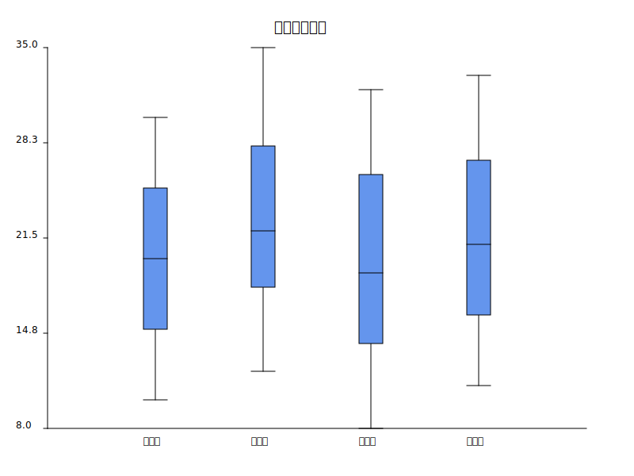
      <div style="font-size: 0.9em; color: #666; margin-top: 10px;">箱线图数据</div>
    </td>
  </tr>
</table>


```string 
// ============================================================================
# HEATMAP  热力图 chart
// ============================================================================
```

<table style="width: 100%; border: none; border-collapse: collapse;">
  <tr>
    <td style="width: 30%; vertical-align: middle; padding-right: 2%; border: none;">
      <strong>热力图数据</strong><br>
      <pre style="background: #f5f5f5; padding: 10px; border-radius: 4px; font-size: 0.9em; overflow-x: auto;">
          <code class="language-java">
          // 1. 创建图表配置
           JOption option = new JOption();
           option.title().text("销售数据分布");
           option.xAxis(new JCategoryAxis().data("一季度", 
           "二季度", "三季度", "四季度"));
           option.series(new JBoxplot().data(
              new Object[]{10, 15, 20, 25, 30},
              new Object[]{12, 18, 22, 28, 35},
              new Object[]{8, 14, 19, 26, 32},
              new Object[]{11, 16, 21, 27, 33}
           ));
          JOption option = new JOption();
          option.title("2023年月度温度分布热力图");
          option.xAxis(new JCategoryAxis()
          .data("1月", "2月", "3月", "4月", "5月", "6月",
          "7月", "8月", "9月", "10月", "11月", "12月"));
          option.yAxis(new JCategoryAxis()
          .data("凌晨(0-6)", "早晨(6-9)", "上午(9-12)",
          "中午(12-14)", "下午(14-18)", "晚上(18-24)"));
          JHeatmap heatmap = new JHeatmap();
          heatmap.data(
          new Object[]{0, 0, -5.2}, new Object[]{0, 1, -3.8}
          , new Object[]{0, 2, 1.5},
          new Object[]{0, 3, 4.2}, new Object[]{0, 4, 2.8}, 
          new Object[]{0, 5, -2.1},
          new Object[]{1, 0, -3.5}, new Object[]{1, 1, -1.2}
          , new Object[]{1, 2, 3.0},
          new Object[]{1, 3, 6.5}, new Object[]{1, 4, 4.2},
          new Object[]{1, 5, 0.5},
          new Object[]{2, 0, 0.8}, new Object[]{2, 1, 3.5},
          new Object[]{2, 2, 8.2},
          new Object[]{2, 3, 12.0}, new Object[]{2, 4, 9.5},
          new Object[]{2, 5, 4.2},
          new Object[]{3, 0, 5.2}, new Object[]{3, 1, 8.0},
          new Object[]{3, 2, 12.5},
          new Object[]{3, 3, 16.8}, new Object[]{3, 4, 14.2},
          new Object[]{3, 5, 9.5},
          new Object[]{4, 0, 10.5}, new Object[]{4, 1, 13.2}, 
          new Object[]{4, 2, 17.8},
          new Object[]{4, 3, 21.5}, new Object[]{4, 4, 19.0},
          new Object[]{4, 5, 14.8},
          new Object[]{5, 0, 15.2}, new Object[]{5, 1, 18.5},
          new Object[]{5, 2, 22.0},
          new Object[]{5, 3, 26.5}, new Object[]{5, 4, 24.2},
          new Object[]{5, 5, 19.8},
          new Object[]{6, 0, 18.5}, new Object[]{6, 1, 22.0},
          new Object[]{6, 2, 26.5},
          new Object[]{6, 3, 30.2}, new Object[]{6, 4, 28.5},
          new Object[]{6, 5, 23.8},
          new Object[]{7, 0, 17.8}, new Object[]{7, 1, 21.5},
          new Object[]{7, 2, 25.2},
          new Object[]{7, 3, 29.0}, new Object[]{7, 4, 27.5},
          new Object[]{7, 5, 22.8},
          new Object[]{8, 0, 13.5}, new Object[]{8, 1, 16.2},
          new Object[]{8, 2, 20.0},
          new Object[]{8, 3, 24.5}, new Object[]{8, 4, 22.0},
          new Object[]{8, 5, 17.5},
          new Object[]{9, 0, 8.2}, new Object[]{9, 1, 11.5},
          new Object[]{9, 2, 15.0},
          new Object[]{9, 3, 18.8}, new Object[]{9, 4, 16.5},
          new Object[]{9, 5, 12.0},
          new Object[]{10, 0, 2.5}, new Object[]{10, 1, 5.0},
          new Object[]{10, 2, 9.2},
          new Object[]{10, 3, 12.5}, new Object[]{10, 4, 10.0},
          new Object[]{10, 5, 5.5},
          new Object[]{11, 0, -2.8}, new Object[]{11, 1, -0.5},
          new Object[]{11, 2, 3.5},
          new Object[]{11, 3, 6.8}, new Object[]{11, 4, 4.2},
          new Object[]{11, 5, 0.0}
        );
    option.series(heatmap);
          </code>
      </pre>
    </td>
    <td style="width: 48%; vertical-align: middle; text-align: center; border: none;">
      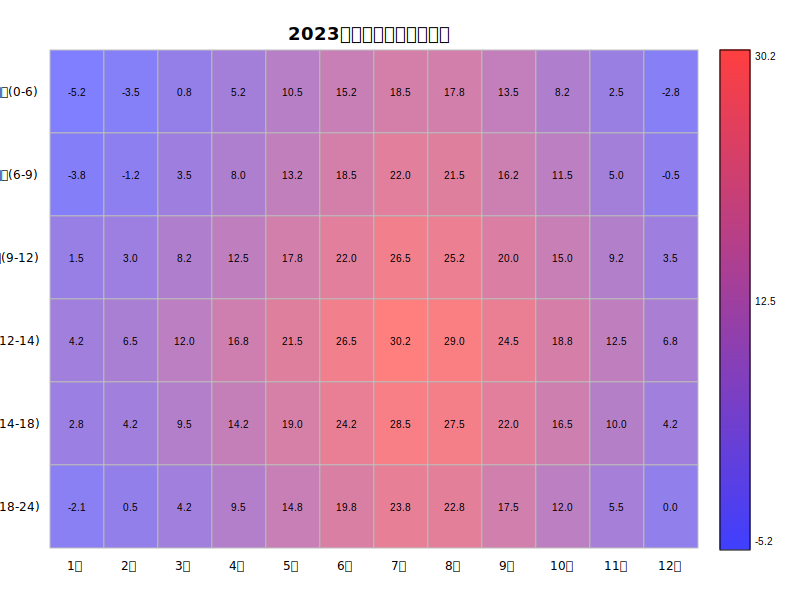
      <div style="font-size: 0.9em; color: #666; margin-top: 10px;">热力图数据</div>
    </td>
  </tr>
</table>


```string 
// ============================================================================
# K线图(蜡烛图)  K chart
// ============================================================================
```

<table style="width: 100%; border: none; border-collapse: collapse;">
  <tr>
    <td style="width: 30%; vertical-align: middle; padding-right: 2%; border: none;">
      <strong>K线图(蜡烛图)</strong><br>
      <pre style="background: #f5f5f5; padding: 10px; border-radius: 4px; font-size: 0.9em; overflow-x: auto;">
          <code class="language-java">
        JOption option = new JOption();
        option.title().text("股票K线图(含数据)");
        option.tooltip().trigger(JTrigger.axis);
        JCategoryAxis xAxis = new JCategoryAxis();
        xAxis.data("01/01", "01/02", "01/03", "01/04", 
        "01/05","01/06", "01/07", "01/08", "01/09",
        "01/10");
        option.xAxis(xAxis);
        option.yAxis(new JValueAxis());
        JCandlestick candlestick = new JCandlestick();
        candlestick.name("股价")
        .data(
             new Object[]{105.2, 108.5, 104.8, 109.1},
             new Object[]{108.6, 107.8, 106.5, 109.5},
             new Object[]{107.9, 105.3, 104.2, 108.0},
             new Object[]{105.4, 106.1, 104.5, 107.2},
             new Object[]{106.2, 104.8, 103.0, 107.5},
             new Object[]{104.9, 107.3, 104.0, 108.2},
             new Object[]{107.4, 109.1, 106.5, 110.2},
             new Object[]{109.2, 108.8, 107.0, 110.5},
             new Object[]{108.9, 110.3, 108.2, 111.0},
             new Object[]{110.4, 112.1, 109.5, 112.8}
        );
        option.series(candlestick);
          </code>
      </pre>
    </td>
    <td style="width: 48%; vertical-align: middle; text-align: center; border: none;">
      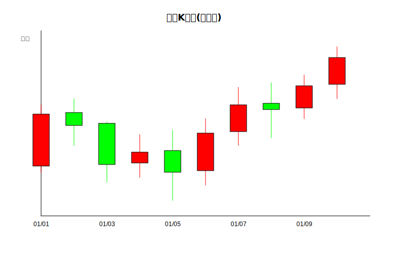
      <div style="font-size: 0.9em; color: #666; margin-top: 10px;">K线图(蜡烛图)</div>
    </td>
  </tr>
</table>


```string 
// ============================================================================
# 折线图  Line chart
// ============================================================================
```

<table style="width: 100%; border: none; border-collapse: collapse;">
  <tr>
    <td style="width: 30%; vertical-align: middle; padding-right: 2%; border: none;">
      <strong>折线图(Line chart)</strong><br>
      <pre style="background: #f5f5f5; padding: 10px; border-radius: 4px; font-size: 0.9em; overflow-x: auto;">
      <code class="language-java">
        JOption option = new JOption();
        option.title().text("销售数据折线图");
        option.tooltip().trigger(JTrigger.axis);
        JCategoryAxis xAxis = new JCategoryAxis();
        xAxis.data("1月", "2月", "3月", "4月", 
        "5月", "6月", "7月");
        option.xAxis(xAxis);
        option.yAxis(new JValueAxis());
        JLine line = new JLine();
        line.name("销售额").data(120, 132, 101,
        134, 90, 230, 210);
        option.series(line);
       </code>
      </pre>
    </td>
    <td style="width: 48%; vertical-align: middle; text-align: center; border: none;">
      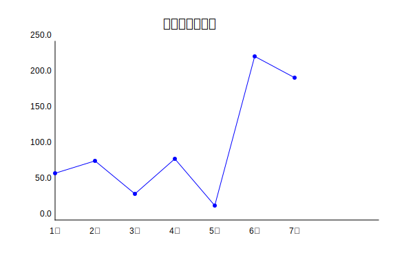
      <div style="font-size: 0.9em; color: #666; margin-top: 10px;">折线图</div>
    </td>
  </tr>
</table>


```string 
// ============================================================================
# 饼图  PIE chart
// ============================================================================
```

<table style="width: 100%; border: none; border-collapse: collapse;">
  <tr>
    <td style="width: 30%; vertical-align: middle; padding-right: 2%; border: none;">
      <strong>饼图(PIE chart)</strong><br>
      <pre style="background: #f5f5f5; padding: 10px; border-radius: 4px; font-size: 0.9em; overflow-x: auto;">
      <code class="language-java">
        JOption option = new JOption();
        option.title().text("销售占比").subtext("2023年度");
        option.tooltip().trigger(JTrigger.item);
        JPie pie = new JPie("销售占比");
        pie.data(
          new JData().name("衬衫").value(35),
          new JData().name("羊毛衫").value(20),
          new JData().name("雪纺衫").value(15),
          new JData().name("裤子").value(18),
          new JData().name("高跟鞋").value(8),
          new JData().name("袜子").value(4)
        );
        option.series(pie);
       </code>
      </pre>
    </td>
    <td style="width: 48%; vertical-align: middle; text-align: center; border: none;">
      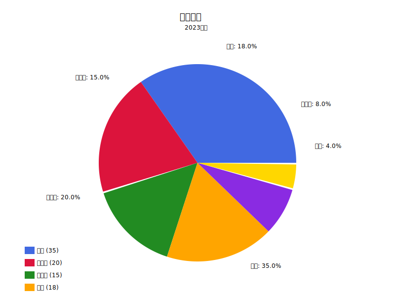
      <div style="font-size: 0.9em; color: #666; margin-top: 10px;">饼图</div>
    </td>
  </tr>
</table>


```string 
// ============================================================================
# 雷达图  RADAR chart
// ============================================================================
```

<table style="width: 100%; border: none; border-collapse: collapse;">
  <tr>
    <td style="width: 30%; vertical-align: middle; padding-right: 2%; border: none;">
      <strong>雷达图(RADAR chart)</strong><br>
      <pre style="background: #f5f5f5; padding: 10px; border-radius: 4px; font-size: 0.9em; overflow-x: auto;">
      <code class="language-java">
              // 创建图表选项
        JOption option = new JOption();
        option.title().text("雷达图示例")
                .subtext("预算 vs 开销对比")
                .left("center")
                .textStyle(new JTextStyle().color("#333"));
        // 设置提示框
        option.tooltip().trigger(JTrigger.item);
        // 设置雷达图指标
        JRadar radar = new JRadar();
        radar.indicator(
        new JRadar.Indicator().name("销售")
        .max(6500),
        new JRadar.Indicator().name("管理")
        .max(16000),
        new JRadar.Indicator().name("信息技术")
        .max(30000),
        new JRadar.Indicator().name("客服")
        .max(38000),
        new JRadar.Indicator().name("研发")
        .max(52000),
        new JRadar.Indicator().name("市场")
        .max(25000)
        );
        option.radar(radar);
        // 添加雷达图系列数据
        JRadarSeries budgetSeries = new JRadarSeries();
        budgetSeries.name("预算").type(JSeriesType.radar)
        .data(4300, 10000, 28000, 35000, 50000, 19000);
        JRadarSeries actualSeries = new JRadarSeries();
        actualSeries.name("实际开销")
        .type(JSeriesType.radar)
        .data(5000, 14000, 28000, 31000, 42000, 21000);
        option.series(budgetSeries, actualSeries);
       </code>
      </pre>
    </td>
    <td style="width: 48%; vertical-align: middle; text-align: center; border: none;">
      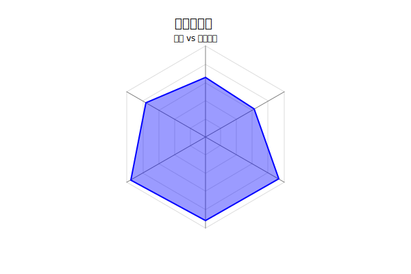
      <div style="font-size: 0.9em; color: #666; margin-top: 10px;">雷达图</div>
    </td>
  </tr>
</table>

```string 
// ============================================================================
# 关系图  RELATION chart
// ============================================================================
```

<table style="width: 100%; border: none; border-collapse: collapse;">
  <tr>
    <td style="width: 30%; vertical-align: middle; padding-right: 2%; border: none;">
      <strong>关系图(RELATION chart)</strong><br>
      <pre style="background: #f5f5f5; padding: 10px; border-radius: 4px; font-size: 0.9em; overflow-x: auto;">
      <code class="language-java">
         JGsonOption option = new JGsonOption();
        option.title("Relationship Chart Test");
        // 创建图系列
        JGraph graph = new JGraph();
        graph.name("关系图");
        graph.layout(JLayout.force); // 使用力导向布局
        graph.force().repulsion(100); // 设置排斥力
        graph.draggable(true); // 节点可拖动
        // 添加节点 - 修正了ID问题
        List<JNode> nodes = new ArrayList<>();
        nodes.add(new JNode("1", "Node A")
        .symbolSize(30).category(0));//id 1
        nodes.add(new JNode("2", "Node B")
        .symbolSize(25).category(1));
        nodes.add(new JNode("3", "Node C")
        .symbolSize(20).category(2));
        nodes.add(new JNode("4", "Node D")
        .symbolSize(15).category(0));
        nodes.add(new JNode("5", "Node E")
        .symbolSize(35).category(1));
        nodes.add(new JNode("6", "Node F")
        .symbolSize(20).category(3));
        nodes.add(new JNode("7", "Node G")
        .symbolSize(25).category(2));
        nodes.add(new JNode("8", "Node H")
        .symbolSize(15).category(4));
        nodes.add(new JNode("9", "Node I")
        .symbolSize(30).category(3));
        nodes.add(new JNode("10", "Node J")
        .symbolSize(20).category(0));
        graph.setData(nodes);
        // 添加连接
        List<JLink> links = new ArrayList<>();
        links.add(new JLink("1", "2"));
        links.add(new JLink("1", "3"));
        links.add(new JLink("2", "4"));
        links.add(new JLink("3", "5"));
        links.add(new JLink("4", "6"));
        links.add(new JLink("5", "7"));
        links.add(new JLink("6", "8"));
        links.add(new JLink("7", "9"));
        links.add(new JLink("8", "10"));
        links.add(new JLink("9", "1"));
        links.add(new JLink("10", "2"));
        links.add(new JLink("3", "6"));
        links.add(new JLink("4", "7"));
        links.add(new JLink("5", "8"));
        graph.setLinks(links);
        // 添加类别
        List<JCategory> categories =
        new ArrayList<>();
        categories.add(new JCategory()
        .name("Category 1"));
        categories.add(new JCategory()
        .name("Category 2"));
        categories.add(new JCategory()
        .name("Category 3"));
        categories.add(new JCategory()
        .name("Category 4"));
        categories.add(new JCategory()
        .name("Category 5"));
        graph.setCategories(categories);
        option.series(graph);
        option.legend().data("Category 1",
        "Category 2", "Category 3", "Category 4",
        "Category 5");
       </code>
      </pre>
    </td>
    <td style="width: 48%; vertical-align: middle; text-align: center; border: none;">
      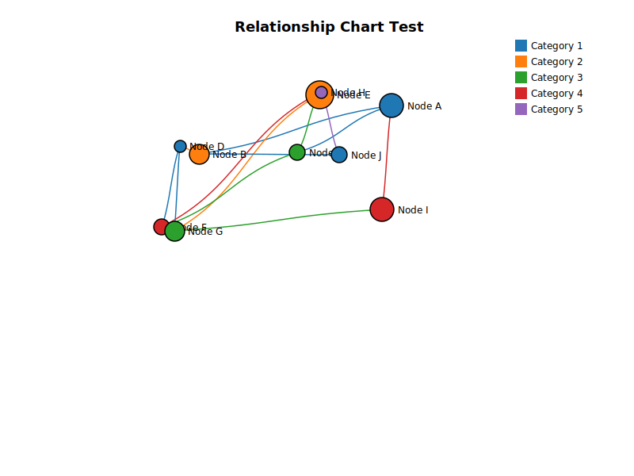
      <div style="font-size: 0.9em; color: #666; margin-top: 10px;">关系图</div>
    </td>
  </tr>
</table>

```string 
// ============================================================================
# 散点图  SCATTER chart
// ============================================================================
```

<table style="width: 100%; border: none; border-collapse: collapse;">
  <tr>
    <td style="width: 30%; vertical-align: middle; padding-right: 2%; border: none;">
      <strong>散点图(SCATTER chart)</strong><br>
      <pre style="background: #f5f5f5; padding: 10px; border-radius: 4px; font-size: 0.9em; overflow-x: auto;">
      <code class="language-java">
      JData[] data = new JData[]{
      new JData().value(new Double[]{10.0, 8.04}),
      new JData().value(new Double[]{8.07, 6.95}),
      new JData().value(new Double[]{13.0, 7.58}),
      new JData().value(new Double[]{9.05, 8.81}),
      new JData().value(new Double[]{11.0, 8.33}),
      new JData().value(new Double[]{14.0, 7.66}),
      new JData().value(new Double[]{13.4, 6.81}),
      new JData().value(new Double[]{10.0, 6.33}),
      new JData().value(new Double[]{14.0, 8.96}),
      new JData().value(new Double[]{12.5, 6.82}),
      new JData().value(new Double[]{9.15, 7.2}),
      new JData().value(new Double[]{11.5, 7.2}),
      new JData().value(new Double[]{3.03, 4.23}),
      new JData().value(new Double[]{12.2, 7.83}),
      new JData().value(new Double[]{2.02, 4.47}),
      new JData().value(new Double[]{1.05, 3.33}),
      new JData().value(new Double[]{4.05, 4.96}),
      new JData().value(new Double[]{6.03, 7.24}),
      new JData().value(new Double[]{12.0, 6.26}),
      new JData().value(new Double[]{12.0, 8.84}),
      new JData().value(new Double[]{7.08, 5.82}),
      new JData().value(new Double[]{5.02, 5.68})
      };
      JOption option = new JOption();
      option.title().text("散点图示例");
      option.tooltip().trigger(JTrigger.axis);
      option.xAxis(new JValueAxis().scale(true));
      option.yAxis(new JValueAxis().scale(true));
      JScatter scatter = new JScatter();
      scatter.symbolSize(20).data(data);
      option.series(scatter);
       </code>
      </pre>
    </td>
    <td style="width: 48%; vertical-align: middle; text-align: center; border: none;">
      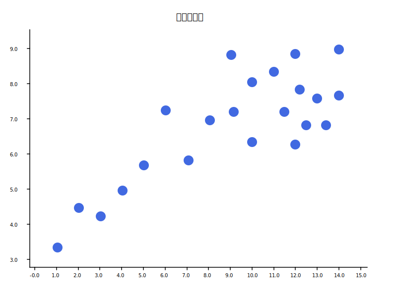
      <div style="font-size: 0.9em; color: #666; margin-top: 10px;">散点图</div>
    </td>
  </tr>
</table>

```string 
// ============================================================================
# 旭日图(1.5.1)  SUNBURST chart
// ============================================================================
```

<table style="width: 100%; border: none; border-collapse: collapse;">
  <tr>
    <td style="width: 30%; vertical-align: middle; padding-right: 2%; border: none;">
      <strong>旭日图(SUNBURST chart)</strong><br>
      <pre style="background: #f5f5f5; padding: 10px; border-radius: 4px; font-size: 0.9em; overflow-x: auto;">
      <code class="language-java">
        JOption option = new JOption();
        // 设置标题
        JTitle title = new JTitle();
        title.setText("咖啡风味分析");
        option.setTitle(title);
        JSunburstData root = 
        new JSunburstData("总数据", 1.0);
        JSunburstData main1 = 
        new JSunburstData("电子产品", 0.4);
        JSunburstData main2 = 
        new JSunburstData("服装", 0.3);
        JSunburstData main3 = 
        new JSunburstData("食品", 0.3);
        // 第二层：子分类
        JSunburstData main1Sub1 = 
        new JSunburstData("手机", 0.6);
        JSunburstData main1Sub2 =
        new JSunburstData("电脑", 0.4);
        JSunburstData main2Sub1 =
        new JSunburstData("男装", 0.5);
        JSunburstData main2Sub2 = 
        new JSunburstData("女装", 0.5);
        JSunburstData main3Sub1 =
        new JSunburstData("生鲜", 0.4);
        JSunburstData main3Sub2 =
        new JSunburstData("零食", 0.6);
        // 第三层：孙分类
        main1Sub1.addChild(new
          JSunburstData("智能手机", 0.7));
        main1Sub1.addChild(new 
          JSunburstData("功能手机", 0.3));
        main1Sub2.addChild(new 
          JSunburstData("笔记本电脑", 0.6));
        main1Sub2.addChild(new 
          JSunburstData("台式电脑", 0.4));
        main2Sub1.addChild(new 
          JSunburstData("衬衫", 0.4));
        main2Sub1.addChild(new 
          JSunburstData("裤子", 0.6));
        main3Sub2.addChild(new 
          JSunburstData("膨化食品", 0.5));
        main3Sub2.addChild(new 
          JSunburstData("糖果", 0.5));
        main1.addChild(main1Sub1);
        main1.addChild(main1Sub2);
        main2.addChild(main2Sub1);
        main2.addChild(main2Sub2);
        main3.addChild(main3Sub1);
        main3.addChild(main3Sub2);
        root.addChild(main1);
        root.addChild(main2);
        root.addChild(main3);
        option.setSunburstData(root);
       </code>
      </pre>
    </td>
    <td style="width: 48%; vertical-align: middle; text-align: center; border: none;">
      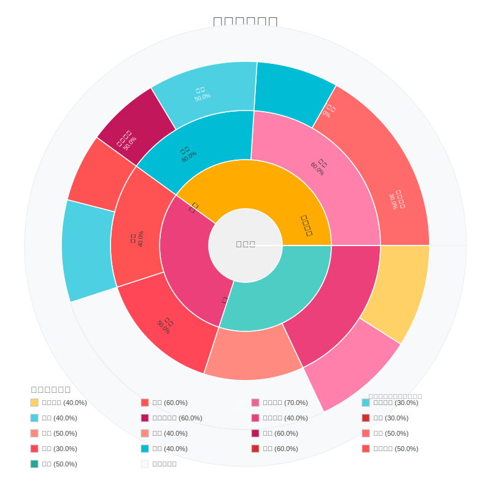
      <div style="font-size: 0.9em; color: #666; margin-top: 10px;">旭日图</div>
    </td>
  </tr>
</table>


```string 
// ============================================================================
# 矩形树图(1.5.1)  Treemap chart
// ============================================================================
```

<table style="width: 100%; border: none; border-collapse: collapse;">
  <tr>
    <td style="width: 30%; vertical-align: middle; padding-right: 2%; border: none;">
      <strong>矩形树图(Treemap chart)</strong><br>
      <pre style="background: #f5f5f5; padding: 10px; border-radius: 4px; font-size: 0.9em; overflow-x: auto;">
      <code class="language-java">
        JTreeMapNode root = createTestData();
        TreeMapOption treemapOption = new TreeMapOption();
        treemapOption.setRoot(root);
        treemapOption.setDepartmentColors(DEPARTMENT_COLORS);
        treemapOption.setCategoryColors(CATEGORY_COLORS);
        treemapOption.getDepartmentRules()
        .add(new TreeMapMapping("开发", "技术部"));
        treemapOption.getDepartmentRules()
        .add(new TreeMapMapping("项目", "技术部"));
        treemapOption.getDepartmentRules()
        .add(new TreeMapMapping("服务", "技术部"));
        treemapOption.getDepartmentRules()
        .add(new TreeMapMapping("会计", "财务部"));
        treemapOption.getDepartmentRules()
        .add(new TreeMapMapping("预算", "财务部"));
        treemapOption.getDepartmentRules()
        .add(new TreeMapMapping("税务", "财务部"));
        treemapOption.getDepartmentRules()
        .add(new TreeMapMapping("审计", "财务部"));
        treemapOption.getDepartmentRules()
        .add(new TreeMapMapping("销售", "销售部"));
        treemapOption.getDepartmentRules()
        .add(new TreeMapMapping("区域", "销售部"));
        treemapOption.getDepartmentRules()
        .add(new TreeMapMapping("招聘", "人力资源"));
        treemapOption.getDepartmentRules()
        .add(new TreeMapMapping("培训", "人力资源"));
        treemapOption.getDepartmentRules()
        .add(new TreeMapMapping("薪酬", "人力资源"));
        treemapOption.getDepartmentRules()
        .add(new TreeMapMapping("员工", "人力资源"));
        treemapOption.getDepartmentRules()
        .add(new TreeMapMapping("营销", "市场营销"));
        treemapOption.getDepartmentRules()
        .add(new TreeMapMapping("品牌", "市场营销"));
        treemapOption.getDepartmentRules()
        .add(new TreeMapMapping("公关", "市场营销"));
        JOption option = new JOption();
        option.setTreemapOption(treemapOption);
        option.title("公司业务分布矩形树图（JTreemapRenderer）");
       </code>
      </pre>
    </td>
    <td style="width: 48%; vertical-align: middle; text-align: center; border: none;">
      
      <div style="font-size: 0.9em; color: #666; margin-top: 10px;">矩形树图</div>
    </td>
  </tr>
</table>

```string 
// ============================================================================
# 气泡图(1.5.1)  Bubble chart
// ============================================================================
```

<table style="width: 100%; border: none; border-collapse: collapse;">
  <tr>
    <td style="width: 30%; vertical-align: middle; padding-right: 2%; border: none;">
      <strong>气泡图(Bubble chart)</strong><br>
      <pre style="background: #f5f5f5; padding: 10px; border-radius: 4px; font-size: 0.9em; overflow-x: auto;">
      <code class="language-java">
        JTitle title = new JTitle();
        title.setText("空气质量指数 (AQI) 监测气泡图");
        title.setSubtext("图表说明：本气泡图展示了空气质量指数(AQI)的
        时间变化趋势。X轴表示日期，Y轴表示AQI数值，气泡大小反映PM2.5浓度，
        气泡颜色表示AQI等级。");
        JOption option = new JOption()
        .title(title)
        .legend("优", "良", "轻度污染", "中度污染", "重度污染")
        .xAxis(new CategoryAxis().name("日期"))
        .yAxis(new ValueAxis().name("AQI数值"));
        ScatterSeries series = new ScatterSeries("空气质量监测");
        List<Map<String, Object>> data = new ArrayList<>();
        Random random = new Random(42); // 固定种子以便重现
        String[] dates = {"01-01", "01-02", "01-03", "01-04",
        "01-05", "01-06", "01-07", "01-08", "01-09", "01-10",
        "01-11", "01-12", "01-13", "01-14", "01-15"};
        for (int i = 0; i < dates.length; i++) {
            int aqi = 20 + random.nextInt(180); // AQI 20-200
            double pm25 = 10 + random.nextDouble() * 150; // PM2.5 10-160
            String category;
            if (aqi <= 50) category = "优";
            else if (aqi <= 100) category = "良";
            else if (aqi <= 150) category = "轻度污染";
            else if (aqi <= 200) category = "中度污染";
            else category = "重度污染";
            String name = String.format("日期:%s, AQI:%d, 
            PM2.5:%.1f", dates[i], aqi, pm25);
            Map<String, Object> dataPoint = new HashMap<>();
            dataPoint.put("x", dates[i]);
            dataPoint.put("y", aqi);
            dataPoint.put("size", pm25);
            dataPoint.put("category", category);
            dataPoint.put("name", name);
            data.add(dataPoint);
        }
        series.data(data.toArray());
        option.series(series);
       </code>
      </pre>
    </td>
    <td style="width: 48%; vertical-align: middle; text-align: center; border: none;">
      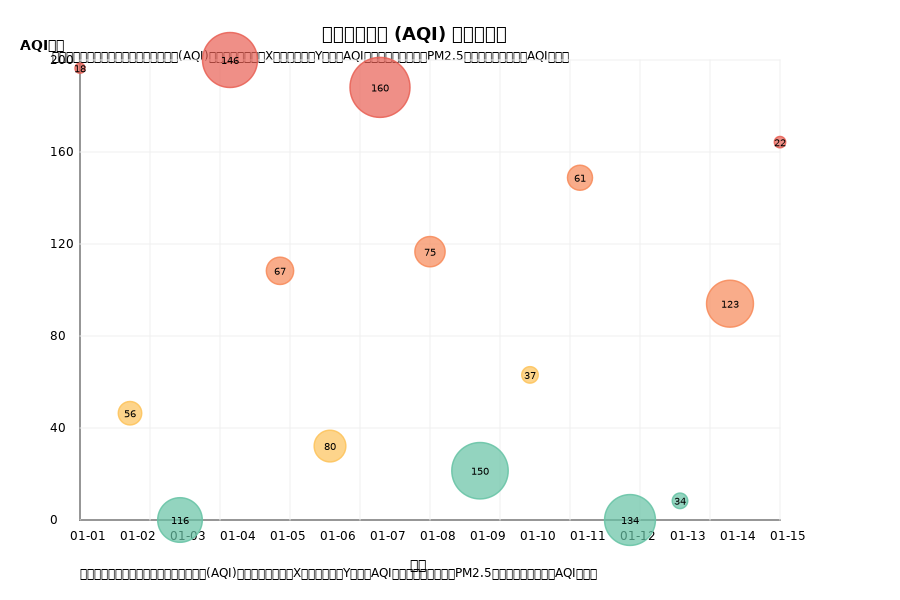
      <div style="font-size: 0.9em; color: #666; margin-top: 10px;">气泡图</div>
    </td>
  </tr>
</table>

```string 
// ============================================================================
# 日历(1.5.3)  Lunar chart
// ============================================================================
```

<table style="width: 100%; border: none; border-collapse: collapse;">
  <tr>
    <td style="width: 30%; vertical-align: middle; padding-right: 2%; border: none;">
      <strong>日历贡献图(Calendar chart)</strong><br>
      <pre style="background: #f5f5f5; padding: 10px; border-radius: 4px; font-size: 0.9em; overflow-x: auto;">
      <code class="language-java">
        Map<LocalDate, Integer> data = new HashMap<>();
        LocalDate startDate = LocalDate.of(2024, 1, 1);
        for (int i = 0; i < 365; i++) {
            LocalDate date = startDate.plusDays(i);
            int value = (int) (Math.random() * 15);
            data.put(date, value);
        }
        JOption option = new JOption();
        JCalendarOption calendarOption = new JCalendarOption(
          "2024年活动日历", "类似GitHub贡献图", 2024, data,
                new Color(235, 237, 240),
                new Color(32, 125, 222),
                new Color(232, 235, 240),
                new Color(84, 85, 90),
                20,
                80
        );
        option.setJCalendarOption(calendarOption);
       </code>
      </pre>
    </td>
    <td style="width: 48%; vertical-align: middle; text-align: center; border: none;">
      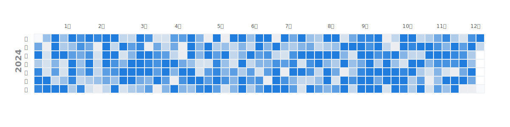
      <div style="font-size: 0.9em; color: #666; margin-top: 10px;">日历贡献图</div>
    </td>
  </tr>
</table>

```string 
// ============================================================================
# 日历(1.5.3)  Lunar chart
// ============================================================================
```

<table style="width: 100%; border: none; border-collapse: collapse;">
  <tr>
    <td style="width: 30%; vertical-align: middle; padding-right: 2%; border: none;">
      <strong>日历(Lunar chart)</strong><br>
      <pre style="background: #f5f5f5; padding: 10px; border-radius: 4px; font-size: 0.9em; overflow-x: auto;">
      <code class="language-java">
       LunarCalendarOption.CalendarDataConfig dataConfig = 
              new LunarCalendarOption.CalendarDataConfig()
       .setDayDataList(createDefaultDayData())
       .setSpecialDays(createDefaultSpecialDays())
       .setWeekDays(new String[]{"Mon", "Tue", 
        "Wed", "Thu", "Fri", "Sat", "Sun"})
       .setRows(5)
       .setCols(7);
        LunarCalendarOption.ColorConfig colorConfig = 
        new LunarCalendarOption.ColorConfig()
        .setBackgroundColor(null)
        .setSpecialDayColor(new Color(0, 100, 0));
        JTitle title = new JTitle();
        title.setText("2024年3月日历");
       </code>
      </pre>
    </td>
    <td style="width: 48%; vertical-align: middle; text-align: center; border: none;">
      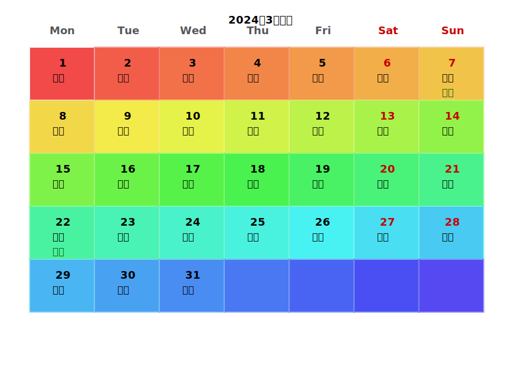
      <div style="font-size: 0.9em; color: #666; margin-top: 10px;">日历</div>
    </td>
  </tr>
</table>


```string 
// ============================================================================
# 漏斗图(1.5.3)  Funnel chart
// ============================================================================
```

<table style="width: 100%; border: none; border-collapse: collapse;">
  <tr>
    <td style="width: 30%; vertical-align: middle; padding-right: 2%; border: none;">
      <strong>日历(Lunar chart)</strong><br>
      <pre style="background: #f5f5f5; padding: 10px; border-radius: 4px; font-size: 0.9em; overflow-x: auto;">
      <code class="language-java">
        JFunnelOption option = JFunnelOption
        .createDefaultFunnel();
        JFunnelOption customOption = option
        .title(new Title().text("销售漏斗")
        .subtext("2024年数据"))
        .funnel(new Funnel()
        .width(600)
        .topY(80)
        .bottomY(200)
        .gap(2)
        .borderColor(Color.GRAY)
        )
        .series(Collections.singletonList(
        new Series()
        .name("sales")
        .type("funnel")
        .data(Arrays.asList(
             new DataItem("展现", 10000),
             new DataItem("点击", 5000),
             new DataItem("咨询", 2000),
             new DataItem("订单", 500)
        ))
        ))
        .colors(
             new Color(12, 168, 223),
             new Color(255, 153, 77),
             new Color(80, 112, 221),
             new Color(182, 214, 52)
        );
        JFunnelChartRenderer renderer = new JFunnelChartRenderer();
        JOption jOption = new JOption();
        jOption.setFunnelOption(customOption);
       </code>
      </pre>
    </td>
    <td style="width: 48%; vertical-align: middle; text-align: center; border: none;">
      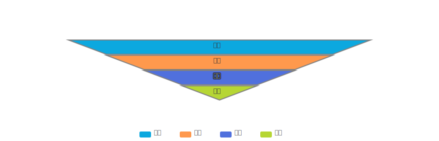
      <div style="font-size: 0.9em; color: #666; margin-top: 10px;">漏斗图</div>
    </td>
  </tr>
</table>

```string 
// ============================================================================
# 相关系数矩阵(1.5.3)  CorrectionMatrix chart
// ============================================================================
```

<table style="width: 100%; border: none; border-collapse: collapse;">
  <tr>
    <td style="width: 30%; vertical-align: middle; padding-right: 2%; border: none;">
      <strong>相关系数矩阵(CorrectionMatrix chart)</strong><br>
      <pre style="background: #f5f5f5; padding: 10px; border-radius: 4px; font-size: 0.9em; overflow-x: auto;">
      <code class="language-java">
double[][] correlationData = {
{1.00, -0.20, 0.03, -0.62, -0.54, -0.21, 0.63, 0.30},
{-0.20, 1.00, 0.36, -0.61, -0.26, 0.05, 0.16, 0.41},
{0.03, 0.36, 1.00, -0.74, -0.94, 0.71, -0.90, -0.66},
{-0.62, -0.61, -0.74, 1.00, 0.37, -0.66, 0.54, -0.66},
{-0.54, -0.26, -0.94, 0.37, 1.00, -0.05, -0.46, 0.71},
{-0.21, 0.05, 0.71, -0.66, -0.05, 1.00, -0.84, -0.40},
{0.63, 0.16, -0.90, 0.54, -0.46, -0.84, 1.00, -0.55},
{0.30, 0.41, -0.66, -0.66, 0.71, -0.40, -0.55, 1.00}
};
String[] dimensions = {"销售额", "广告费", "促销费",
"竞品价", "季节指数", "GDP", "人口", "天气"};
JCorrelationMatrixOption option = JCorrelationMatrixOption.builder()
.title("销售因素相关系数矩阵", "各因素之间的相关性分析")
.dataset(correlationData)
.build();
option.dataset().dimensions(dimensions);
JOption jOption = new JOption();
jOption.setCorrelationMatrixOption(option);
       </code>
      </pre>
    </td>
    <td style="width: 48%; vertical-align: middle; text-align: center; border: none;">
      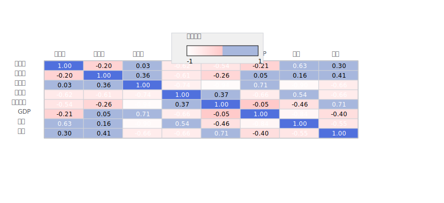
      <div style="font-size: 0.9em; color: #666; margin-top: 10px;">相关系数矩阵</div>
    </td>
  </tr>
</table>

```string 
// ============================================================================
# 甘特图(1.5.3)  Gantt chart
// ============================================================================
```

<table style="width: 100%; border: none; border-collapse: collapse;">
  <tr>
    <td style="width: 30%; vertical-align: middle; padding-right: 2%; border: none;">
      <strong>甘特图(Gantt chart)</strong><br>
      <pre style="background: #f5f5f5; padding: 10px; border-radius: 4px; font-size: 0.9em; overflow-x: auto;">
      <code class="language-java">
        JGanttOption option = new JGanttOption();
        option.setTitle(
        new JGanttOption.Title(
        "Gantt of Airport Flight", "航班调度甘特图")
        );
        option.setFlightData(
        Arrays.asList(
        new JGanttOption.FlightData
            ("Y3683", "681", "X", 21, 0, 360, 0, 0.7),
        new JGanttOption.FlightData
            ("EKXAD", "682I", "W", 21, 0, 360, 1, 0.7),
        new JGanttOption.FlightData
            ("Y4682", "682O", "W", 21, 0, 360, 2, 0.7),
        new JGanttOption.FlightData
            ("Y4393", "682", "X", 21, 0, 360, 3, 0.7),
        new JGanttOption.FlightData
            ("Y2238", "683", "X", 21, 0, 360, 4, 0.7),
        new JGanttOption.FlightData
            ("Y8192", "684", "W", 21, 0, 240, 5, 0.7),
        new JGanttOption.FlightData
            ("Y3887", "685", "X", 21, 0, 360, 6, 0.7),
        new JGanttOption.FlightData
            ("Y3086", "690", "X", 21, 0, 360, 7, 0.7),
        new JGanttOption.FlightData
            ("Y7421", "691", "X", 21, 0, 120, 8, 0.7),
        new JGanttOption.FlightData
            ("Y4619", "692", "X", 21, 0, 300, 9, 0.7)
        ));
        option.setChartStyle(new JGanttOption.ChartStyle(
                    Color.WHITE,
                    new Color(146, 154, 186),
                    new Color(54, 140, 108),
                    new Color(80, 112, 221),
                    new Color(221, 179, 11),
                    new Font("微软雅黑", Font.BOLD, 18),
                    new Font("微软雅黑", Font.PLAIN, 12),
                    872,
                    282
        ));
        option.setTimeRange(
            new JGanttOption.TimeRange(21, 3, 
            new String[]{"21:00", "22:00", "23:00", "00:00", 
         "01:00", "02:00", "03:00"}));
        JChartRenderer renderer = new JGanttChartRenderer();
        JOption jOption = new JOption();
        jOption.setGanttOption(option);
       </code>
      </pre>
    </td>
    <td style="width: 48%; vertical-align: middle; text-align: center; border: none;">
      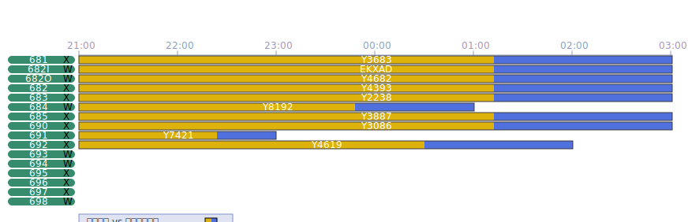
      <div style="font-size: 0.9em; color: #666; margin-top: 10px;">甘特图</div>
    </td>
  </tr>
</table>

```string 
// ============================================================================
# 甘特图(1.5.3)  Gantt chart
// ============================================================================
```

<table style="width: 100%; border: none; border-collapse: collapse;">
  <tr>
    <td style="width: 30%; vertical-align: middle; padding-right: 2%; border: none;">
      <strong>仪表盘(Gauge chart)</strong><br>
      <pre style="background: #f5f5f5; padding: 10px; border-radius: 4px; font-size: 0.9em; overflow-x: auto;">
      <code class="language-java">
        GuageConfig scoreConfig = GuageConfig.builder()
        .score(75)  // 设置分数为75
        .pointerColor(new Color(220, 80, 80))  
        // 红色指针
        .backgroundColor(new Color(240, 240, 245))  
         // 浅灰色背景
        .title("PERFORMANCE")
        .build();
        JGuageOption option = JGuageOption.builder()
        .scoreMeter(scoreConfig).build();
        JGuageRenderer renderer = new JGuageRenderer();
        JOption option1 = new JOption();
        option1.setGuageOption(option);
       </code>
      </pre>
    </td>
    <td style="width: 48%; vertical-align: middle; text-align: center; border: none;">
      
      <div style="font-size: 0.9em; color: #666; margin-top: 10px;">仪表盘</div>
    </td>
  </tr>
</table>


```string 
// ============================================================================
# 词云(1.5.3)  WordsCloud chart
// ============================================================================
```

<table style="width: 100%; border: none; border-collapse: collapse;">
  <tr>
    <td style="width: 30%; vertical-align: middle; padding-right: 2%; border: none;">
      <strong>词云(WordsCloud chart)</strong><br>
      <pre style="background: #f5f5f5; padding: 10px; border-radius: 4px; font-size: 0.9em; overflow-x: auto;">
      <code class="language-java">
        JOption option = new JOption()
        .title(new JTitle().text("热门编程语言"))
        .series(Arrays.asList(
         new JWordCloudSeries("语言热度")
         .data(Arrays.asList(
              new JData("Java", 100),
              new JData("Python", 85),
              new JData("JavaScript", 75),
              new JData("C++", 60),
              new JData("Go", 50),
              new JData("Rust", 45),
              new JData("Kotlin", 40),
              new JData("Swift", 35),
              new JData("TypeScript", 30),
              new JData("Scala", 25)
           ))
        .minFontSize(20)
        .maxFontSize(60)
        .gridSize(10)
        .rotationStep(15)
        .rotationRange(90)
        .textStyle(new JItemStyle().color(Color.BLUE))
        ));
       </code>
      </pre>
    </td>
    <td style="width: 48%; vertical-align: middle; text-align: center; border: none;">
      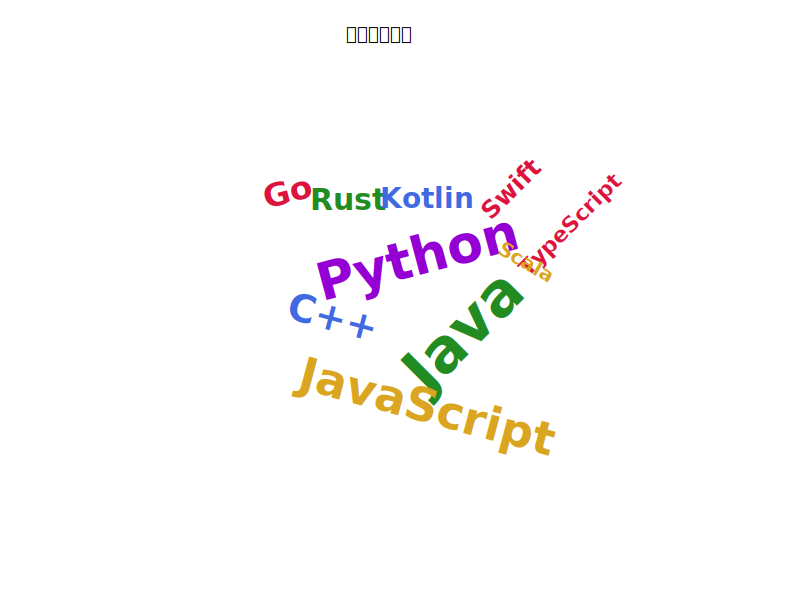
      <div style="font-size: 0.9em; color: #666; margin-top: 10px;">词云</div>
    </td>
  </tr>
</table>

### How to Generate a Credit Report Using JQuickPDF
#### Define a Template
```xml
<pdf>
<body>
  <div style="textAlignment:center; marginBottom:5px; paddings:5px 5px 60px 70px; background:#3E6B9D; color:white; borderRadius:4px; position:relative">
    <h1 style="textAlignment:center;color:white; marginBottom:8px; fontSize:20; fontWeight:bold">'企业信用评级报告'</h1>
    <p style="textAlignment:center;color:rgba(255,255,255,0.9); fontSize:11; margin:2px">'报告编号: CR-2023-08975 | 评估日期: 2023年11月15日'</p>
    <p style="textAlignment:center;color:rgba(255,255,255,0.9); fontSize:11; margin:2px">'评估机构: 四川省企业信用评估中心'</p>
  </div>
  <div style="marginBottom:3px;borderRadius:4px;">
    <div style="padding:12px">
      <h2 style="color:#2c3e50; marginTop:0; marginBottom:8px; fontSize:14; fontWeight:bold">'四川省泡海椒科技有限公司'</h2>
      <table style="width:600px;verticalAlignment:center; fontSize:10">
        <tr>
          <td style="backgroundColor:#f8f9fa;padding:5px; textAlign:left;width:150px;">'统一信用代码'</td>
          <td style="backgroundColor:#f8f9fa;padding:5px;width:150px;  ">'91110108MA01XX1234'</td>
          <td style="backgroundColor:#f8f9fa; padding:5px; textAlign:left;width:150px;">'成立日期'</td>
          <td style="padding:5px; width:150px;">'2018年5月20日'</td>
        </tr>
        <tr>
          <td style="backgroundColor:#f8f9fa; padding:5px; textAlign:left; ">'注册资本'</td>
          <td style="padding:5px; ">'1000万元人民币'</td>
          <td style="backgroundColor:#f8f9fa; padding:5px; textAlign:left; ">'法定代表人'</td>
          <td style="padding:5px;">'泡海椒'</td>
        </tr>
        <tr>
          <td style="backgroundColor:#f8f9fa; padding:5px; textAlign:left; ">'所属行业'</td>
          <td style="padding:5px; ">'软件和信息技术服务业'</td>
          <td style="backgroundColor:#f8f9fa; padding:5px; textAlign:left; ">'企业规模'</td>
          <td style="padding:5px; ">'中型（150-200人）'</td>
        </tr>
      </table>
    </div>
  </div>
  <template>&html</template>
  <div style="margin-bottom:15px">
    <h2 style="color:#3498db; borderBottom:1px solid #3498db; paddingBottom:4px; fontSize:13; marginBottom:10px">'历年财务数据（单位：万元）'</h2>
    <table style="width:600px; fontSize:10; marginTop:8px">
      <tr>
        <th style="backgroundColor:#3498db; color:white; padding:6px; textAlign:center; border:1px solid #dee2e6">'财务指标'</th>
        <th style="backgroundColor:#3498db; color:white; padding:6px; textAlign:center; border:1px solid #dee2e6">'2020年'</th>
        <th style="backgroundColor:#3498db; color:white; padding:6px; textAlign:center; border:1px solid #dee2e6">'2021年'</th>
        <th style="backgroundColor:#3498db; color:white; padding:6px; textAlign:center; border:1px solid #dee2e6">'2022年'</th>
        <th style="backgroundColor:#3498db; color:white; padding:6px; textAlign:center; border:1px solid #dee2e6">'2023年'</th>
        <th style="backgroundColor:#3498db; color:white; padding:6px; textAlign:center; border:1px solid #dee2e6">'增长率'</th>
      </tr>
      <tr>
        <td style="backgroundColor:#f8f9fa; padding:5px; textAlign:left; border:1px solid #dee2e6; fontWeight:bold">'营业收入'</td>
        <td style="padding:5px; textAlign:right; border:1px solid #dee2e6">'8,560'</td>
        <td style="padding:5px; textAlign:right; border:1px solid #dee2e6">'12,340'</td>
        <td style="padding:5px; textAlign:right; border:1px solid #dee2e6">'18,920'</td>
        <td style="padding:5px; textAlign:right; border:1px solid #dee2e6">'25,680'</td>
        <td style="padding:5px; textAlign:right; border:1px solid #dee2e6; color:#4CAF50; fontWeight:bold">'+44.2%'</td>
      </tr>
      <tr>
        <td style="backgroundColor:#f8f9fa; padding:5px; textAlign:left; border:1px solid #dee2e6; fontWeight:bold">'净利润'</td>
        <td style="padding:5px; textAlign:right; border:1px solid #dee2e6">'1,240'</td>
        <td style="padding:5px; textAlign:right; border:1px solid #dee2e6">'2,150'</td>
        <td style="padding:5px; textAlign:right; border:1px solid #dee2e6">'3,890'</td>
        <td style="padding:5px; textAlign:right; border:1px solid #dee2e6">'5,420'</td>
        <td style="padding:5px; textAlign:right; border:1px solid #dee2e6; color:#4CAF50; fontWeight:bold">'+63.8%'</td>
      </tr>
      <tr>
        <td style="backgroundColor:#f8f9fa; padding:5px; B:left; border:1px solid #dee2e6; fontWeight:bold">'总资产'</td>
        <td style="padding:5px; textAlign:right; border:1px solid #dee2e6">'15,800'</td>
        <td style="padding:5px; textAlign:right; border:1px solid #dee2e6">'22,450'</td>
        <td style="padding:5px; textAlign:right; border:1px solid #dee2e6">'31,200'</td>
        <td style="padding:5px; textAlign:right; border:1px solid #dee2e6">'42,800'</td>
        <td style="padding:5px; textAlign:right; border:1px solid #dee2e6; color:#4CAF50; fontWeight:bold">'+39.5%'</td>
      </tr>
      <tr>
        <td style="backgroundColor:#f8f9fa; padding:5px; textAlign:left; border:1px solid #dee2e6; fontWeight:bold">'净资产'</td>
        <td style="padding:5px; textAlign:right; border:1px solid #dee2e6">'9,200'</td>
        <td style="padding:5px; textAlign:right; border:1px solid #dee2e6">'13,800'</td>
        <td style="padding:5px; textAlign:right; border:1px solid #dee2e6">'19,500'</td>
        <td style="padding:5px; textAlign:right; border:1px solid #dee2e6">'26,400'</td>
        <td style="padding:5px; textAlign:right; border:1px solid #dee2e6; color:#4CAF50; fontWeight:bold">'+42.1%'</td>
      </tr>
      <tr>
        <td style="backgroundColor:#f8f9fa; padding:5px; textAlign:left; border:1px solid #dee2e6; fontWeight:bold">'毛利率'</td>
        <td style="padding:5px; textAlign:right; border:1px solid #dee2e6">'42.5%'</td>
        <td style="padding:5px; textAlign:right; border:1px solid #dee2e6">'45.8%'</td>
        <td style="padding:5px; textAlign:right; border:1px solid #dee2e6">'48.2%'</td>
        <td style="padding:5px; textAlign:right; border:1px solid #dee2e6">'51.6%'</td>
        <td style="padding:5px; textAlign:right; border:1px solid #dee2e6; color:#4CAF50; fontWeight:bold">'+9.1%'</td>
      </tr>
    </table>
  </div>

  <div style="margin-bottom:15px">
    <h2 style="color:#3498db; border-bottom:1px solid #3498db; padding-bottom:4px; font-size:13px; margin-bottom:10px">'关键经营指标'</h2>
    <list style="list-style-type:none; padding-left:0; font-size:11px">
      <li style="margin-bottom:8px; padding:10px; background-color:#f8f9fa; border-left:4px solid #4CAF50; border-radius:0 4px 4px 0">
        '营收增长率:连续三年保持40%以上增长，2023年达到25,680万元'
      </li>
      <li style="margin-bottom:8px; padding:10px; background-color:#f8f9fa; border-left:4px solid #2196F3; border-radius:0 4px 4px 0">
        ' 利润率提升:净利率从14.5%提升至21.1%，盈利能力显著增强'
      </li>
      <li style="margin-bottom:8px; padding:10px; background-color:#f8f9fa; border-left:4px solid #FF9800; border-radius:0 4px 4px 0">
        ' 研发投入:研发费用年均增长38.9%，占营收比例达13.3%'
      </li>
      <li style="margin-bottom:8px; padding:10px; background-color:#f8f9fa; border-left:4px solid #9C27B0; border-radius:0 4px 4px 0">
        ' 人才结构:技术研发人员占比42%，硕士以上学历占35%'
      </li>
      <li style="margin-bottom:8px; padding:10px; background-color:#f8f9fa; border-left:4px solid #E91E63; border-radius:0 4px 4px 0">
        ' 客户质量:服务15家上市公司，客户续约率92%，大客户满意度4.8/5.0'
      </li>
      <li style="margin-bottom:8px; padding:10px; background-color:#f8f9fa; border-left:4px solid #009688; border-radius:0 4px 4px 0">
        ' 资产质量:资产负债率维持在38%左右，流动比率2.8，偿债能力良好'
      </li>
    </list>
  </div>

  <div style="margin-bottom:15px">
    <h2 style="color:#3498db; border-bottom:1px solid #3498db; padding-bottom:4px; font-size:13px; margin-bottom:10px">'信用评级雷达图'</h2>
    <div style="display:flex; justify-content:space-between; margin-top:10px">
        <svg>${svg}</svg>
    </div>
    <div style="display:flex; justify-content:space-between; margin-top:10px">
      <div style="width:400px">
        <div style="backgroundColor:#f8f9fa; padding:15px; borderRadius:4px; height:230px; overflow-y:auto">
          <h3 style="color:#2c3e50; margin-top:0; fontSize:12; marginBottom:8px">'评级指标说明'</h3>
          <list style="list-style-type:none; padding-left:0; font-size:10px">
            <li style="margin-bottom:6px; padding-left:16px; position:relative">
              <span style="position:absolute; left:0; width:8px; height:8px; background-color:#3498db; border-radius:50%; top:4px"></span>
              <span style="font-weight:bold; color:#2c3e50">'财务状况(90分):' </span>
              '营收稳定增长'
            </li>
            <li style="margin-bottom:6px; padding-left:16px; position:relative">
              <span style="position:absolute; left:0; width:8px; height:8px; background-color:#2ecc71; border-radius:50%; top:4px"></span>
              <span style="font-weight:bold; color:#2c3e50">'经营能力(95分):' </span>
             ' 客户留存率高'
            </li>
            <li style="margin-bottom:6px; padding-left:16px; position:relative">
              <span style="position:absolute; left:0; width:8px; height:8px; background-color:#e74c3c; border-radius:50%; top:4px"></span>
              <span style="font-weight:bold; color:#2c3e50">'偿债能力(85分):' </span>
              '负债率合理'
            </li>
            <li style="margin-bottom:6px; padding-left:16px; position:relative">
              <span style="position:absolute; left:0; width:8px; height:8px; background-color:#f39c12; border-radius:50%; top:4px"></span>
              <span style="font-weight:bold; color:#2c3e50">'发展潜力(92分):' </span>
              '研发投入增加'
            </li>
          </list>
        </div>
      </div>
    </div>
  </div>

  <div style="margin-bottom:15px; background:linear-gradient(135deg, #e3f2fd 0%, #bbdefb 100%); padding:15px; border-radius:4px; border-left:4px solid #2196F3; position:relative">
    <h2 style="color:#1565c0; margin-top:0; font-size:13px; margin-bottom:8px">'综合评价'</h2>
    <p style="line-height:1.5; text-align:justify; margin-bottom:8px; font-size:11px">
      '四川省泡海椒科技有限公司作为国家级高新技术企业和专精特新"小巨人"企业，在云计算和大数据领域表现出色。'
      '公司财务状况健康，经营能力突出，技术创新能力强，具备良好的发展潜力。信用评级为AAA级，展望稳定。'
    </p>
    <div style="position:absolute; bottom:10px; right:15px; text-align:center">
      <div style="font-size:8px; color:#d32f2f; margin-top:2px">'认证通过'</div>
    </div>
  </div>

  <div style="text-align:center; margin-top:15px; padding-top:12px; border-top:1px solid #dee2e6; color:#6c757d; font-size:9px; position:relative">
    <p>'本报告依据公开信息和专业评估模型生成，仅供参考 | 报告生成时间: 2025年09月06日'</p>
    <p>'© 2023 企业信用评估中心 版权所有 | 认证编号: CE-2023-001'</p>
    <div style="position:absolute; bottom:5px; right:10px; opacity:0.1">
    </div>
  </div>
</body>
</pdf>
```
#### 定义一个内嵌的html 组件(html 变量)
<div style="marginBottom:15px">
    <h2 style="color:#3498db;  fontSize:13; marginBottom:10px">企业资质认证</h2>
    <div style="display:flex; marginTop:12px; gap:8px">
      <div style="width:20%; background:linear-gradient(135deg, #4CAF50 0%, #81C784 100%); color:white; padding:10px; border-radius:5px; text-align:center">
        <div style="font-size:18px; font-weight:bold; margin-bottom:3px">AAA</div>
        <div style="font-size:10px">信用等级</div>
      </div>
      <div style="width:20%; background:linear-gradient(135deg, #FF9800 0%, #F57C00 100%); color:white; padding:10px; border-radius:5px; text-align:center">
        <div style="font-size:18px; font-weight:bold; margin-bottom:3px">高新</div>
        <div style="font-size:10px">高新技术企业</div>
      </div>
      <div style="width:20%; background:linear-gradient(135deg, #1976D2 0%, #0D47A1 100%); color:white; padding:10px; border-radius:5px; text-align:center">
        <div style="font-size:18px; font-weight:bold; margin-bottom:3px">专精特新</div>
        <div style="font-size:10px">小巨人企业</div>
      </div>
      <div style="width:20%; background:linear-gradient(135deg, #9C27B0 0%, #BA68C8 100%); color:white; padding:10px; border-radius:5px; text-align:center">
        <div style="font-size:18px; font-weight:bold; margin-bottom:3px">水电</div>
        <div style="font-size:10px">双软认证企业</div>
      </div>
    </div>
  </div>

#### 定义一个雷达图背景svg(也可以使用java 加载方式)
```xml
<svg xmlns="http://www.w3.org/2000/svg" width="500" height="450" viewBox="0 0 500 450">
                <!-- 雷达图背景 -->
                <g transform="translate(250, 200)">
                    <!-- 绘制5层同心六边形 -->
                    <polygon points="0,-150 129.9,-75 129.9,75 0,150 -129.9,75 -129.9,-75" 
                             fill="none" stroke="#e0e0e0" stroke-width="1"/>
                    <polygon points="0,-120 103.9,-60 103.9,60 0,120 -103.9,60 -103.9,-60" 
                             fill="none" stroke="#e0e0e0" stroke-width="1"/>
                    <polygon points="0,-90 77.9,-45 77.9,45 0,90 -77.9,45 -77.9,-45" 
                             fill="none" stroke="#e0e0e0" stroke-width="1"/>
                    <polygon points="0,-60 51.9,-30 51.9,30 0,60 -51.9,30 -51.9,-30" 
                             fill="none" stroke="#e0e0e0" stroke-width="1"/>
                    <polygon points="0,-30 25.9,-15 25.9,15 0,30 -25.9,15 -25.9,-15" 
                             fill="none" stroke="#e0e0e0" stroke-width="1"/>

                    <!-- 坐标轴 -->
                    <line x1="0" y1="0" x2="0" y2="-160" stroke="#95a5a6" stroke-width="1.5"/>
                    <line x1="0" y1="0" x2="129.9" y2="-75" stroke="#95a5a6" stroke-width="1.5"/>
                    <line x1="0" y1="0" x2="129.9" y2="75" stroke="#95a5a6" stroke-width="1.5"/>
                    <line x1="0" y1="0" x2="0" y2="160" stroke="#95a5a6" stroke-width="1.5"/>
                    <line x1="0" y1="0" x2="-129.9" y2="75" stroke="#95a5a6" stroke-width="1.5"/>
                    <line x1="0" y1="0" x2="-129.9" y2="-75" stroke="#95a5a6" stroke-width="1.5"/>
                    
                    <!-- 维度标签 -->
                    <text x="0" y="-180" text-anchor="middle" font-size="12" fill="#2c3e50">偿债能力</text>
                    <text x="145" y="-75" text-anchor="start" font-size="12" fill="#2c3e50">盈利能力</text>
                    <text x="145" y="85" text-anchor="start" font-size="12" fill="#2c3e50">运营能力</text>
                    <text x="0" y="190" text-anchor="middle" font-size="12" fill="#2c3e50">成长能力</text>
                    <text x="-145" y="85" text-anchor="end" font-size="12" fill="#2c3e50">现金流</text>
                    <text x="-145" y="-75" text-anchor="end" font-size="12" fill="#2c3e50">信用历史</text>
                    
                    <!-- 刻度标签 -->
                    <text x="5" y="-150" text-anchor="start" font-size="10" fill="#7f8c8d">100</text>
                    <text x="5" y="-120" text-anchor="start" font-size="10" fill="#7f8c8d">80</text>
                    <text x="5" y="-90" text-anchor="start" font-size="10" fill="#7f8c8d">60</text>
                    <text x="5" y="-60" text-anchor="start" font-size="10" fill="#7f8c8d">40</text>
                    <text x="5" y="-30" text-anchor="start" font-size="10" fill="#7f8c8d">20</text>
                    
                    <!-- 当前企业数据 -->
                    <polygon points="0,-135 116.9,-67.5 103.9,60 0,120 -103.9,67.5 -116.9,-67.5" 
                             fill="#3498db" fill-opacity="0.2" stroke="#3498db" stroke-width="2"/>
                    
                    <!-- 数据点 -->
                    <circle cx="0" cy="-135" r="4" fill="#ffffff" stroke="#3498db" stroke-width="2"/>
                    <circle cx="116.9" cy="-67.5" r="4" fill="#ffffff" stroke="#3498db" stroke-width="2"/>
                    <circle cx="103.9" cy="60" r="4" fill="#ffffff" stroke="#3498db" stroke-width="2"/>
                    <circle cx="0" cy="120" r="4" fill="#ffffff" stroke="#3498db" stroke-width="2"/>
                    <circle cx="-103.9" cy="67.5" r="4" fill="#ffffff" stroke="#3498db" stroke-width="2"/>
                    <circle cx="-116.9" cy="-67.5" r="4" fill="#ffffff" stroke="#3498db" stroke-width="2"/>
                    
                    <!-- 数据值标签 -->
                    <text x="0" y="-145" text-anchor="middle" font-size="10" fill="#3498db">90</text>
                    <text x="127" y="-67.5" text-anchor="start" font-size="10" fill="#3498db">85</text>
                    <text x="114" y="70" text-anchor="start" font-size="10" fill="#3498db">80</text>
                    <text x="0" y="140" text-anchor="middle" font-size="10" fill="#3498db">75</text>
                    <text x="-114" y="77" text-anchor="end" font-size="10" fill="#3498db">88</text>
                    <text x="-127" y="-67.5" text-anchor="end" font-size="10" fill="#3498db">92</text>
                </g>
                
                <!-- 标题 -->
                <text x="250" y="30" text-anchor="middle" font-size="16" font-weight="bold" fill="#2c3e50">
                    科技有限公司信用评级
                </text>
                
                <!-- 评级说明 -->
                <text x="250" y="380" text-anchor="middle" font-size="12" fill="#2c3e50">
                    综合信用评分: 85/100 | 评级: AA
                </text>
            </svg>
```
#### pdf 渲染
```java
JPdfConfig config = new JPdfConfig();
JTemplateConfig templateConfig = config.getTemplateConfig();
        templateConfig.put("html", html);
        System.out.println(html);
        config.setTemplateConfig(templateConfig);
JReader fileReader = new JReSourceFileReader("report.txt");
JAdaptor adaptor = new JAdaptor(fileReader);

JContext param = new JContext();
 param.put("svg", svg);
JQuickPdfXExecutor executor = new JQuickPdfXExecutor(param, config);
executor.execute(adaptor.getRuleContent());
 
```


# **捐献 ☕**

感谢您使用这个开源项目！它完全免费并将持续维护，但开发者确实需要您的支持。

---

## **如何支持我们**

1. **请我喝杯咖啡**  
   果这个项目为您节省了时间或金钱，请考虑通过小额捐赠支持我。

2. **您的捐赠用途**

- 维持项目运行的服务器成本.
- 开发新功能以提供更多价值.
- 优化文档以提升用户体验.

3. **每一分都很重要**  
   即使是1分钱的捐赠也能激励我熬夜调试！

## **为什么捐赠?**

✔️ 保持项目永远免费且无广告.  
✔️ 支持及时响应问题和社区咨询.  
✔️ 实现计划中的未来功能.

感谢您成为让开源世界更美好的伙伴！

--- 

### **补充说明**

- 本项目和产品维护.
- 您的支持确保其可持续性和成长 .

---

## **🌟 立即支持**

赞助时欢迎通过 [email](mailto:goudingcheng@gmail.com) 留言。您的名字将被列入项目README文件的 **"特别感谢"** 名单中！


---