# 📄 JQuickPDF

> The lightest and purest Java PDF generation library

<p align="center">
  <a href="./README.md">简体中文</a> | <a href="./README-EN.md">English</a>
</p>

<p align="center">
  <a href="https://github.com/akullpp/awesome-java"></a>
  <a href="https://search.maven.org/artifact/io.github.paohaijiao/jquick-pdfx"></a>
  <a href="https://github.com/paohaijiao/jquick-pdf/stargazers"></a>
  <a href="https://github.com/paohaijiao/jquick-pdf/fork"></a>
  <a href="https://github.com/paohaijiao/jquick-pdf/issues"></a>
  <a href="./LICENSE"></a>
</p>

> ⚡ A PDF generation library featured in [Awesome Java](https://github.com/akullpp/awesome-java)
>
> If this project helps you, please give it a Star ⭐

---

## 📝 Foreword

In Java PDF generation, the real issue is often not whether a PDF can be generated, but whether it is easy to write, maintain, and deploy.

Common pain points include:

- Heavy browser or WebKit dependency
- Hard-to-read template syntax and unclear style attributes
- Scattered chart rendering logic
- SVG embedding is often inconvenient
- Tables, forms, images, and pagination usually need extra assembly work

**JQuickPDF** is built for these problems.

It aims to provide a lighter way to generate business PDFs, reports, credit reports, and image-text documents in Java.

---

## 🛠️ Introduction

**JQuickPDF** is a lightweight Java PDF generation library built on top of **iText 7**. It provides HTML + CSS-like template syntax and supports template variables, charts, SVG, tables, forms, images, custom fonts, and pagination.

It fits these scenarios well:

- Enterprise credit reports
- Data analysis reports
- Image-text PDFs
- Chart-rich business reports
- Template-driven notices, contracts, and manuals

Its technical direction is straightforward:

- Pure Java implementation
- No browser required
- No external WebKit rendering engine required
- Can work with Thymeleaf, FreeMarker, and other template engines

---

## ✨ Core Features

- 🚀 **Pure Java PDF generation**
  - No browser required
  - No WebKit required
  - Suitable for direct server-side generation
- 🎨 **HTML + CSS-like template syntax**
  - Closer to frontend layout habits
  - Easier composition of text, tables, images, and SVG
- 🧩 **Template-engine friendly**
  - Works with Thymeleaf
  - Works with FreeMarker
  - Supports variable binding and template fragment injection
- 📊 **30+ chart capabilities**
  - Bar, pie, radar, K-line, heatmap, Gantt, word cloud, map, and more
- 🧾 **Common PDF elements included**
  - Text
  - Tables
  - Forms
  - Images
  - SVG
  - Pagination
- 🔤 **Font configuration support**
  - Useful for Chinese business documents
- 🔗 **Data binding support**
  - Templates can work with Java-side data models

---

## 📦 Quick Start

### 1. Maven Dependency

```xml
<dependency>
    <groupId>io.github.paohaijiao</groupId>
    <artifactId>jquick-pdfx</artifactId>
    <version>latest version</version>
</dependency>
```

### 2. Minimal runnable example

#### Java code

```java
import com.github.paohaijiao.config.JPdfConfig;
import com.github.paohaijiao.config.JTemplateConfig;
import com.github.paohaijiao.executor.JQuickPdfFactory;

import java.io.FileOutputStream;

public class Demo {
    public static void main(String[] args) throws Exception {
        JPdfConfig config = new JPdfConfig();
        JTemplateConfig templateConfig = config.getTemplateConfig();
        templateConfig.put("html", "<h1>Hello JQuickPDF</h1><p>这是一个最小示例。</p>");
        config.setTemplateConfig(templateConfig);

        String template = "<html><body><template>&html</template></body></html>";

        byte[] pdf = new JQuickPdfFactory(config).executeContent(template);

        try (FileOutputStream out = new FileOutputStream("demo.pdf")) {
            out.write(pdf);
        }
    }
}
```

#### Template XML snippet

```xml
<html>
<body>
  <template>&html</template>
</body>
</html>
```

---

## 📖 Core Capabilities at a Glance

### Support Status

| Status | Meaning |
|---|---|
| ✅ Supported | Available in the main flow and backed by demos |
| 🟡 Migrating | Visitor / rendering skeleton exists and is moving from iText to PDFBox |
| ⏳ Pending | Entry or class exists in the repository, but full integration is not complete |

### Element List

| Element | Status | Example / Notes |
|---|---|---|
| `<paragraph>` | ✅ Supported | `sample/paragraph.txt` |
| `<heading>` | ✅ Supported | `sample/heading.txt` |
| `<span>` | ✅ Supported | `sample/span.txt` |
| `<div>` | ✅ Supported | `sample/div.txt` |
| `<list>` / `<li>` | ✅ Supported | `sample/list.txt` |
| `<table>` / `<tr>` / `<td>` / `<th>` | ✅ Supported | `sample/table.txt` |
| `<image>` | ✅ Supported | `sample/image.txt` |
| `<svg>` | ✅ Supported | `sample/svg1.txt`, `sample/svg2.txt` |
| `<areaBreak>` | ✅ Supported | `sample/areaBreak.txt` |
| `<htmlPageBreak>` | ✅ Supported | `sample/htmlPageBreak.txt` |
| `<lineSeparator>` | ✅ Supported | `sample/lineSeperator.txt` |
| `<tab>` | ✅ Supported | `sample/tab.txt` |
| `<button>` | ✅ Supported | `sample/button.txt` |
| `<checkbox>` | ✅ Supported | `sample/checkbox.txt` |
| `<comboBoxField>` | ✅ Supported | `sample/comboxFiled.txt` |
| `<textArea>` | ✅ Supported | `sample/textArea.txt` |
| `<tree>` | ✅ Supported | `sample/tree1.txt`, `sample/tree2.txt` |
| `<template>` | 🟡 Migrating | `sample/template.txt` |
| `<inputField>` | ⏳ Pending | Only a visitor stub exists; full grammar wiring is not ready |
| `${variable}` | ✅ Supported | Variable placeholder binding |

### Chart Demo Index

| Chart / Scenario | Demo File |
|---|---|
| Area | `demo/area/JQuickAreaTest.java` |
| Horizontal Bar | `demo/bar/JQuickHorizontalBarChartTest.java` |
| Multiple Bar | `demo/bar/JQuickMutipleBarTest.java` |
| Multiple Horizontal Bar | `demo/bar/JQuickMutipleHorizontalBarChartTest.java` |
| Line Radar | `demo/bar/JQuickLineRadarChartTest.java` |
| Bubble | `demo/bubble/JQuickBubbleTest.java` |
| Calendar | `demo/calendar/JQuickCalendarTest.java` |
| Circle / Donut | `demo/circle/JQuickCircleTest.java` |
| Credit Report | `demo/creditreport/JQuickCreditReportTest.java` |
| Funnel | `demo/funnel/JQuickFunnelTest.java` |
| Gantt | `demo/gantt/JGanttTest.java` |
| Geo / Map | `demo/geo/JGeoTest.java` |
| Gauge | `demo/guage/JQuickGuageTest.java` |
| Line Bar | `demo/linebar/JQuickLineBarTest.java` |
| Multiple Line | `demo/linebar/JQuickMutipleLineTest.java` |
| Lunar | `demo/lunar/JQuickLunarTest.java` |
| Matrix | `demo/matrix/JQuickMatrixTest.java` |
| TimeLine | `demo/other/JQuickTimeLineTest.java` |
| Tree | `demo/other/JQuickTreeTest.java` |
| TreeMap | `demo/other/JQuickTreeMapTest.java` |
| Double Radar | `demo/radar/JQuickTwoRadarTest.java` |
| Sunburst | `demo/sunburd/JQuickSunburdTest.java` |
| Advanced Topology | `demo/advance/JQuickAdvanceToplogyTest.java` |

### Basic Chart API Lookup

> This section is organized as “one chart + one Java snippet” so it can be used as a quick API lookup index. For the complete version, open the corresponding demo class.

#### Area Chart

Preview: 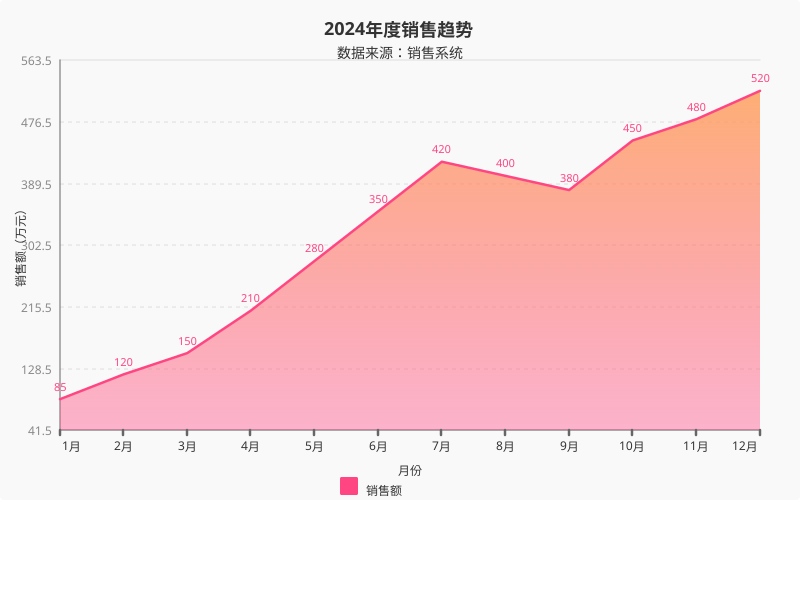

Demo: `jquick-pdfx/src/test/java/com/github/paohaijiao/demo/area/JQuickAreaTest.java`

```java
JGraphContainer graphContainer = new JGraphContainer();
graphContainer.setType(JChartType.AREA);

JAreaChartData data = new JAreaChartData();
data.setWidth(500);
data.setHeight(400);
data.setTitle("2024年度销售趋势");
data.setXAxisTitle("月份");
data.setYAxisTitle("销售额（万元）");
data.setShowDataLabels(true);
data.setSeriesList(Arrays.asList(new JSeriesData("销售额", values)));
data.setXAxisLabels(labels);

JOption option = new JOption();
option.setData(data);
graphContainer.setOption(option);
```

#### Horizontal Bar Chart

Preview: 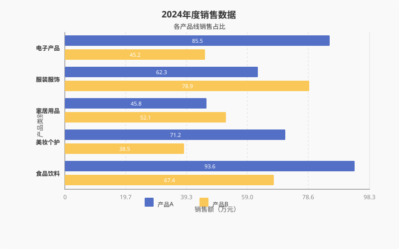

Demo: `jquick-pdfx/src/test/java/com/github/paohaijiao/demo/bar/JQuickHorizontalBarChartTest.java`

```java
JGraphContainer graphContainer = new JGraphContainer();
graphContainer.setType(JChartType.HorizontalBar);

JHorizontalBarChartData chartData = new JHorizontalBarChartData();
chartData.setTitleText("2024年度销售数据");
chartData.setWidth(300);
chartData.setHeight(400);
chartData.addYAxisLabel("电子产品");
chartData.addYAxisLabel("服装服饰");
chartData.addBarData(new JHorizontalBarChartData.BarData("产品A", productAValues, JHorizontalBarChartData.COLOR_A));
chartData.addBarData(new JHorizontalBarChartData.BarData("产品B", productBValues, JHorizontalBarChartData.COLOR_B));

JOption option = new JOption();
option.setData(chartData);
graphContainer.setOption(option);
```

#### Bubble Chart

Preview: 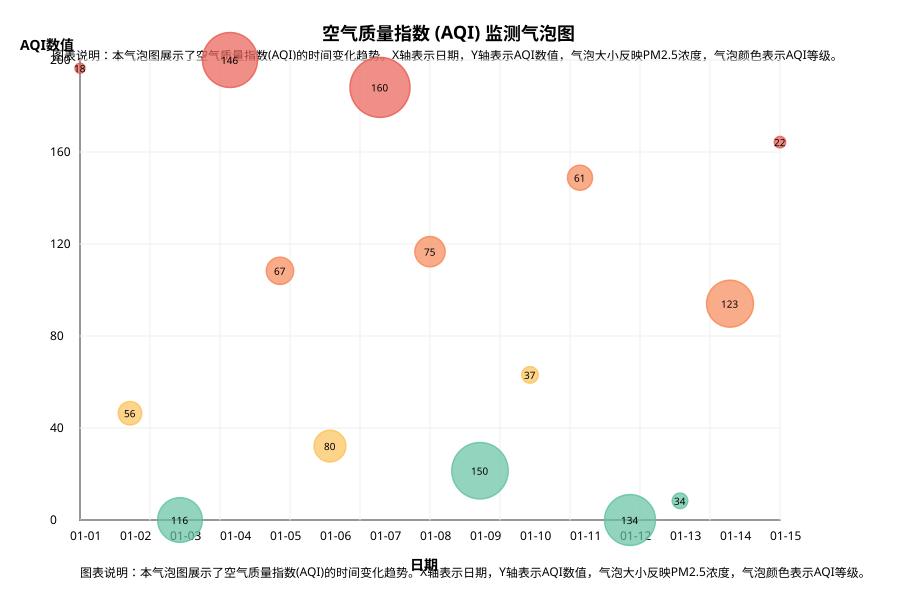

Demo: `jquick-pdfx/src/test/java/com/github/paohaijiao/demo/bubble/JQuickBubbleTest.java`

```java
JOption option = new JOption()
        .legend("优", "良", "轻度污染", "中度污染", "重度污染")
        .xAxis(new CategoryAxis().name("日期"))
        .yAxis(new ValueAxis().name("AQI数值"));

ScatterSeries series = new ScatterSeries("空气质量监测");
series.data(seriesData.toArray());
option.series(series);

JGraphContainer graphContainer = new JGraphContainer();
graphContainer.setType(JChartType.Bubble);
graphContainer.setOption(option);
```

#### Funnel Chart

Preview: 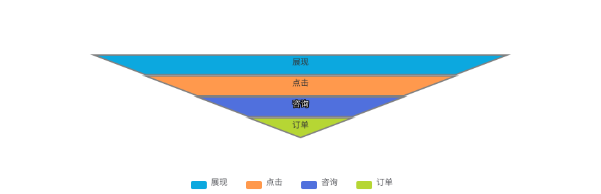

Demo: `jquick-pdfx/src/test/java/com/github/paohaijiao/demo/funnel/JQuickFunnelTest.java`

```java
JGraphContainer graphContainer = new JGraphContainer();
graphContainer.setType(JChartType.Funnel);

JFunnelOption option = JFunnelOption.createDefaultFunnel()
        .title(new Title().text("销售漏斗").subtext("2024年数据"))
        .funnel(new Funnel().width(600).topY(80).bottomY(200).gap(2))
        .series(Collections.singletonList(
                new Series().name("sales").type("funnel").data(Arrays.asList(
                        new DataItem("展现", 10000),
                        new DataItem("点击", 5000),
                        new DataItem("咨询", 2000),
                        new DataItem("订单", 500)
                ))));

JOption jOption = new JOption();
jOption.setFunnelOption(option);
graphContainer.setOption(jOption);
```

#### Calendar Chart

Preview: 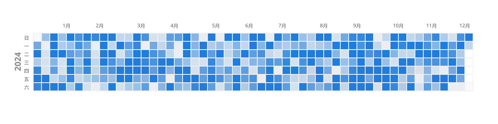

Demo: `jquick-pdfx/src/test/java/com/github/paohaijiao/demo/calendar/JQuickCalendarTest.java`

```java
Map<LocalDate, Integer> data = new HashMap<>();
JCalendarOption calendarOption = new JCalendarOption(
        "2024年活动日历",
        "类似GitHub贡献图",
        2024,
        data,
        new Color(235, 237, 240),
        new Color(32, 125, 222),
        new Color(232, 235, 240),
        new Color(84, 85, 90),
        20,
        80
);

JOption option = new JOption();
option.setJCalendarOption(calendarOption);
```

#### Geo / Map Chart

Preview: 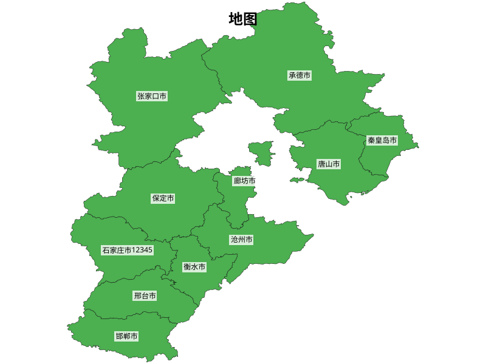

Demo: `jquick-pdfx/src/test/java/com/github/paohaijiao/demo/geo/JGeoTest.java`

```java
String geoJsonContent = readFromClasspath("sample/test.geojson");
GeoOption geoOption = new GeoOption();
geoOption.setGeoJsonContent(geoJsonContent);

JOption option = new JOption();
option.setGeoOption(geoOption);

JGraphContainer graphContainer = new JGraphContainer();
graphContainer.setType(JChartType.Geo);
graphContainer.setOption(option);
```

#### Double Radar Chart

Preview: 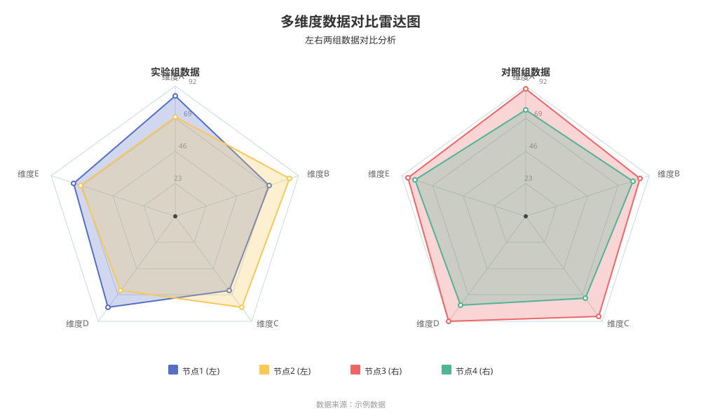

Demo: `jquick-pdfx/src/test/java/com/github/paohaijiao/demo/radar/JQuickTwoRadarTest.java`

```java
JGraphContainer graphContainer = new JGraphContainer();
graphContainer.setType(JChartType.DoubleRadar);

JDoubleRadarChartData chartData = new JDoubleRadarChartData();
chartData.setWidth(1000);
chartData.setHeight(600);
chartData.setTitleText("多维度数据对比雷达图");
chartData.setDimensions(Arrays.asList("维度A", "维度B", "维度C", "维度D", "维度E"));
chartData.setLeftTitle("实验组数据");
chartData.setRightTitle("对照组数据");
chartData.setLeftRadar(leftRadar);
chartData.setRightRadar(rightRadar);

JOption option = new JOption();
option.setData(chartData);
graphContainer.setOption(option);
```

#### Circle / Donut Chart

Preview: 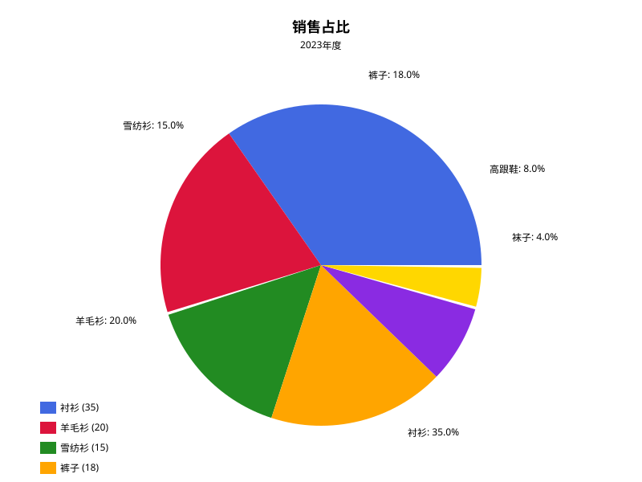

Demo: `jquick-pdfx/src/test/java/com/github/paohaijiao/demo/circle/JQuickCircleTest.java`

```java
JGraphContainer graphContainer = new JGraphContainer();
graphContainer.setType(JChartType.Circle);

JCircleChartData chartData = new JCircleChartData();
chartData.setWidth(500);
chartData.setHeight(400);
chartData.setTitleText("2024年度销售分布");
chartData.setCenterTitle("总销售额");
chartData.setCenterUnit("万");
chartData.setSectorDataList(sectors);

JOption option = new JOption();
option.setData(chartData);
graphContainer.setOption(option);
```

#### Gauge Chart

Preview: 

Demo: `jquick-pdfx/src/test/java/com/github/paohaijiao/demo/guage/JQuickGuageTest.java`

```java
GuageConfig scoreConfig = GuageConfig.builder()
        .score(75)
        .pointerColor(new Color(220, 80, 80))
        .backgroundColor(new Color(240, 240, 245))
        .title("PERFORMANCE")
        .build();

JGuageOption option = JGuageOption.builder().scoreMeter(scoreConfig).build();
JOption jOption = new JOption();
jOption.setGuageOption(option);
```

#### Gantt Chart

Preview: 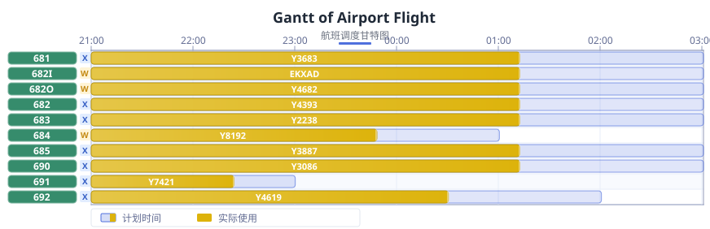

Demo: `jquick-pdfx/src/test/java/com/github/paohaijiao/demo/gantt/JGanttTest.java`

```java
JGanttOption option = new JGanttOption();
option.setTitle(new JGanttOption.Title("Gantt of Airport Flight", "航班调度甘特图"));
option.setFlightData(Arrays.asList(
        new JGanttOption.FlightData("Y3683", "681", "X", 21, 0, 360, 0, 0.7),
        new JGanttOption.FlightData("EKXAD", "682I", "W", 21, 0, 360, 1, 0.7)
));
option.setTimeRange(new JGanttOption.TimeRange(21, 3, new String[]{"21:00", "22:00", "23:00", "00:00"}));

JOption jOption = new JOption();
jOption.setGanttOption(option);
```

#### Matrix Chart

Preview: 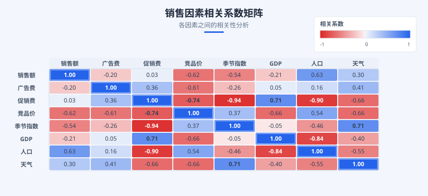

Demo: `jquick-pdfx/src/test/java/com/github/paohaijiao/demo/matrix/JQuickMatrixTest.java`

```java
double[][] correlationData = new double[][] {
        {1.00, -0.20, 0.03},
        {-0.20, 1.00, 0.36},
        {0.03, 0.36, 1.00}
};
String[] dimensions = {"销售额", "广告费", "促销费"};

JCorrelationMatrixOption option = JCorrelationMatrixOption.builder()
        .title("销售因素相关系数矩阵", "各因素之间的相关性分析")
        .dataset(correlationData)
        .build();
option.dataset().dimensions(dimensions);

JOption jOption = new JOption();
jOption.setCorrelationMatrixOption(option);
```

#### Line Bar Combo Chart

Preview: 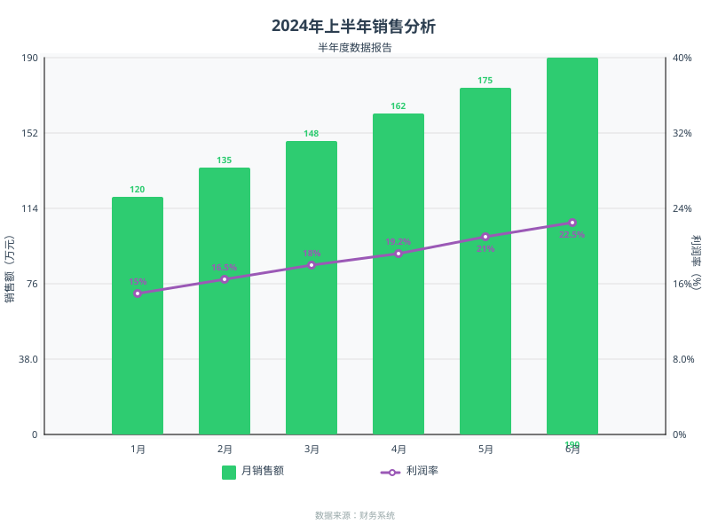

Demo: `jquick-pdfx/src/test/java/com/github/paohaijiao/demo/linebar/JQuickLineBarTest.java`

```java
JComboLineBarChartData data = JComboLineBarChartData.builder()
        .width(1000)
        .height(600)
        .title("2024年上半年销售分析", "半年度数据报告")
        .barData(sales)
        .lineData(profits)
        .xAxisLabels(months)
        .leftAxisTitle("销售额（万元）")
        .rightAxisTitle("利润率（%）")
        .build();

JOption option = new JOption();
option.setData(data);
```

#### Multiple Line Chart

Preview: 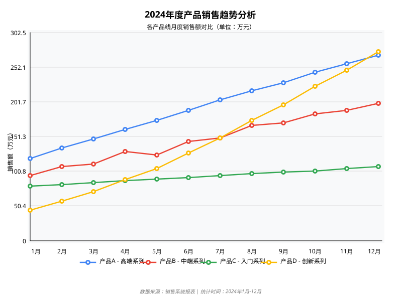

Demo: `jquick-pdfx/src/test/java/com/github/paohaijiao/demo/linebar/JQuickMutipleLineTest.java`

```java
JMultiLineChartData chartData = new JMultiLineChartData();
chartData.setXAxisLabels(months);
chartData.setWidth(900);
chartData.setHeight(600);
chartData.setTitleText("2024年度产品销售趋势分析");
chartData.setYAxisTitle("销售额（万元）");
chartData.setLineDataList(Arrays.asList(lineA, lineB, lineC, lineD));
chartData.updateMaxValues();

JOption option = new JOption();
option.setData(chartData);
```

#### Timeline Chart

Preview: 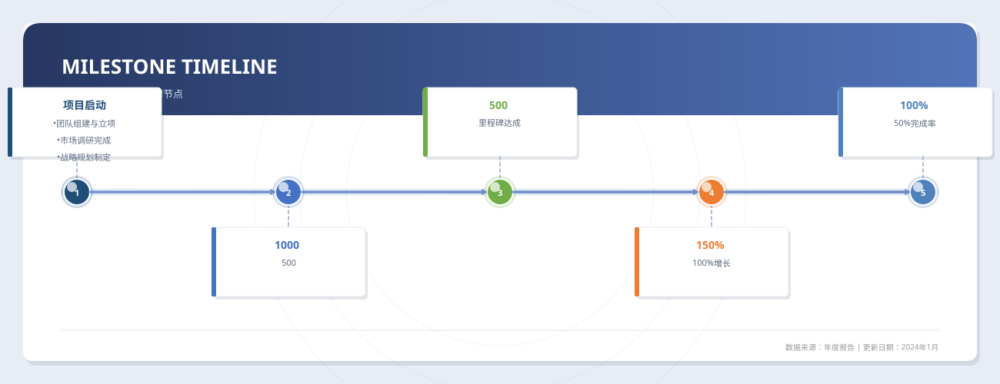

Demo: `jquick-pdfx/src/test/java/com/github/paohaijiao/demo/other/JQuickTimeLineTest.java`

```java
JTimeLineData data = new JTimeLineData();
data.setNodes(nodes);
data.setMainTitle("MILESTONE TIMELINE");
data.setSubtitle("2021-2023 关键里程碑节点");
data.setFooterText("数据来源：年度报告 | 更新日期：2024年1月");
data.setHeight(1300);
data.setBoxWidth(200);
data.setBoxHeight(90);

JOption option = new JOption();
option.setData(data);
```

#### Advanced Topology Chart

Preview: 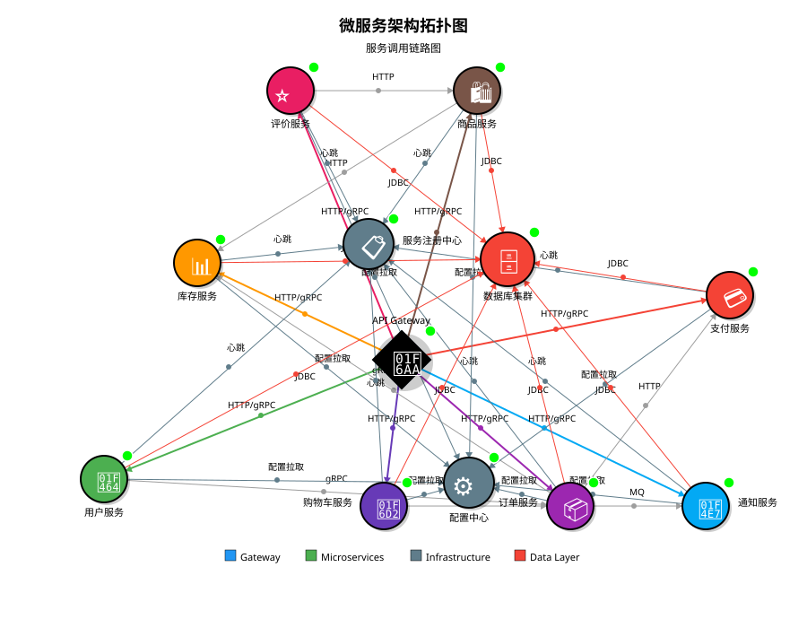

Demo: `jquick-pdfx/src/test/java/com/github/paohaijiao/demo/advance/JQuickAdvanceToplogyTest.java`

```java
JAdvancedTopologyData data = new JAdvancedTopologyData();
data.setTitleText("微服务架构拓扑图");
data.setSubtitleText("服务调用链路图");
data.setWidth(1200);
data.setHeight(800);
data.setAutoLayout(true);
data.setCurvedLinks(true);
data.setShowDataFlow(true);

data.getNodes().add(gateway);
data.getLinks().add(link);

JOption option = new JOption();
option.setData(data);
```

#### Multiple Bar Chart

Preview: 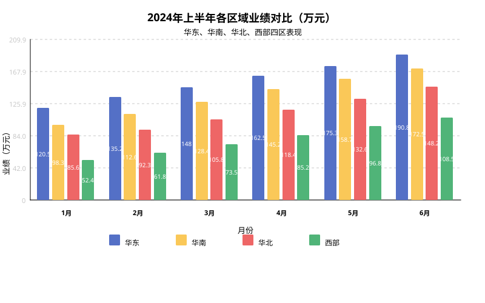

Demo: `jquick-pdfx/src/test/java/com/github/paohaijiao/demo/bar/JQuickMutipleBarTest.java`

```java
JGraphContainer graphContainer = new JGraphContainer();
graphContainer.setType(JChartType.MultipleBar);

JMultiBarChartData regionalData = new JMultiBarChartData();
regionalData.setTitleText("2024年上半年各区域业绩对比（万元）");
regionalData.setXAxisLabels(Arrays.asList("1月", "2月", "3月", "4月", "5月", "6月"));
regionalData.setXAxisTitle("月份");
regionalData.setYAxisTitle("业绩（万元）");
regionalData.setBarDataList(Arrays.asList(eastChina, southChina, northChina, westChina));

JOption option = new JOption();
option.setData(regionalData);
```

#### Multiple Horizontal Bar Chart

Preview: 

Demo: `jquick-pdfx/src/test/java/com/github/paohaijiao/demo/bar/JQuickMutipleHorizontalBarChartTest.java`

```java
JHorizontalMultiBarChartData chartData = new JHorizontalMultiBarChartData();
chartData.setTitleText("2024年度各产品销售数据");
chartData.setXAxisTitle("销售额（万元）");
chartData.setShowDataLabels(true);
chartData.setLegendAtTop(true);
chartData.addCategory("智能手机");
chartData.addCategory("笔记本电脑");
chartData.addSeries("品牌 A", productAValues, new Color(52, 73, 94));
chartData.addSeries("品牌 B", productBValues, new Color(41, 128, 185));
chartData.addSeries("品牌 C", productCValues, new Color(26, 188, 156));

JOption option = new JOption();
option.setData(chartData);
```

#### Line Radar Chart

Preview: 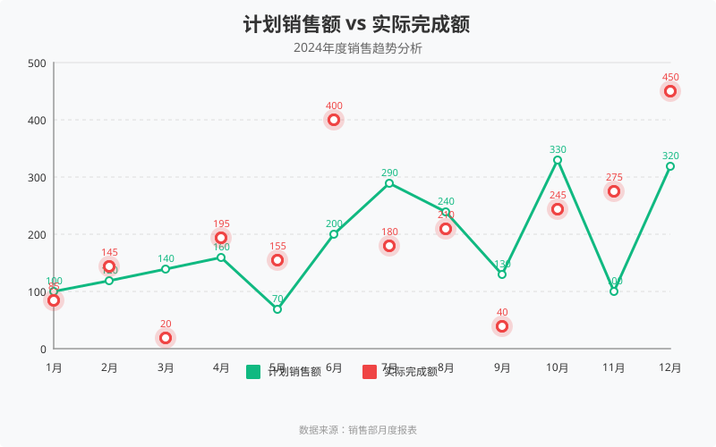

Demo: `jquick-pdfx/src/test/java/com/github/paohaijiao/demo/bar/JQuickLineRadarChartTest.java`

```java
JLineScatterChartData data = new JLineScatterChartData();
data.setTitleText("计划销售额 vs 实际完成额");
data.setCategories(categories);
data.setLineValues(lineValues);
data.setScatterValues(scatterValues);
data.setLineSeriesName("计划销售额");
data.setScatterSeriesName("实际完成额");
data.setMaxValue(500);
data.setShowDataLabels(true);

JOption option = new JOption();
option.setData(data);
```

#### Lunar Calendar Chart

Preview: 

Demo: `jquick-pdfx/src/test/java/com/github/paohaijiao/demo/lunar/JQuickLunarTest.java`

```java
LunarCalendarOption.CalendarDataConfig dataConfig = new LunarCalendarOption.CalendarDataConfig()
        .setDayDataList(createDefaultDayData())
        .setSpecialDays(createDefaultSpecialDays())
        .setWeekDays(new String[]{"Mon", "Tue", "Wed", "Thu", "Fri", "Sat", "Sun"})
        .setRows(5)
        .setCols(7);

LunarCalendarOption option = LunarCalendarOption.of("2024", "三月", colorConfig, title, dataConfig);
```

#### Tree Chart

Preview: 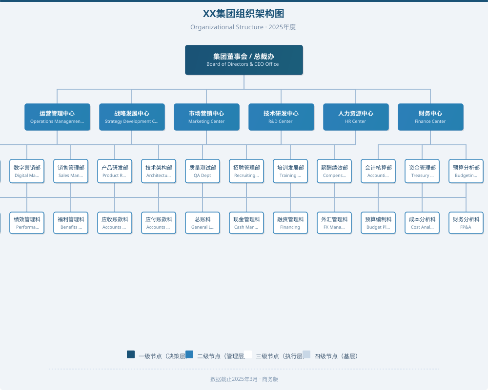

Demo: `jquick-pdfx/src/test/java/com/github/paohaijiao/demo/other/JQuickTreeTest.java`

```java
JTreeChartData data = new JTreeChartData();
data.setWidth(1100);
data.setHeight(750);
data.setTitleText("XX集团组织架构图");
data.setRootNodeWidth(240);
data.setLevelNodeWidth(190);
data.setHorizontalSpacing(70);
data.setVerticalSpacing(60);
data.setRootNode(root);

JOption option = new JOption();
option.setData(data);
```

#### TreeMap Chart

Preview: 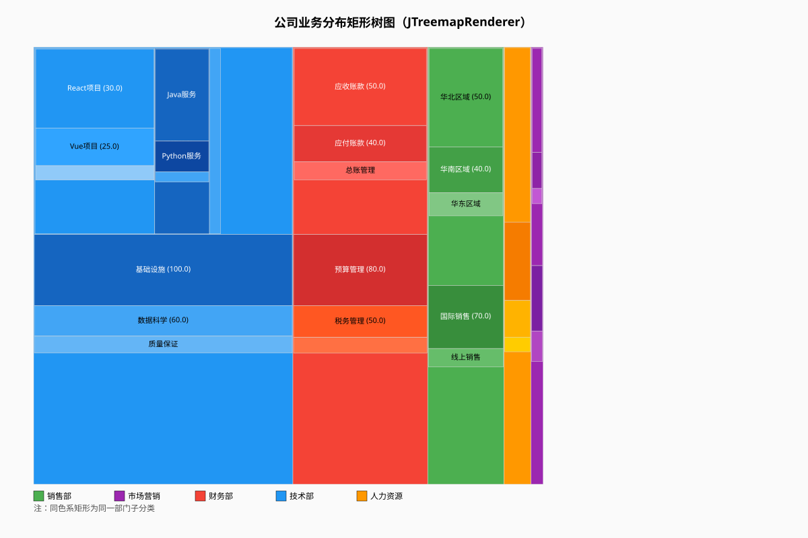

Demo: `jquick-pdfx/src/test/java/com/github/paohaijiao/demo/other/JQuickTreeMapTest.java`

```java
JTreeMapNode root = createTestData();
TreeMapOption treemapOption = new TreeMapOption();
treemapOption.setRoot(root);
treemapOption.setDepartmentColors(DEPARTMENT_COLORS);
treemapOption.setCategoryColors(CATEGORY_COLORS);
treemapOption.getDepartmentRules().add(new TreeMapMapping("开发", "技术部"));

graphContainer.setType(JChartType.TreeMap);
JOption option = new JOption();
option.setTreemapOption(treemapOption);
```

#### Sunburst Chart

Preview: 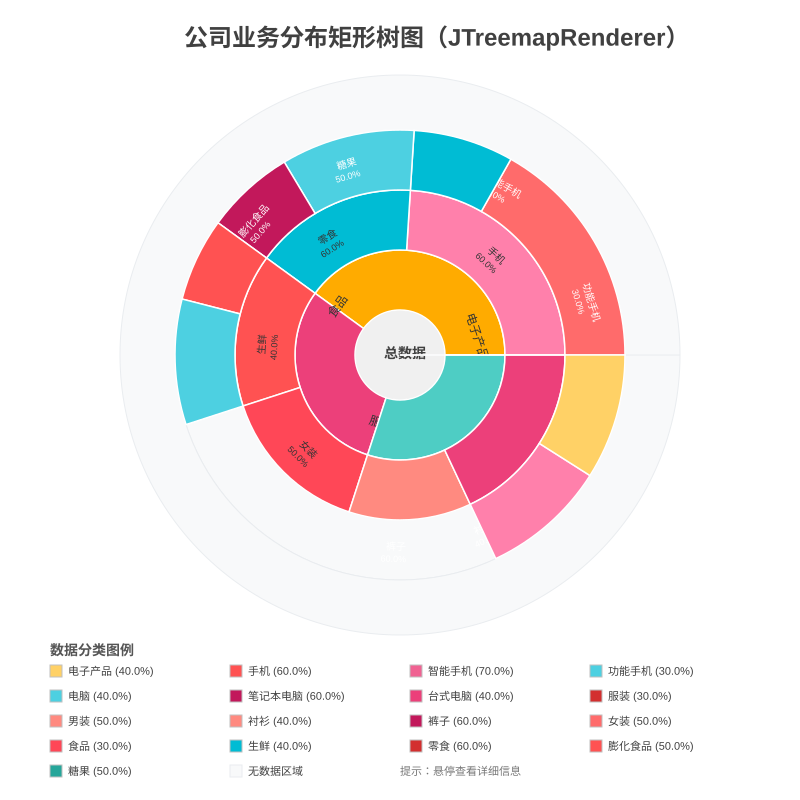

Demo: `jquick-pdfx/src/test/java/com/github/paohaijiao/demo/sunburd/JQuickSunburdTest.java`

```java
JSunburstData root = new JSunburstData("总数据", 1.0);
JSunburstData main1 = new JSunburstData("电子产品", 0.4);
main1.addChild(new JSunburstData("手机", 0.6));
main1.addChild(new JSunburstData("电脑", 0.4));
root.addChild(main1);

JOption option = new JOption();
option.setSunburstData(root);
```

#### Credit Report Composite Demo

Preview: see the enterprise credit report section and the `images/` previews

Demo: `jquick-pdfx/src/test/java/com/github/paohaijiao/demo/creditreport/JQuickCreditReportTest.java`

```java
JReader htmlReader = new JReSourceFileReader("html.txt");
JAdaptor htmlAdaptor = new JAdaptor(htmlReader);
JPdfConfig config = new JPdfConfig();
JTemplateConfig templateConfig = config.getTemplateConfig();
templateConfig.put("html", htmlAdaptor.getRuleContent());
config.setTemplateConfig(templateConfig);

JReader svgReader = new JReSourceFileReader("radar.txt");
JAdaptor svgAdaptor = new JAdaptor(svgReader);
JQuickPdfFactory factory = new JQuickPdfFactory(config);
factory.bind("svg", svgAdaptor.getRuleContent());
byte[] bytes = factory.executeResource("report.txt");
```
---

## 📚 API and Template Tag Reference

> This section is split into two parts: Java core APIs and XML template tags with attributes.

### 1. Java Core APIs

#### `JQuickPdfXExecutor`

This is the main execution entry in the repository.

It supports:

- empty constructor
- constructor with `JContext`
- constructor with `JPdfConfig`
- constructor with both `JContext` and `JPdfConfig`

Typical construction:

```java
JQuickPdfXExecutor executor1 = new JQuickPdfXExecutor();
JQuickPdfXExecutor executor2 = new JQuickPdfXExecutor(context);
JQuickPdfXExecutor executor3 = new JQuickPdfXExecutor(config);
JQuickPdfXExecutor executor4 = new JQuickPdfXExecutor(context, config);
```

Main flow responsibilities:

- parse template text
- build the ANTLR parse tree
- render PDF through `JPdfXCommonVisitor`
- return an `OutputStream`

#### Common configuration objects

| Configuration | Purpose | Notes |
|---|---|---|
| `JPdfConfig` | Top-level PDF config | Main entry for page, margin, font, chart, template, and more |
| `JTemplateConfig` | Template fragment config | `templateConfig.put("html", htmlString)` |
| `JGraphConfig` | Chart config | Provides chart data for chart-related rendering |
| `JTreeNodeConfig` | Tree config | Provides tree data for the tree tag |
| `JContext` | Variable context | Provides values for `${variable}` |

#### Common `JPdfConfig` fields

| Field | Purpose |
|---|---|
| `defaultPageSize` | Default page size |
| `margins` | Page margin list |
| `reverse` | Page order control |
| `catalogConfig` | Catalog configuration |
| `doc` | Document configuration |
| `pageConfig` | Page configuration |
| `headerConfig` | Header configuration |
| `footerConfig` | Footer configuration |
| `watermarkConfig` | Watermark configuration |
| `fontConfig` | Font configuration |
| `securityConfig` | Security configuration |
| `graphConfig` | Chart configuration |
| `comboBoxFieldConfig` | ComboBox configuration |
| `treeConfig` | Tree node configuration |
| `templateConfig` | Template fragment configuration |

### 2. XML Template Tags and Attributes

> Note: style naming in the repository follows actual examples. Common keys include `fontSize`, `marginBottom`, `backgroundColor`, `width`, and `height`. This section now includes copyable demo snippets in addition to the attribute tables.

#### Page-level global attributes

| Tag | Attribute | Description | Example |
|---|---|---|---|
| `<pdf>` / `<html>` | `page-width` | Page width, document-level control | `595` |
| `<pdf>` / `<html>` | `page-height` | Page height, document-level control | `842` |
| `<pdf>` / `<html>` | `margin-left` | Left margin | `36` |
| `<pdf>` / `<html>` | `margin-right` | Right margin | `36` |
| `<pdf>` / `<html>` | `margin-top` | Top margin | `36` |
| `<pdf>` / `<html>` | `margin-bottom` | Bottom margin | `36` |
| `<areaBreak>` | - | Force page break | - |
| `<htmlPageBreak>` | - | Page switch | - |

Page-level demo:

```xml
<pdf page-width="595" page-height="842" margin-left="36" margin-right="36" margin-top="36" margin-bottom="36">
  <body>
    <p>'First page content'</p>
    <areaBreak></areaBreak>
    <p>'Second page content'</p>
  </body>
</pdf>
```

#### Container / text

| Tag | Attribute | Description | Example |
|---|---|---|---|
| `<div>` | `width` | Container width | `400px` |
| `<div>` | `height` | Container height | `230px` |
| `<div>` | `padding` | Inner padding | `15px` |
| `<div>` | `margin` | Outer margin | `30 0 20 0` |
| `<div>` | `background` / `backgroundColor` | Background color | `#f8f9fa` |
| `<div>` | `borderRadius` | Border radius | `4px` |
| `<div>` | `textAlignment` | Text alignment | `center` |
| `<p>` / `<paragraph>` | `fontSize` | Font size | `11` |
| `<p>` / `<paragraph>` | `fontFamily` | Font family | `微软雅黑` |
| `<p>` / `<paragraph>` | `color` / `fontColor` | Text color | `#2c3e50` |
| `<p>` / `<paragraph>` | `marginBottom` | Bottom margin | `8px` |
| `<heading>` | `fontSize` | Heading size | `20` |
| `<heading>` | `fontWeight` | Font weight | `bold` |
| `<span>` | `color` | Text color | `#3498db` |
| `<span>` | `background` | Background color | `#ffffff` |

Container / text demo:

```xml
<div style="textAlignment:center; marginBottom:12px; padding:12px; background:#3E6B9D; color:white; borderRadius:4px">
  <h1 style="fontSize:20; fontWeight:bold; marginBottom:8px">'企业信用评级报告'</h1>
  <p style="fontSize:11; margin:2px">'报告编号: CR-2023-08975'</p>
  <p style="fontSize:11; margin:2px">
    <span style="fontWeight:bold">'评估机构: '</span>
    '四川省企业信用评估中心'
  </p>
</div>
```

#### Table

| Tag | Attribute | Description | Example |
|---|---|---|---|
| `<table>` | `width` | Table width | `600px` |
| `<table>` | `border` | Border | `1px solid #ddd` |
| `<table>` | `cell-padding` / `padding` | Common cell padding styles | `8px` |
| `<table>` | `cell-spacing` | Cell spacing | `0` |
| `<table>` | `fontSize` | Table text font size | `10` |
| `<td>` / `<th>` | `padding` | Cell padding | `10px` |
| `<td>` / `<th>` | `backgroundColor` | Cell background color | `#f8f9fa` |

Table demo:

```xml
<table style="width:600px; fontSize:10; marginTop:8px">
  <tr>
    <th style="backgroundColor:#3498db; color:white; padding:6px; textAlign:center; border:1px solid #dee2e6">'财务指标'</th>
    <th style="backgroundColor:#3498db; color:white; padding:6px; textAlign:center; border:1px solid #dee2e6">'2023年'</th>
  </tr>
  <tr>
    <td style="backgroundColor:#f8f9fa; padding:5px; textAlign:left; border:1px solid #dee2e6">'营业收入'</td>
    <td style="padding:5px; textAlign:right; border:1px solid #dee2e6">'25,680'</td>
  </tr>
</table>
```

#### Image

| Tag | Attribute | Description | Example |
|---|---|---|---|
| `<image>` | `src` | Image source | `https://...` |
| `<image>` | `width` | Image width | `200px` |
| `<image>` | `height` | Image height | `300px` |
| `<image>` | `alt` | Alternate description | `logo` |

Image demo:

```xml
<div style="marginTop:10px; textAlignment:center">
  <image src="https://bkimg.cdn.bcebos.com/pic/8b13632762d0f703918f27f985a2463d269759ee6fc7" style="width:240px;height:120px"></image>
</div>
```

#### Chart

| Tag | Attribute | Description | Example |
|---|---|---|---|
| chart configuration | `type` | Chart type | `RADAR` |
| chart configuration | `width` | Chart width | `400` |
| chart configuration | `height` | Chart height | `400` |
| chart configuration | `data` | Chart data source | `JGraphConfig` binding |

Chart demo:

```xml
<div style="margin-bottom:15px">
  <h2 style="color:#3498db; borderBottom:1px solid #3498db; paddingBottom:4px; fontSize:13; marginBottom:10px">'信用评级雷达图'</h2>
  <svg style="width:400px;height:400px">${svg}</svg>
</div>
```

#### SVG

| Tag | Attribute | Description | Example |
|---|---|---|---|
| `<svg>` | `width` | Render width | `400px` |
| `<svg>` | `height` | Render height | `400px` |
| `<svg>` | `viewBox` | SVG viewport | `0 0 500 450` |
| `<svg>` | `xmlns` | SVG namespace | `http://www.w3.org/2000/svg` |

SVG demo:

```xml
<pdf>
  <body>
    <svg style="width:400px;height:400px">${svg}</svg>
  </body>
</pdf>
```
---

## 🖼️ Preparing SVG Data

JQuickPDF supports embedding SVG strings into templates.

The built-in chart capability is the wrapped chart system, suitable when you want Java-side chart configuration. The `svg` tag is more suitable for external vector graphics, such as business charts or static SVG exported from design or visualization tools.

### SVG Render Showcase

> The images below come directly from the repository `images/` directory and can be used as SVG rendering references.

#### Basic Charts

| Chart | Preview |
|---|---|
| Bar | 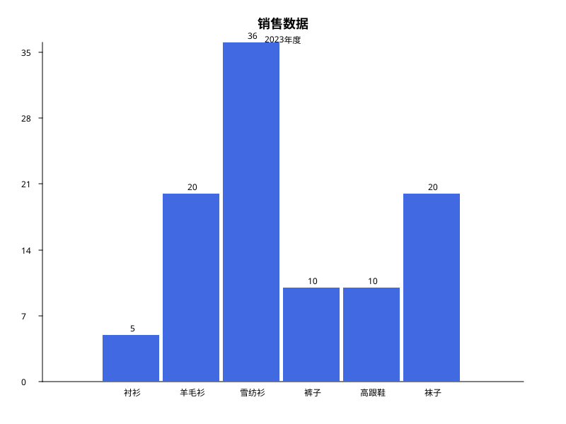 |
| Line | 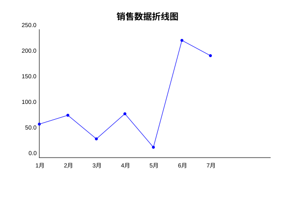 |
| Pie |  |
| Radar | 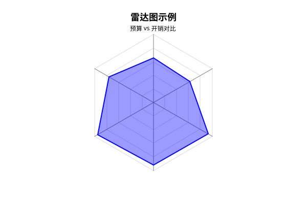 |
| Heatmap | 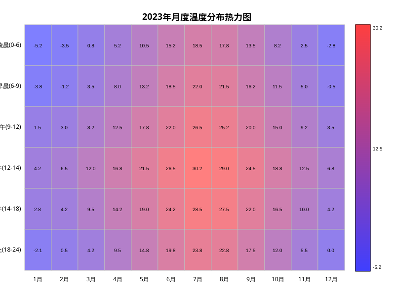 |
| Scatter | 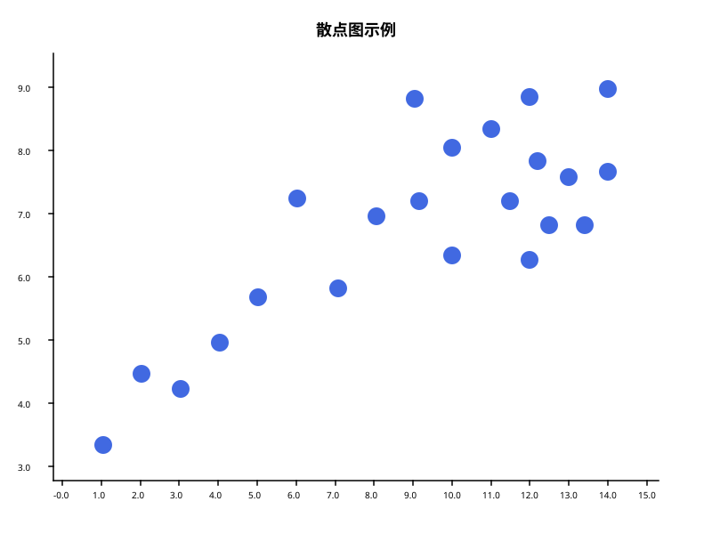 |
| Boxplot | 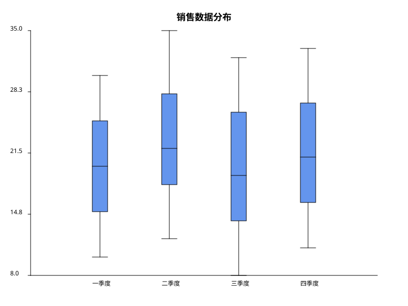 |
| Bubble |  |
| Area |  |
| Funnel |  |

#### Combo and Business Charts

| Chart | Preview |
|---|---|
| Horizontal Bar |  |
| Multiple Bar |  |
| Multiple Line |  |
| Line Bar |  |
| Line Radar |  |
| Double Radar |  |
| Treemap |  |
| Word Cloud | 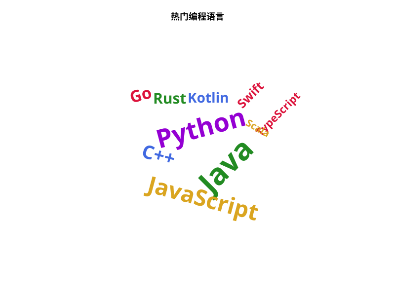 |
| Timeline |  |
| Gantt |  |

#### Special-Scenario Charts

| Chart | Preview |
|---|---|
| Gauge |  |
| Calendar |  |
| K-line | 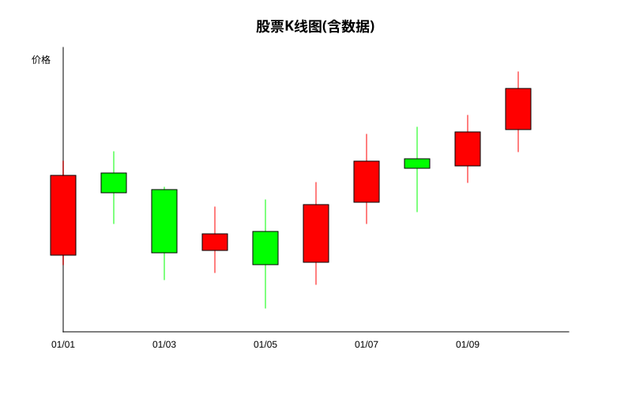 |
| Geo / Map |  |
| Relation | 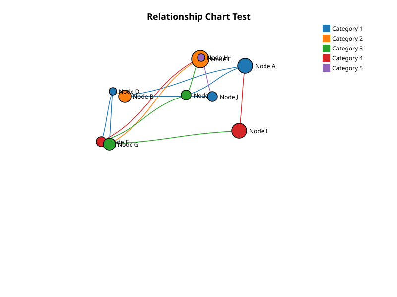 |
| Matrix |  |
| Sunburst |  |
| Tree |  |
| Advanced Topology |  |
| Enterprise Network Topology | 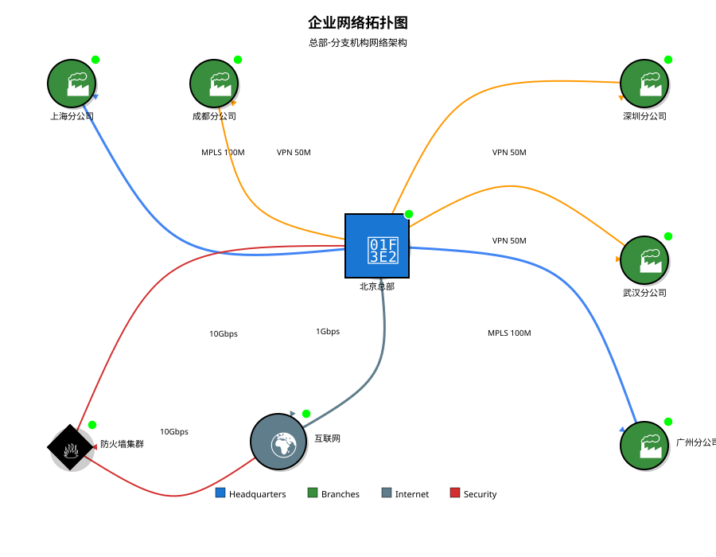 |
| Cloud Architecture Topology | 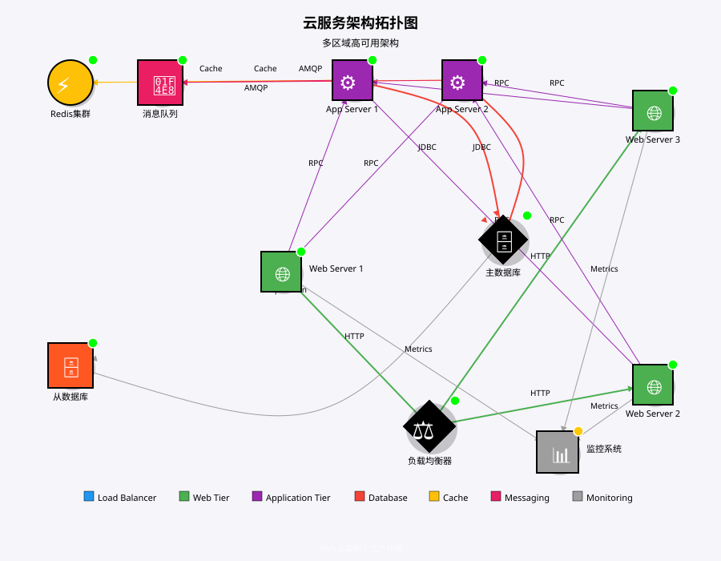 |
| Datacenter Topology | 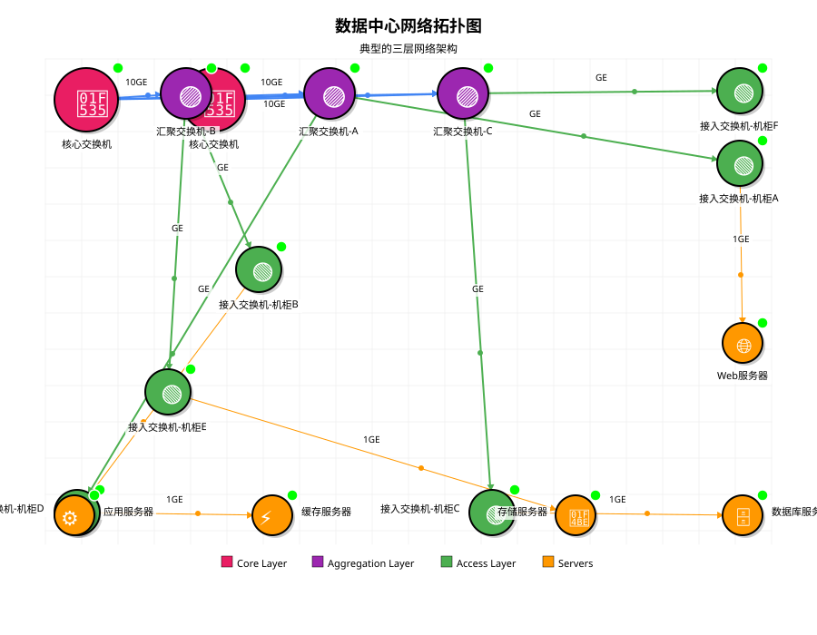 |
| Manual Layout Topology | 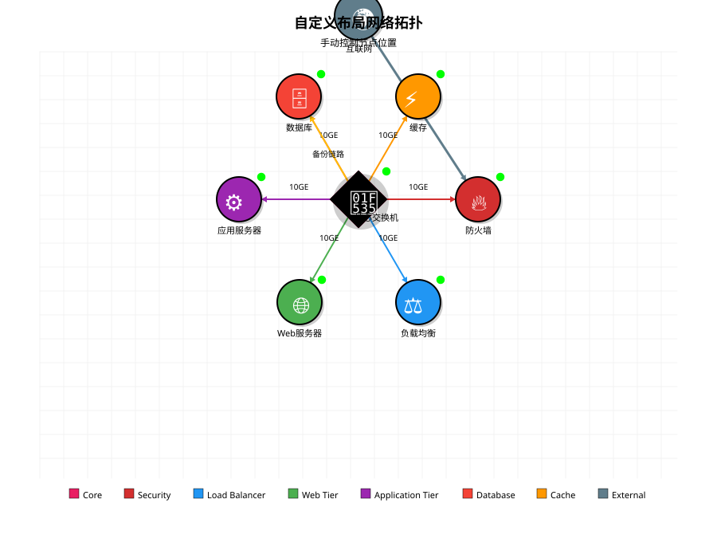 |

### Method 1: Handwritten native SVG string

Suitable for simple shapes, icons, and fixed-structure drawings.

```java
import com.github.paohaijiao.param.JContext;

JContext context = new JContext();
context.put("svg", "<svg xmlns=\"http://www.w3.org/2000/svg\" width=\"120\" height=\"108\" viewBox=\"0 0 500 450\"><rect x=\"10\" y=\"10\" width=\"100\" height=\"50\" fill=\"#3498db\"/></svg>");
```

### Method 2: Export SVG from ECharts or other visualization tools

This is the most common approach in business reporting.

You generate SVG on the frontend or in a chart tool, then pass the exported SVG string into the template.

```java
import com.github.paohaijiao.param.JContext;

JContext context = new JContext();
context.put("svg", svgContentFromEcharts);
```

### Method 3: Read a local `.svg` file and pass its content as a string

Do not pass the file path directly to `<svg>`. Read the file content first, then pass the string.

```java
import com.github.paohaijiao.param.JContext;

JContext context = new JContext();
context.put("svg", svgFileContent);
```

### Template embedding syntax

```xml
<pdf>
  <body>
    <svg>${svg}</svg>
  </body>
</pdf>
```

You can also control rendering size on the `svg` tag itself:

```xml
<pdf>
  <body>
    <svg style="width:400px;height:400px">${svg}</svg>
  </body>
</pdf>
```

### Java parameter example

```java
import com.github.paohaijiao.adaptor.JAdaptor;
import com.github.paohaijiao.executor.JQuickPdfXExecutor;
import com.github.paohaijiao.param.JContext;
import com.github.paohaijiao.resouce.JReader;
import com.github.paohaijiao.resouce.impl.JReSourceFileReader;

public class SvgDemo {
    public static void main(String[] args) throws Exception {
        JContext context = new JContext();
        context.put("svg", svgContent);

        JReader reader = new JReSourceFileReader("sample/svg1.txt");
        JAdaptor adaptor = new JAdaptor(reader);

        JQuickPdfXExecutor executor = new JQuickPdfXExecutor(context);
        executor.execute(adaptor.getRuleContent());
    }
}
```

### Common pitfalls

- ⚠️ SVG must include the full namespace: `xmlns="http://www.w3.org/2000/svg"`
- ⚠️ Avoid animation, scripts, and interaction logic; use static SVG only
- ⚠️ `viewBox` must be correct, otherwise stretching can happen
- ⚠️ Do not pass a `.svg` file path directly; pass the string content instead
- ⚠️ `width` / `height` on the `svg` tag itself affects the final rendered size

---

## 📊 Supported Chart Overview

| Chart Type | Description |
|---|---|
| BAR | Bar chart |
| BOXPLOT | Box plot |
| HEATMAP | Heatmap |
| K | K-line / candlestick chart |
| LINE | Line chart |
| PIE | Pie chart |
| RADAR | Radar chart |
| RELATION | Relationship graph |
| SCATTER | Scatter plot |
| SUNBURST | Sunburst |
| Treemap | Treemap |
| Bubble | Bubble chart |
| Calendar | Calendar activity chart |
| Lunar | Calendar |
| Funnel | Funnel chart |
| CorrectionMatrix | Correlation matrix |
| Gantt | Gantt chart |
| Gauge | Gauge chart |
| WordsCloud | Word cloud |
| GEO Json | Map |
| Line Bar | Line + bar combo chart |
| Multiple Line | Multi-line chart |
| Multiple Bar | Multi-bar chart |
| AREA | Area stacked chart |
| HorizontalBar | Horizontal bar chart |
| MutipleHorizontalBar | Multiple horizontal bar chart |
| DoubleRadar | Double radar chart |
| LineRadar | Radar line chart |
| Circle | Donut chart |
| AdvancedTopology | Advanced topology chart |
| TimeLine | Timeline |
| Tree | Tree |

---

## 🎯 Business Scenario Example

### Enterprise Credit Report

The repository already provides enterprise credit report examples:

- `jquick-pdfx/src/test/java/com/github/paohaijiao/demo/creditreport/JQuickCreditReportTest.java`
- `jquick-pdfx/src/test/resources/report.txt`
- `jquick-pdfx/src/test/resources/html.txt`
- `jquick-pdfx/src/test/resources/radar.txt`

#### Demo skeleton overview

This scenario includes:

- page title area
- enterprise basic-info table
- template fragment insertion
- financial data table
- multi-paragraph business description
- SVG radar chart
- pagination
- bottom notes and stamp area

#### Core Java code

```java
import com.github.paohaijiao.adaptor.JAdaptor;
import com.github.paohaijiao.config.JPdfConfig;
import com.github.paohaijiao.config.JTemplateConfig;
import com.github.paohaijiao.executor.JQuickPdfFactory;
import com.github.paohaijiao.resouce.JReader;
import com.github.paohaijiao.resouce.impl.JReSourceFileReader;

public class CreditReportDemo {
    public static void main(String[] args) throws Exception {
        JReader htmlReader = new JReSourceFileReader("html.txt");
        JAdaptor htmlAdaptor = new JAdaptor(htmlReader);

        JReader svgReader = new JReSourceFileReader("radar.txt");
        JAdaptor svgAdaptor = new JAdaptor(svgReader);

        JPdfConfig config = new JPdfConfig();
        JTemplateConfig templateConfig = config.getTemplateConfig();
        templateConfig.put("html", htmlAdaptor.getRuleContent());
        config.setTemplateConfig(templateConfig);

        JQuickPdfFactory factory = new JQuickPdfFactory(config);
        factory.bind("svg", svgAdaptor.getRuleContent());

        byte[] pdf = factory.executeResource("report.txt");
    }
}
```

#### Template skeleton snippet

```xml
<pdf>
  <body>
    <div style="textAlignment:center; marginBottom:5px; padding:12px; background:#3E6B9D; color:white; borderRadius:4px">
      <h1 style="fontSize:20; fontWeight:bold; marginBottom:8px">'企业信用评级报告'</h1>
      <p style="fontSize:11; margin:2px">'报告编号: CR-2023-08975 | 评估日期: 2023年11月15日'</p>
      <p style="fontSize:11; margin:2px">'评估机构: 四川省企业信用评估中心'</p>
    </div>

    <table style="width:600px; fontSize:10; marginTop:8px">
      <tr>
        <td style="backgroundColor:#f8f9fa; padding:5px; width:150px">'统一信用代码'</td>
        <td style="padding:5px; width:150px">'91110108MA01XX1234'</td>
        <td style="backgroundColor:#f8f9fa; padding:5px; width:150px">'成立日期'</td>
        <td style="padding:5px; width:150px">'2018年5月20日'</td>
      </tr>
    </table>

    <template>&html</template>

    <div style="margin-bottom:15px">
      <h2 style="color:#3498db; borderBottom:1px solid #3498db; paddingBottom:4px; fontSize:13; marginBottom:10px">'关键经营指标'</h2>
      <list style="list-style-type:none; padding-left:0; font-size:11px">
        <li style="margin-bottom:8px; padding:10px; background-color:#f8f9fa; border-left:4px solid #4CAF50">'营收增长率: 连续三年保持40%以上增长'</li>
        <li style="margin-bottom:8px; padding:10px; background-color:#f8f9fa; border-left:4px solid #2196F3">'利润率提升: 盈利能力显著增强'</li>
      </list>
    </div>

    <div style="margin-bottom:15px">
      <h2 style="color:#3498db; borderBottom:1px solid #3498db; paddingBottom:4px; fontSize:13; marginBottom:10px">'信用评级雷达图'</h2>
      <svg style="width:400px;height:400px">${svg}</svg>
    </div>

    <areaBreak></areaBreak>

    <div style="margin-bottom:15px; background:#e3f2fd; padding:15px; borderRadius:4px; border-left:4px solid #2196F3">
      <h2 style="color:#1565c0; fontSize:13; marginBottom:8px">'综合评价'</h2>
      <p style="line-height:1.5; font-size:11px">'公司财务状况健康，经营能力突出，具备良好的发展潜力。'</p>
    </div>

    <div style="text-align:center; margin-top:15px; padding-top:12px; border-top:1px solid #dee2e6; color:#6c757d; font-size:9px">
      <p>'本报告依据公开信息和专业评估模型生成，仅供参考'</p>
      <p>'© 企业信用评估中心 | 签章区'</p>
    </div>
  </body>
</pdf>
```

> Please check the demo directory and `report.txt` for the full source and full template.

---

## 📌 ⚠️ Important Retrospective License Statement

> **Please read carefully.**

- **All versions 4.0.0 and below are retroactively licensed under AGPL-3.0.**
- **The previously stated Apache-2.0 license has been formally revoked.**
- This change is caused by the project’s dependency on **iText 7**, which is distributed under the **AGPL-3.0** license.
- For open-source projects: versions 4.0.0 and below may be used for free under **AGPL-3.0** terms.
- ⚠️ For closed-source commercial projects: if you integrate this library directly into a closed-source commercial product, you must obtain a commercial license from **iText Group NV**.
- The current roadmap is evaluating migration to **Apache PDFBox**, and a more Apache-2.0-friendly version is planned for the future.
- When using this project, you should preserve iText attribution and comply with its license obligations.

---

## 🗺️ Roadmap

- [ ] Evaluate migration to Apache PDFBox
- [ ] Release an Apache-2.0-friendly version
- [ ] Continue improving templates and chart capabilities
- [ ] Improve Chinese font and typography support
- [ ] Add more business-oriented demos

---

## ❓ FAQ

### 1. What scenarios is JQuickPDF suitable for?
It is suitable for enterprise credit reports, business reports, image-text PDFs, chart-based documents, and template-driven document generation.

### 2. Does it require a browser?
No. JQuickPDF is pure Java and does not rely on a browser or WebKit.

### 3. Does it support template engines?
Yes. It can work with Thymeleaf, FreeMarker, and other template engines.

### 4. How should SVG data be prepared?
You can handwrite SVG strings, export SVG from ECharts or other visualization tools, or read a local `.svg` file into a string before passing it to the template.

### 5. Can SVG come directly from ECharts export?
Yes. This is a common approach in business reporting, as long as you pass a complete SVG string rather than a file path.

---

## ☕ Donate & Support

If this project helps you, please give it a Star ⭐.

You are also welcome to support the author through the sponsorship options in the repository.

---

## 🤝 Contributing

Issues, PRs, and suggestions are welcome.

You can contribute in areas such as:

- Documentation improvements
- More demos
- Chart extensions
- Template enhancements
- PDFBox migration and font support improvements

---

## 🔗 Related Links

- GitHub: https://github.com/paohaijiao/jquick-pdf
- Gitee: https://gitee.com/paohaijiao/jquick-pdf
- Issues: https://github.com/paohaijiao/jquick-pdf/issues
- Changelog: [change.md](./change.md)

---

## 📜 License

Please refer to [LICENSE](./LICENSE) for the project license statement.

> Versions 4.0.0 and below are retroactively licensed under AGPL-3.0.
- Documentation improvements
- More demos
- Chart extensions
- Template enhancements
- PDFBox migration and font support improvements

---

## 🔗 Related Links

- GitHub: https://github.com/paohaijiao/jquick-pdf
- Gitee: https://gitee.com/paohaijiao/jquick-pdf
- Issues: https://github.com/paohaijiao/jquick-pdf/issues
- Changelog: [change.md](./change.md)

---

## 📜 License

Please refer to [LICENSE](./LICENSE) for the project license statement.

> Versions 4.0.0 and below are retroactively licensed under AGPL-3.0.
