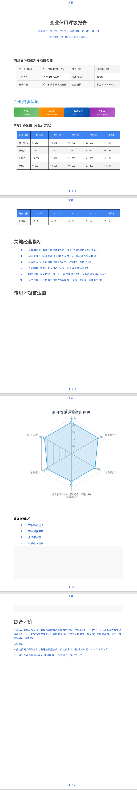

# JQuickPDF 文档
简体中文 | [英文](./readme-en.md)
- [1. 概述](#1-概述)
- [2. 安装](#2-安装)
- [3. 基本语法](#3-基本语法)
- [4. 元素样式](#4-元素样式)
    - [4.1 块元素样式](#41-块元素样式)
    - [4.2 元素属性样式](#42-元素属性样式)
- [5. 内容元素](#5-内容元素)
    - [5.1 文本元素](#51-文本元素)
        - [5.1.1 段落](#511-段落)
        - [5.1.2 标题（h1-h6）](#512-标题h1-h6)
        - [5.1.3 行内文本](#513-行内文本)
        - [5.1.4 制表符](#514-制表符)
    - [5.2 布局元素](#52-布局元素)
        - [5.2.1 容器](#521-容器)
        - [5.2.2 区域分隔](#522-区域分隔)
        - [5.2.3 HTML 分页符](#523-html-分页符)
    - [5.3 列表元素](#53-列表元素)
        - [5.3.1 列表](#531-列表)
    - [5.4 表格元素](#54-表格元素)
        - [5.4.1 表格](#541-表格)
    - [5.5 表单元素](#55-表单元素)
        - [5.5.1 按钮](#551-按钮)
        - [5.5.2 复选框](#552-复选框)
        - [5.5.3 输入框](#553-输入框)
        - [5.5.4 下拉选择框](#554-下拉选择框)
    - [5.6 媒体元素](#56-媒体元素)
        - [5.6.1 图片](#561-图片)
        - [5.6.2 矢量图形](#562-矢量图形)
- [6. 图表类型枚举值](#6-图表类型枚举值)
    - [6.1 柱状图（示例代码）](#61-柱状图示例代码)
    - [6.2 箱线图（示例代码）](#62-箱线图示例代码)
    - [6.3 热力图（示例代码）](#63-热力图示例代码)
    - [6.4 K线图（示例代码）](#64-k线图示例代码)
    - [6.5 折线图（示例代码）](#65-折线图示例代码)
    - [6.6 饼图（示例代码）](#66-饼图示例代码)
    - [6.7 雷达图（示例代码）](#67-雷达图示例代码)
    - [6.8 关系图（示例代码）](#68-关系图示例代码)
    - [6.9 散点图（示例代码）](#69-散点图示例代码)
- [7. 特殊元素](#7-特殊元素)
    - [7.1 页码元素](#71-页码元素)
    - [7.2 模板](#72-模板)
    - [7.3 链接](#73-链接)
    - [7.4 列表框](#74-列表框)
    - [7.5 文本区域](#75-文本区域)
    - [7.6 树形结构（示例1）](#76-树形结构示例1)
    - [7.7 树形结构（示例2）](#77-树形结构示例2)
## 概述
```string
      jQuickPDF 是一个轻量级的 Java 库，用于从类似 HTML 的模板生成 PDF 文档，支持动态内容和丰富的
   样式以及常用的chart图表。
```
## 安装
```xml
<dependency>
    <groupId>io.github.paohaijiao</groupId>
    <artifactId>jquick-pdf</artifactId>
</dependency>
```
## 基础语法
```html
<pdf>
<body>
    <!-- Content goes here -->
</body>
</pdf>
```
## Elements STYLE

### BlockElement Styles
| Property              | Example Value            | Description               |
|-----------------------|--------------------------|---------------------------|
| marginLeft            | `"1px"`                  | 左边距值                      |
| marginRight           | `"500px"`                | 右边距值                      |
| marginTop             | `"500px"`                | 上边距值                      |
| marginBottom          | `"500px"`                | 下边距值                      |
| commonMargin          | `"100px"`                | 所有边统一的边距                  |
| margins               | `"'20px 30px 40px 50px'"`   | 上、右、下、左边距                 |
| paddingLeft           | `"50px"`                 | 左内边距值                     |
| paddingRight          | `"50px"`                 | 右内边距值                     |
| paddingTop            | `"50px"`                 | 上内边距值                     |
| paddingBottom         | `"50px"`                 | 下内边距值                     |
| commonPadding         | `"50px"`                 | 所有边统一的内边距                 |
| paddings              | `"50px 50px 60px 70px"`  | 上、右、下、左内边距                |
| verticalAlignment     | `"top"`                  | 垂直对齐方式(top/middle/bottom) |
| spacingRatio          | `"30"`                   | 元素之间的间距比例                 |
| keepTogether          | `"true"`                 | 是否保持元素在一起                 |
| keepWithNext          | `"true"`                 | 是否与下一个元素保持在一起             |
| angleInRadians        | `"30"`                   | 旋转角度(弧度)                  |
| width                 | `"300px"`                | 元素宽度                      |
| height                | `"300px"`                | 元素高度                      |
| maxHeight             | `"300px"`                | 元素最大高度                    |
| minHeight             | `"300px"`                | 元素最小高度                    |
| minWidth              | `"300px"`                | 元素最小宽度                    |
| maxWidth              | `"300px"`                | 元素最大宽度                    |

## ElementProperty Styles
| Property                  | Example Value             | Description                 |
|---------------------------|---------------------------|-----------------------------|
| relativePosition          | `"30px 30px 30px 30px"`   | 相对位置值                       |
| font                      | `"HELVETICA"`             | 字体类型:具体值可参考 JFontEnum       |
| fontFamilyNames           | `"Helvetica"`             | 字体家族名称(逗号分隔)                |
| fontColor                 | `"red"`                   | 字体颜色:值参考 JColorEnums 类      |
| opacity                   | `"0.5"`                   | 元素透明度                       |
| fontSize                  | `"34"`                    | 字体大小                        |
| textAlignment             | `"left"`                  | 文本对齐方式，具体值参考 JTextAlignment |
| characterSpacing          | `"30"`                    | 字符间距                        |
| wordSpacing               | `"30"`                    | 单词间距                        |
| fontKerning               | `"yes"`                   | 字体字距调整设置                    |
| backgroundColor           | `"red"`                   | 背景颜色，值参考 JColorEnums 类      |
| backgroundImage           | `"D:/pdf/image.png"`      | 背景图片路径                      |
| border                    | `"solid 32px red"`        | 边框样式(类型 宽度 颜色)              |
| borderTop                 | `"solid 32px red"`        | 上边框样式                       |
| borderRight               | `"solid 32px red"`        | 右边框样式                       |
| borderLeft                | `"solid 32px red"`        | 左边框样式                       |
| borderBottom              | `"solid 32px red"`        | 下边框样式                       |
| borderRadius              | `"32px 24px"`             | 边框圆角值                       |
| borderBottomLeftRadius    | `"32px 24px"`             | 左下边框圆角                      |
| borderBottomRightRadius   | `"32px 24px"`             | 右下边框圆角                      |
| borderTopRightRadius      | `"32px 24px"`             | 右上边框圆角                      |
| borderTopLeftRadius       | `"32px 24px"`             | 左上边框圆角                      |
| splitCharacters           | `"24"`                    | 字符间距(同 characterSpacing)    |
| textRenderingMode         | `"24"`                    | 文本渲染模式                      |
| strokeColor               | `"red"`                   | 描边颜色                        |
| strokeWidth               | `"24"`                    | 描边宽度                        |
| bold                      | `"true"`                  | 文本是否加粗                      |
| italic                    | `"true"`                  | 文本是否斜体                      |
| lineThrough               | `"true"`                  | 文本是否有删除线                    |
| underline                 | `"true"`                  | 文本是否有下划线                    |
| baseDirection             | `"no_bidi"`               | 文本基础方向                      |
| fontScript                | `"common"`                | 字体脚本类型                      |
| destination               | `"hello"`                 | 元素目标/锚点名称                   |

## Content Elements

### Text Elements

| Element    | Description    | Style Attributes      | Values                          |
|------------|----------------|-----------------------|---------------------------------|
| `<p>`      | 段落块(Paragraph) | ElementProperty style | `text-align="justify"`         |
| `<h1>-<h6>`| 标题(带样式的段落)     | ElementProperty style | `font-size="24pt"`            |
| `<span>`   | 内联文本容器(Chunk)  | ElementProperty style | `font-style="italic"`         |
| `<br>`     | 换行(Newline)    | ElementProperty style | `<br type="after">`           |
| `<tab>`     | 制表符	           | ElementProperty style | `<br type="after">`           |

#### 1. 段落
```java
     JReader fileReader = new JReSourceFileReader("sample/paragraph.txt");
     JAdaptor context = new JAdaptor(fileReader);
     JQuickPdfXExecutor executor = new JQuickPdfXExecutor();
     executor.execute(context.getRuleContent());
```
```html
<pdf>
<body>
<p>
     '这是 is Paragraph......................................................................'
</p>
<p>
    <tab>
    </tab>
    <tab>
    </tab>
     <tab>
     </tab>
     <span> '这种 is Paragraph1......................................................................'</span>
</p>
</body>
</pdf>
```
#### 2.标题h1-h6
```html
<pdf>
<body>
<h1>
    '这是 is h1......................................................................'
</h1>
<h2>
    '这是 is h2......................................................................'
</h2>
<h3>
    '这是 is h3......................................................................'
</h3>
<h4>
    '这是 is h4......................................................................'
</h4>
<h5>
    '这是 is h5......................................................................'
</h5>
<h6>
    '这是 is h6......................................................................'
</h6>
</body>
</pdf>
```
#### 3.span内联文本
```html
<pdf>
<body>
<p>
<span style="fontColor:blue">'你好中国'</span>
</p>
</body>
</pdf>
```
#### 4.tab制表符
```html
<pdf>
<body>
<p style="fontColor:red">
<tab>/tab>
<tab>/tab>
<tab>/tab>
<span>'你好中国'</span>
</p>
</body>
</pdf>
```
### 布局元素

| Element         | Description      | Style Attributes                | Values                          |
|-----------------|------------------|---------------------------------|---------------------------------|
| `<div>`         | 块容器(Div)         | ElementProperty style and Block | `width="100%"`                 |
| `<areaBreak>`   | 分节符(AreaBreak)   | ElementProperty                 | `type="nextPage"`              |
| `<htmlPageBreak>`| 显式分页符(NewPage)	  | ElementProperty                 | `<htmlPageBreak/>`             |
#### 1. div块容器
```html
<pdf>
<body>
<div style="fontColor:red">'你好中国'</div>
</body>
</pdf>
```
####  2. areaBreak分节符
```html
<pdf>
<body>
<p>
<span style="fontColor:blue">'你好中国'</span>
</p>
<areaBreak></areaBreak>
<p>
<span style="fontColor:blue">'你好中国'</span>
</p>
</body>
</pdf>
```
####  3.htmlPageBreak分页符
```html
<pdf>
<body>
<htmlPageBreak style="font-color:blue">next_area</htmlPageBreak>
</body>
</pdf>
```

### List Elements

| Element  | Description    | Style Attributes                | Values                          |
|----------|----------------|---------------------------------|---------------------------------|
| `<list>` | 有序/无序列表(List)	 | ElementProperty style and Block | `list-style="circle"`       |
| `<li>`   | 列表项(ListItem)  | ElementProperty                 | `margin-left="15px"`          |

####  1.列表
```html
<pdf>
<body>
<list style="symbol:hahaha">
    <li style="fontColor:red">'选项1'</li>
    <li style="fontColor:red">'选项2'</li>
    <li style="fontColor:red">'选项3'</li>
    <li style="fontColor:red">'选项4'</li>
    <li style="fontColor:red">'选项5'</li>
</list>
</body>
</pdf>
```

### 表格元素

| Element | Description                          | Style Attributes                | Values                          |
|---------|-------------------------------------|---------------------------------|---------------------------------|
| `<table>` | 表格容器(Table)           | ElementProperty style and Block | `border="1px"`                |
| `<tr>`  | 表格行(TableRow)              | ElementProperty                 | `height="30px"`               |
| `<td>`  | 表格数据单元格(TableCell)         | ElementProperty                 | `colspan="2"`                 |
| `<th>`  | 表格标题单元格(TableCell)       | ElementProperty                 | `font-weight="bold"`          |

####  1.表格
```html
<pdf>
<body>
<table >
    <tr>
        <td style="fontColor:red">'中国'</td>
        <td style="fontColor:red">'四川'</td>
    </tr>
    <tr>
        <td style="fontColor:red">'你好'</td>
        <td style="fontColor:red">'世界'</td>
    </tr>
</table>
</body>
</pdf>
```
### 表单元素

| Element           | Description                       | Attributes | Values            |
|-------------------|-----------------------------------|------------|-------------------|
| `<button>`        | 按钮(PushbuttonField)               | N/A        | N/A               |
| `<checkbox>`      | 复选框(CheckboxField)         | N/A        |  N/A        |
| `<inputField>`    | 文本输入框(TextField)           | N/A        |  N/A       |
| `<comboBoxField>` | 下拉选择框(ComboBoxField) | N/A        |  N/A       |

####  1.按钮
```html
<pdf>
<body>
<button style="fontColor:blue">'提交'</button>
</body>
</pdf>
```
####  2.复选框
```html
<pdf>
<body>
<checkbox style="font-color:blue" checked>'提交'</checkbox>
</body>
</pdf>
```
####  3.文本输入框
```html
<pdf>
<body>
<inputField style="font-color:blue">'你好中国'</inputField>
</body>
</pdf>
```
####  4.下拉选择框
```html
<pdf>
<body>
<comboBoxField style="font-color:blue" checked>'提交'</comboBoxField>
</body>
</pdf>
```

### 媒体元素

| Element  | Description        | STYLE Attributes       | Values                         |
|----------|--------------------|------------------------|--------------------------------|
| `<image>` | 嵌入图片(Image)        | ElementProperty style  | `src="logo.png" width="200px"` |
| `<svg>`   | 矢量图形(PdfTemplate)  | ElementProperty style  | N/A                            |
# ChartType Enum Values
| Enum Value   | Description/Notes |
|--------------|-------------------|
| BAR          | 柱状图               |
| BOXPLOT      | 箱线图               |
| HEATMAP      | 热力图               |
| K            | K线图(蜡烛图)          |
| LINE         | 折线图               |
| PIE          | 饼图                |
| RADAR        | 雷达图               |
| RELATION     | 关系图               |
| SCATTER      | 散点图               |
| SUNBURST     | 旭日图(1.5.1)        |
| Treemap      | 矩形树图(1.5.1)       |
| Bubble       | 气泡图(1.5.1)        |
| Calendar       | 日历活动图(1.5.3)      |
| Lunar       | 日历(1.5.3)         |
#### sample java code
##### 1. 柱状图
```java
     JOption option = new JOption();
        option.title().text("销售数据").subtext("2023年度");
        option.tooltip().trigger(JTrigger.axis);
        JCategoryAxis xAxis = new JCategoryAxis();
        xAxis.data("衬衫", "羊毛衫", "雪纺衫", "裤子", "高跟鞋", "袜子");
        option.xAxis(xAxis);
        option.yAxis(new JValueAxis());
        JBar bar = new JBar();
        bar.name("销量").data(5, 20, 36, 10, 10, 20);
        option.series(bar);
```
##### 2.箱线图
```java
        JOption option = new JOption();
        option.title().text("销售数据分布");
        option.xAxis(new JCategoryAxis().data("一季度", "二季度", "三季度", "四季度"));
        option.series(new JBoxplot().data(
                new Object[]{10, 15, 20, 25, 30},
                new Object[]{12, 18, 22, 28, 35},
                new Object[]{8, 14, 19, 26, 32},
                new Object[]{11, 16, 21, 27, 33}
        ));
```
##### 3.热力图
```java
 JOption option = new JOption();
        option.title("2023年月度温度分布热力图");
        option.xAxis(new JCategoryAxis()
                .data("1月", "2月", "3月", "4月", "5月", "6月",
                              "7月", "8月", "9月", "10月", "11月", "12月"));
        option.yAxis(new JCategoryAxis()
                .data("凌晨(0-6)", "早晨(6-9)", "上午(9-12)",
                              "中午(12-14)", "下午(14-18)", "晚上(18-24)"));
JHeatmap heatmap = new JHeatmap();
        heatmap.data(
                new Object[]{0, 0, -5.2}, new Object[]{0, 1, -3.8}, new Object[]{0, 2, 1.5},
        new Object[]{0, 3, 4.2}, new Object[]{0, 4, 2.8}, new Object[]{0, 5, -2.1},
        new Object[]{1, 0, -3.5}, new Object[]{1, 1, -1.2}, new Object[]{1, 2, 3.0},
        new Object[]{1, 3, 6.5}, new Object[]{1, 4, 4.2}, new Object[]{1, 5, 0.5},
        new Object[]{2, 0, 0.8}, new Object[]{2, 1, 3.5}, new Object[]{2, 2, 8.2},
        new Object[]{2, 3, 12.0}, new Object[]{2, 4, 9.5}, new Object[]{2, 5, 4.2},
        new Object[]{3, 0, 5.2}, new Object[]{3, 1, 8.0}, new Object[]{3, 2, 12.5},
        new Object[]{3, 3, 16.8}, new Object[]{3, 4, 14.2}, new Object[]{3, 5, 9.5},
        new Object[]{4, 0, 10.5}, new Object[]{4, 1, 13.2}, new Object[]{4, 2, 17.8},
        new Object[]{4, 3, 21.5}, new Object[]{4, 4, 19.0}, new Object[]{4, 5, 14.8},
        new Object[]{5, 0, 15.2}, new Object[]{5, 1, 18.5}, new Object[]{5, 2, 22.0},
        new Object[]{5, 3, 26.5}, new Object[]{5, 4, 24.2}, new Object[]{5, 5, 19.8},
        new Object[]{6, 0, 18.5}, new Object[]{6, 1, 22.0}, new Object[]{6, 2, 26.5},
        new Object[]{6, 3, 30.2}, new Object[]{6, 4, 28.5}, new Object[]{6, 5, 23.8},
        new Object[]{7, 0, 17.8}, new Object[]{7, 1, 21.5}, new Object[]{7, 2, 25.2},
        new Object[]{7, 3, 29.0}, new Object[]{7, 4, 27.5}, new Object[]{7, 5, 22.8},
        new Object[]{8, 0, 13.5}, new Object[]{8, 1, 16.2}, new Object[]{8, 2, 20.0},
        new Object[]{8, 3, 24.5}, new Object[]{8, 4, 22.0}, new Object[]{8, 5, 17.5},
        new Object[]{9, 0, 8.2}, new Object[]{9, 1, 11.5}, new Object[]{9, 2, 15.0},
        new Object[]{9, 3, 18.8}, new Object[]{9, 4, 16.5}, new Object[]{9, 5, 12.0},
        new Object[]{10, 0, 2.5}, new Object[]{10, 1, 5.0}, new Object[]{10, 2, 9.2},
        new Object[]{10, 3, 12.5}, new Object[]{10, 4, 10.0}, new Object[]{10, 5, 5.5},
        new Object[]{11, 0, -2.8}, new Object[]{11, 1, -0.5}, new Object[]{11, 2, 3.5},
        new Object[]{11, 3, 6.8}, new Object[]{11, 4, 4.2}, new Object[]{11, 5, 0.0}
        );
        option.series(heatmap);
```
##### 4.K线图
```java
 JOption option = new JOption();
        option.title().text("股票K线图(含数据)");
        option.tooltip().trigger(JTrigger.axis);
JCategoryAxis xAxis = new JCategoryAxis();
        xAxis.data("01/01", "01/02", "01/03", "01/04", "01/05",
                           "01/06", "01/07", "01/08", "01/09", "01/10");
        option.xAxis(xAxis);
        option.yAxis(new JValueAxis());
JCandlestick candlestick = new JCandlestick();
        candlestick.name("股价")
                .data(
                        new Object[]{105.2, 108.5, 104.8, 109.1},
        new Object[]{108.6, 107.8, 106.5, 109.5},
        new Object[]{107.9, 105.3, 104.2, 108.0},
        new Object[]{105.4, 106.1, 104.5, 107.2},
        new Object[]{106.2, 104.8, 103.0, 107.5},
        new Object[]{104.9, 107.3, 104.0, 108.2},
        new Object[]{107.4, 109.1, 106.5, 110.2},
        new Object[]{109.2, 108.8, 107.0, 110.5},
        new Object[]{108.9, 110.3, 108.2, 111.0},
        new Object[]{110.4, 112.1, 109.5, 112.8}
        );
        option.series(candlestick);
```
##### 5.折线图
```java
JOption option = new JOption();
option.title().text("销售数据折线图");
option.tooltip().trigger(JTrigger.axis);
JCategoryAxis xAxis = new JCategoryAxis();
xAxis.data("1月", "2月", "3月", "4月", "5月", "6月", "7月");
option.xAxis(xAxis);
option.yAxis(new JValueAxis());
JLine line = new JLine();
line.name("销售额").data(120, 132, 101, 134, 90, 230, 210);
option.series(line);
```
##### 6.饼图
```java
 JOption option = new JOption();
        option.title().text("销售占比").subtext("2023年度");
        option.tooltip().trigger(JTrigger.item);
JPie pie = new JPie("销售占比");
        pie.data(
                new JData().name("衬衫").value(35),
                new JData().name("羊毛衫").value(20),
                new JData().name("雪纺衫").value(15),
                new JData().name("裤子").value(18),
                new JData().name("高跟鞋").value(8),
                new JData().name("袜子").value(4)
        );
                option.series(pie);
```
##### 7.雷达图
```java
   // 创建图表选项
JOption option = new JOption();
        option.title().text("雷达图示例")
                .subtext("预算 vs 开销对比")
                .left("center")
                .textStyle(new JTextStyle().color("#333"));

        // 设置提示框
        option.tooltip().trigger(JTrigger.item);

// 设置雷达图指标
JRadar radar = new JRadar();
        radar.indicator(
                new JRadar.Indicator().name("销售").max(6500),
                new JRadar.Indicator().name("管理").max(16000),
                new JRadar.Indicator().name("信息技术").max(30000),
                new JRadar.Indicator().name("客服").max(38000),
                new JRadar.Indicator().name("研发").max(52000),
                new JRadar.Indicator().name("市场").max(25000)
        );
                option.radar(radar);

// 添加雷达图系列数据
JRadarSeries budgetSeries = new JRadarSeries();
        budgetSeries.name("预算")
                .type(JSeriesType.radar)
                .data(4300, 10000, 28000, 35000, 50000, 19000);

JRadarSeries actualSeries = new JRadarSeries();
        actualSeries.name("实际开销")
                .type(JSeriesType.radar)
                .data(5000, 14000, 28000, 31000, 42000, 21000);

        option.series(budgetSeries, actualSeries);
```
##### 8.关系图
```java
        JGsonOption option = new JGsonOption();
        option.title("Relationship Chart Test");

        // 创建图系列
        JGraph graph = new JGraph();
        graph.name("关系图");
        graph.layout(JLayout.force); // 使用力导向布局
        graph.force().repulsion(100); // 设置排斥力
        graph.draggable(true); // 节点可拖动

        // 添加节点 - 修正了ID问题
        List<JNode> nodes = new ArrayList<>();
        nodes.add(new JNode("1", "Node A").symbolSize(30).category(0));//id 1
        nodes.add(new JNode("2", "Node B").symbolSize(25).category(1));
        nodes.add(new JNode("3", "Node C").symbolSize(20).category(2));
        nodes.add(new JNode("4", "Node D").symbolSize(15).category(0));
        nodes.add(new JNode("5", "Node E").symbolSize(35).category(1));
        nodes.add(new JNode("6", "Node F").symbolSize(20).category(3));
        nodes.add(new JNode("7", "Node G").symbolSize(25).category(2));
        nodes.add(new JNode("8", "Node H").symbolSize(15).category(4));
        nodes.add(new JNode("9", "Node I").symbolSize(30).category(3));
        nodes.add(new JNode("10", "Node J").symbolSize(20).category(0));
        graph.setData(nodes);

        // 添加连接
        List<JLink> links = new ArrayList<>();
        links.add(new JLink("1", "2"));
        links.add(new JLink("1", "3"));
        links.add(new JLink("2", "4"));
        links.add(new JLink("3", "5"));
        links.add(new JLink("4", "6"));
        links.add(new JLink("5", "7"));
        links.add(new JLink("6", "8"));
        links.add(new JLink("7", "9"));
        links.add(new JLink("8", "10"));
        links.add(new JLink("9", "1"));
        links.add(new JLink("10", "2"));
        links.add(new JLink("3", "6"));
        links.add(new JLink("4", "7"));
        links.add(new JLink("5", "8"));
        graph.setLinks(links);

        // 添加类别
        List<JCategory> categories = new ArrayList<>();
        categories.add(new JCategory().name("Category 1"));
        categories.add(new JCategory().name("Category 2"));
        categories.add(new JCategory().name("Category 3"));
        categories.add(new JCategory().name("Category 4"));
        categories.add(new JCategory().name("Category 5"));
        graph.setCategories(categories);

        option.series(graph);
        option.legend().data("Category 1", "Category 2", "Category 3", "Category 4", "Category 5");
```
#####  9.散点图
```java
        JData[] data= new JData[]{
        new JData().value(new Double[]{10.0, 8.04}),
        new JData().value(new Double[]{8.07, 6.95}),
        new JData().value(new Double[]{13.0, 7.58}),
        new JData().value(new Double[]{9.05, 8.81}),
        new JData().value(new Double[]{11.0, 8.33}),
        new JData().value(new Double[]{14.0, 7.66}),
        new JData().value(new Double[]{13.4, 6.81}),
        new JData().value(new Double[]{10.0, 6.33}),
        new JData().value(new Double[]{14.0, 8.96}),
        new JData().value(new Double[]{12.5, 6.82}),
        new JData().value(new Double[]{9.15, 7.2}),
        new JData().value(new Double[]{11.5, 7.2}),
        new JData().value(new Double[]{3.03, 4.23}),
        new JData().value(new Double[]{12.2, 7.83}),
        new JData().value(new Double[]{2.02, 4.47}),
        new JData().value(new Double[]{1.05, 3.33}),
        new JData().value(new Double[]{4.05, 4.96}),
        new JData().value(new Double[]{6.03, 7.24}),
        new JData().value(new Double[]{12.0, 6.26}),
        new JData().value(new Double[]{12.0, 8.84}),
        new JData().value(new Double[]{7.08, 5.82}),
        new JData().value(new Double[]{5.02, 5.68})
};
JOption option = new JOption();
        option.title().text("散点图示例");
        option.tooltip().trigger(JTrigger.axis);
        option.xAxis(new JValueAxis().scale(true));
        option.yAxis(new JValueAxis().scale(true));
JScatter scatter = new JScatter();
        scatter.symbolSize(20)
                .data(data);
        option.series(scatter);

```
####  1.图片
```html
<pdf>
<body>
<image src="https://bkimg.cdn.bcebos.com/pic/8b13632762d0f703918f27f985a2463d269759ee6fc7" style="width:2000px;height:300px"></image>
<image src="https://bkimg.cdn.bcebos.com/pic/8b13632762d0f703918f27f985a2463d269759ee6fc7" style="width:2000px;height:300px"></image>
<image src="https://bkimg.cdn.bcebos.com/pic/8b13632762d0f703918f27f985a2463d269759ee6fc7" style="width:2000px;height:300px"></image>
</body>
</pdf>
```
####  2.SVG矢量图
```java
JContext params = new JContext();
String svg = "<?xml version=\"1.0\"?>\n" +
"<!DOCTYPE svg PUBLIC '-//W3C//DTD SVG 1.0//EN'\n" +
"          'http://www.w3.org/TR/2001/REC-SVG-20010904/DTD/svg10.dtd'>\n" +
"<svg xmlns:xlink=\"http://www.w3.org/1999/xlink\" style=\"fill-opacity:1; color-rendering:auto; color-interpolation:auto; text-rendering:auto; stroke:black; stroke-linecap:square; stroke-miterlimit:10; shape-rendering:auto; stroke-opacity:1; fill:black; stroke-dasharray:none; font-weight:normal; stroke-width:1; font-family:'Dialog'; font-style:normal; stroke-linejoin:miter; font-size:12px; stroke-dashoffset:0; image-rendering:auto;\" width=\"800\" height=\"600\" xmlns=\"http://www.w3.org/2000/svg\"\n" +
"><!--Generated by the Batik Graphics2D SVG Generator--><defs id=\"genericDefs\"\n" +
"  /><g\n" +
"  ><g style=\"fill:white; stroke:white;\"\n" +
"    ><rect x=\"0\" width=\"800\" height=\"600\" y=\"0\" style=\"stroke:none;\"\n" +
"    /></g\n" +
"    ><g style=\"font-family:'微软雅黑'; font-size:18px; font-weight:bold;\"\n" +
"    ><text x=\"364\" xml:space=\"preserve\" y=\"40\" style=\"stroke:none;\"\n" +
"      >销售数据</text\n" +
"      ><text x=\"374\" y=\"60\" style=\"font-size:12px; font-weight:normal; stroke:none;\" xml:space=\"preserve\"\n" +
"      >2023年度</text\n" +
"      ><line y2=\"540\" style=\"fill:none;\" x1=\"60\" x2=\"740\" y1=\"540\"\n" +
"      /><line y2=\"60\" style=\"fill:none;\" x1=\"60\" x2=\"60\" y1=\"540\"\n" +
"      /><text x=\"175\" y=\"560\" style=\"font-size:12px; font-weight:normal; stroke:none;\" xml:space=\"preserve\"\n" +
"      >衬衫</text\n" +
"      ><text x=\"254\" y=\"560\" style=\"font-size:12px; font-weight:normal; stroke:none;\" xml:space=\"preserve\"\n" +
"      >羊毛衫</text\n" +
"      ><text x=\"339\" y=\"560\" style=\"font-size:12px; font-weight:normal; stroke:none;\" xml:space=\"preserve\"\n" +
"      >雪纺衫</text\n" +
"      ><text x=\"430\" y=\"560\" style=\"font-size:12px; font-weight:normal; stroke:none;\" xml:space=\"preserve\"\n" +
"      >裤子</text\n" +
"      ><text x=\"509\" y=\"560\" style=\"font-size:12px; font-weight:normal; stroke:none;\" xml:space=\"preserve\"\n" +
"      >高跟鞋</text\n" +
"      ><text x=\"600\" y=\"560\" style=\"font-size:12px; font-weight:normal; stroke:none;\" xml:space=\"preserve\"\n" +
"      >袜子</text\n" +
"      ><text x=\"30\" y=\"545\" style=\"font-size:12px; font-weight:normal; stroke:none;\" xml:space=\"preserve\"\n" +
"      >0</text\n" +
"      ><line y2=\"540\" style=\"fill:none;\" x1=\"55\" x2=\"60\" y1=\"540\"\n" +
"      /><text x=\"30\" y=\"452\" style=\"font-size:12px; font-weight:normal; stroke:none;\" xml:space=\"preserve\"\n" +
"      >7</text\n" +
"      ><line y2=\"447\" style=\"fill:none;\" x1=\"55\" x2=\"60\" y1=\"447\"\n" +
"      /><text x=\"30\" y=\"359\" style=\"font-size:12px; font-weight:normal; stroke:none;\" xml:space=\"preserve\"\n" +
"      >14</text\n" +
"      ><line y2=\"354\" style=\"fill:none;\" x1=\"55\" x2=\"60\" y1=\"354\"\n" +
"      /><text x=\"30\" y=\"265\" style=\"font-size:12px; font-weight:normal; stroke:none;\" xml:space=\"preserve\"\n" +
"      >21</text\n" +
"      ><line y2=\"260\" style=\"fill:none;\" x1=\"55\" x2=\"60\" y1=\"260\"\n" +
"      /><text x=\"30\" y=\"172\" style=\"font-size:12px; font-weight:normal; stroke:none;\" xml:space=\"preserve\"\n" +
"      >28</text\n" +
"      ><line y2=\"167\" style=\"fill:none;\" x1=\"55\" x2=\"60\" y1=\"167\"\n" +
"      /><text x=\"30\" y=\"79\" style=\"font-size:12px; font-weight:normal; stroke:none;\" xml:space=\"preserve\"\n" +
"      >35</text\n" +
"      ><line y2=\"74\" style=\"fill:none;\" x1=\"55\" x2=\"60\" y1=\"74\"\n" +
"    /></g\n" +
"    ><g style=\"fill:rgb(65,105,225); font-family:'微软雅黑'; stroke:rgb(65,105,225);\"\n" +
"    ><rect x=\"145\" width=\"80\" height=\"66\" y=\"474\" style=\"stroke:none;\"\n" +
"      /><text x=\"184\" xml:space=\"preserve\" y=\"469\" style=\"fill:black; stroke:none;\"\n" +
"      >5</text\n" +
"      ><rect x=\"230\" width=\"80\" height=\"266\" y=\"274\" style=\"stroke:none;\"\n" +
"      /><text x=\"265\" xml:space=\"preserve\" y=\"269\" style=\"fill:black; stroke:none;\"\n" +
"      >20</text\n" +
"      ><rect x=\"315\" width=\"80\" height=\"480\" y=\"60\" style=\"stroke:none;\"\n" +
"      /><text x=\"350\" xml:space=\"preserve\" y=\"55\" style=\"fill:black; stroke:none;\"\n" +
"      >36</text\n" +
"      ><rect x=\"400\" width=\"80\" height=\"133\" y=\"407\" style=\"stroke:none;\"\n" +
"      /><text x=\"435\" xml:space=\"preserve\" y=\"402\" style=\"fill:black; stroke:none;\"\n" +
"      >10</text\n" +
"      ><rect x=\"485\" width=\"80\" height=\"133\" y=\"407\" style=\"stroke:none;\"\n" +
"      /><text x=\"520\" xml:space=\"preserve\" y=\"402\" style=\"fill:black; stroke:none;\"\n" +
"      >10</text\n" +
"      ><rect x=\"570\" width=\"80\" height=\"266\" y=\"274\" style=\"stroke:none;\"\n" +
"      /><text x=\"605\" xml:space=\"preserve\" y=\"269\" style=\"fill:black; stroke:none;\"\n" +
"      >20</text\n" +
"    ></g\n" +
"  ></g\n" +
"></svg>";
params.put("svg", svg);
JReader fileReader = new JReSourceFileReader("sample/svg1.txt");
JAdaptor context = new JAdaptor(fileReader);
JQuickPdfXExecutor executor = new JQuickPdfXExecutor(params);
executor.execute(context.getRuleContent());
```
```html
<pdf>
<body>
<svg>${svg}</svg>
</body>
</pdf>
```
####  3.SVG矢量图 for java render
```java
   JGraphContainer graphContainer=new JGraphContainer();
        JOption option = new JOption();
        option.title().text("股票K线图(含数据)");
        option.tooltip().trigger(JTrigger.axis);
        JCategoryAxis xAxis = new JCategoryAxis();
        xAxis.data("01/01", "01/02", "01/03", "01/04", "01/05",
                "01/06", "01/07", "01/08", "01/09", "01/10");
        option.xAxis(xAxis);
        option.yAxis(new JValueAxis());
        JCandlestick candlestick = new JCandlestick();
        candlestick.name("股价")
                .data(
                        new Object[]{105.2, 108.5, 104.8, 109.1},
                        new Object[]{108.6, 107.8, 106.5, 109.5},
                        new Object[]{107.9, 105.3, 104.2, 108.0},
                        new Object[]{105.4, 106.1, 104.5, 107.2},
                        new Object[]{106.2, 104.8, 103.0, 107.5},
                        new Object[]{104.9, 107.3, 104.0, 108.2},
                        new Object[]{107.4, 109.1, 106.5, 110.2},
                        new Object[]{109.2, 108.8, 107.0, 110.5},
                        new Object[]{108.9, 110.3, 108.2, 111.0},
                        new Object[]{110.4, 112.1, 109.5, 112.8}
                );
        option.series(candlestick);
        graphContainer.setOption(option);
        graphContainer.setType(JChartType.K);
        JGraphConfig graphConfig=new JGraphConfig();
        graphConfig.put("svg",graphContainer);

        JPdfConfig config = new JPdfConfig();
        config.setGraphConfig(graphConfig);
        JReader fileReader = new JReSourceFileReader("sample/svg2.txt");
        JAdaptor context = new JAdaptor(fileReader);
        JQuickPdfXExecutor executor = new JQuickPdfXExecutor(config);
        executor.execute(context.getRuleContent());
```
```html
<pdf>
<body>
<svg>svg</svg>
</body>
</pdf>
```

## 特殊元素

| Element              | Description                          | Attributes | Values            |
|----------------------|-------------------------------------|------------|-------------------|
| `<template>`         | Reusable content (PdfTemplate)      | N/A        | N/A               |
| `${variable}`        | Data binding (MergeField)           | N/A        | N/A               |
| `<textArea>`     | Multi-line text input (TextAreaField)| N/A        | N/A               |
| `<tree>`         | Hierarchical data (PdfOutline)       | N/A        | N/A               |
####  1.pageCountElement ( remove from version1.4)
```html
<pdf>
<body>
</p>
<areaBreak></areaBreak>
<p>
</p>
<areaBreak></areaBreak>
<p>
</p>
<areaBreak></areaBreak>
<p>
</p>
<areaBreak></areaBreak>
<p>
<p>
    <span>这是</span>
    <pageCountElement></pageCountElement>
    <span>页</span>
</p>

</body>
</pdf>
```
####  2.模板
```java
        JPdfConfig config=new JPdfConfig();
JTemplateConfig templateConfig=config.getTemplateConfig();
        templateConfig.put("html", "<h1>Hello World</h1><p>This is a test PDF generated from HTML</p>");
JReader fileReader = new JReSourceFileReader("sample/template.txt");
JAdaptor adaptor = new JAdaptor(fileReader);
JQuickPdfXExecutor executor = new JQuickPdfXExecutor(config);
        executor.execute(adaptor.getRuleContent());
```
```html
<pdf>
<body>
<template>&html</template>
</body>
</pdf>
```
####  3.link --> ( remove from version1.4)
```html
<html>
<body>
<p>
<link style=”strokeColor:red“>'你好'</link>
</p>
</body>
</html>
```
####  4.listBoxField ( remove from version1.4)
```html
<pdf>
<body>
<listBoxField style="fontColor:red">'这是啥元素'
</listBoxField>
</body>
</pdf>
```
####  5.大文本
```html
<pdf>
<body>
<p style="fontColor:red">
<textArea>'你好中国'</textArea>
</p>
</body>
</pdf>
```
####  6.树
```java
JContext context=new JContext();
TreeNode root = new TreeNode("Root");
TreeNode child1 = new TreeNode("Documents");
TreeNode child2 = new TreeNode("Images");
TreeNode child3 = new TreeNode("System");
child3.setSelected(true);
root.addChild(child1);
root.addChild(child2);
root.addChild(child3);
context.put("tree", root);
JReader fileReader = new JReSourceFileReader("sample/tree1.txt");
JAdaptor adaptor = new JAdaptor(fileReader);
JQuickPdfXExecutor executor = new JQuickPdfXExecutor(context);
executor.execute(adaptor.getRuleContent());
```
```html
<pdf>
<body>
<tree>${tree}</tree>
</body>
</pdf>
```


####  7.树
```java
   JPdfConfig config=new JPdfConfig();
TreeNode root = new TreeNode("Root");
TreeNode child1 = new TreeNode("Documents");
TreeNode child2 = new TreeNode("Images");
TreeNode child3 = new TreeNode("System");
        child3.setSelected(true);
        root.addChild(child1);
        root.addChild(child2);
        root.addChild(child3);
JTreeNodeConfig treeNodeConfig=config.getTreeConfig();
        treeNodeConfig.put("tree", root);
JReader fileReader = new JReSourceFileReader("sample/tree2.txt");
JAdaptor adaptor = new JAdaptor(fileReader);
JQuickPdfXExecutor executor = new JQuickPdfXExecutor(config);
        executor.execute(adaptor.getRuleContent());
```
```html
<pdf>
<body>
<tree>tree</tree>
</body>
</pdf>
```
####  8 样例
```java
   JPdfConfig config=new JPdfConfig();
        JTemplateConfig templateConfig=config.getTemplateConfig();
        templateConfig.put("html", "  <div style=\"marginBottom:15px\">\n" +
                "    <h2 style=\"color:#3498db;  fontSize:13; marginBottom:10px\">企业资质认证</h2>\n" +
                "    <div style=\"display:flex; marginTop:12px; gap:8px\">\n" +
                "      <div style=\"width:20%; background:linear-gradient(135deg, #4CAF50 0%, #81C784 100%); color:white; padding:10px; border-radius:5px; text-align:center\">\n" +
                "        <div style=\"font-size:18px; font-weight:bold; margin-bottom:3px\">AAA</div>\n" +
                "        <div style=\"font-size:10px\">信用等级</div>\n" +
                "      </div>\n" +
                "      <div style=\"width:20%; background:linear-gradient(135deg, #FF9800 0%, #F57C00 100%); color:white; padding:10px; border-radius:5px; text-align:center\">\n" +
                "        <div style=\"font-size:18px; font-weight:bold; margin-bottom:3px\">高新</div>\n" +
                "        <div style=\"font-size:10px\">高新技术企业</div>\n" +
                "      </div>\n" +
                "      <div style=\"width:20%; background:linear-gradient(135deg, #1976D2 0%, #0D47A1 100%); color:white; padding:10px; border-radius:5px; text-align:center\">\n" +
                "        <div style=\"font-size:18px; font-weight:bold; margin-bottom:3px\">专精特新</div>\n" +
                "        <div style=\"font-size:10px\">小巨人企业</div>\n" +
                "      </div>\n" +
                "      <div style=\"width:20%; background:linear-gradient(135deg, #9C27B0 0%, #BA68C8 100%); color:white; padding:10px; border-radius:5px; text-align:center\">\n" +
                "        <div style=\"font-size:18px; font-weight:bold; margin-bottom:3px\">水电</div>\n" +
                "        <div style=\"font-size:10px\">双软认证企业</div>\n" +
                "      </div>\n" +
                "    </div>\n" +
                "  </div>");
        config.setTemplateConfig(templateConfig);
        JReader fileReader = new JReSourceFileReader("report.txt");
        JAdaptor adaptor = new JAdaptor(fileReader);
        String svg = "  <svg xmlns=\"http://www.w3.org/2000/svg\" width=\"500\" height=\"450\" viewBox=\"0 0 500 450\">\n" +
                "                <!-- 雷达图背景 -->\n" +
                "                <g transform=\"translate(250, 200)\">\n" +
                "                    <!-- 绘制5层同心六边形 -->\n" +
                "                    <polygon points=\"0,-150 129.9,-75 129.9,75 0,150 -129.9,75 -129.9,-75\" \n" +
                "                             fill=\"none\" stroke=\"#e0e0e0\" stroke-width=\"1\"/>\n" +
                "                    <polygon points=\"0,-120 103.9,-60 103.9,60 0,120 -103.9,60 -103.9,-60\" \n" +
                "                             fill=\"none\" stroke=\"#e0e0e0\" stroke-width=\"1\"/>\n" +
                "                    <polygon points=\"0,-90 77.9,-45 77.9,45 0,90 -77.9,45 -77.9,-45\" \n" +
                "                             fill=\"none\" stroke=\"#e0e0e0\" stroke-width=\"1\"/>\n" +
                "                    <polygon points=\"0,-60 51.9,-30 51.9,30 0,60 -51.9,30 -51.9,-30\" \n" +
                "                             fill=\"none\" stroke=\"#e0e0e0\" stroke-width=\"1\"/>\n" +
                "                    <polygon points=\"0,-30 25.9,-15 25.9,15 0,30 -25.9,15 -25.9,-15\" \n" +
                "                             fill=\"none\" stroke=\"#e0e0e0\" stroke-width=\"1\"/>\n" +
                "                    \n" +
                "                    <!-- 坐标轴 -->\n" +
                "                    <line x1=\"0\" y1=\"0\" x2=\"0\" y2=\"-160\" stroke=\"#95a5a6\" stroke-width=\"1.5\"/>\n" +
                "                    <line x1=\"0\" y1=\"0\" x2=\"129.9\" y2=\"-75\" stroke=\"#95a5a6\" stroke-width=\"1.5\"/>\n" +
                "                    <line x1=\"0\" y1=\"0\" x2=\"129.9\" y2=\"75\" stroke=\"#95a5a6\" stroke-width=\"1.5\"/>\n" +
                "                    <line x1=\"0\" y1=\"0\" x2=\"0\" y2=\"160\" stroke=\"#95a5a6\" stroke-width=\"1.5\"/>\n" +
                "                    <line x1=\"0\" y1=\"0\" x2=\"-129.9\" y2=\"75\" stroke=\"#95a5a6\" stroke-width=\"1.5\"/>\n" +
                "                    <line x1=\"0\" y1=\"0\" x2=\"-129.9\" y2=\"-75\" stroke=\"#95a5a6\" stroke-width=\"1.5\"/>\n" +
                "                    \n" +
                "                    <!-- 维度标签 -->\n" +
                "                    <text x=\"0\" y=\"-180\" text-anchor=\"middle\" font-size=\"12\" fill=\"#2c3e50\">偿债能力</text>\n" +
                "                    <text x=\"145\" y=\"-75\" text-anchor=\"start\" font-size=\"12\" fill=\"#2c3e50\">盈利能力</text>\n" +
                "                    <text x=\"145\" y=\"85\" text-anchor=\"start\" font-size=\"12\" fill=\"#2c3e50\">运营能力</text>\n" +
                "                    <text x=\"0\" y=\"190\" text-anchor=\"middle\" font-size=\"12\" fill=\"#2c3e50\">成长能力</text>\n" +
                "                    <text x=\"-145\" y=\"85\" text-anchor=\"end\" font-size=\"12\" fill=\"#2c3e50\">现金流</text>\n" +
                "                    <text x=\"-145\" y=\"-75\" text-anchor=\"end\" font-size=\"12\" fill=\"#2c3e50\">信用历史</text>\n" +
                "                    \n" +
                "                    <!-- 刻度标签 -->\n" +
                "                    <text x=\"5\" y=\"-150\" text-anchor=\"start\" font-size=\"10\" fill=\"#7f8c8d\">100</text>\n" +
                "                    <text x=\"5\" y=\"-120\" text-anchor=\"start\" font-size=\"10\" fill=\"#7f8c8d\">80</text>\n" +
                "                    <text x=\"5\" y=\"-90\" text-anchor=\"start\" font-size=\"10\" fill=\"#7f8c8d\">60</text>\n" +
                "                    <text x=\"5\" y=\"-60\" text-anchor=\"start\" font-size=\"10\" fill=\"#7f8c8d\">40</text>\n" +
                "                    <text x=\"5\" y=\"-30\" text-anchor=\"start\" font-size=\"10\" fill=\"#7f8c8d\">20</text>\n" +
                "                    \n" +
                "                    <!-- 当前企业数据 -->\n" +
                "                    <polygon points=\"0,-135 116.9,-67.5 103.9,60 0,120 -103.9,67.5 -116.9,-67.5\" \n" +
                "                             fill=\"#3498db\" fill-opacity=\"0.2\" stroke=\"#3498db\" stroke-width=\"2\"/>\n" +
                "                    \n" +
                "                    <!-- 数据点 -->\n" +
                "                    <circle cx=\"0\" cy=\"-135\" r=\"4\" fill=\"#ffffff\" stroke=\"#3498db\" stroke-width=\"2\"/>\n" +
                "                    <circle cx=\"116.9\" cy=\"-67.5\" r=\"4\" fill=\"#ffffff\" stroke=\"#3498db\" stroke-width=\"2\"/>\n" +
                "                    <circle cx=\"103.9\" cy=\"60\" r=\"4\" fill=\"#ffffff\" stroke=\"#3498db\" stroke-width=\"2\"/>\n" +
                "                    <circle cx=\"0\" cy=\"120\" r=\"4\" fill=\"#ffffff\" stroke=\"#3498db\" stroke-width=\"2\"/>\n" +
                "                    <circle cx=\"-103.9\" cy=\"67.5\" r=\"4\" fill=\"#ffffff\" stroke=\"#3498db\" stroke-width=\"2\"/>\n" +
                "                    <circle cx=\"-116.9\" cy=\"-67.5\" r=\"4\" fill=\"#ffffff\" stroke=\"#3498db\" stroke-width=\"2\"/>\n" +
                "                    \n" +
                "                    <!-- 数据值标签 -->\n" +
                "                    <text x=\"0\" y=\"-145\" text-anchor=\"middle\" font-size=\"10\" fill=\"#3498db\">90</text>\n" +
                "                    <text x=\"127\" y=\"-67.5\" text-anchor=\"start\" font-size=\"10\" fill=\"#3498db\">85</text>\n" +
                "                    <text x=\"114\" y=\"70\" text-anchor=\"start\" font-size=\"10\" fill=\"#3498db\">80</text>\n" +
                "                    <text x=\"0\" y=\"140\" text-anchor=\"middle\" font-size=\"10\" fill=\"#3498db\">75</text>\n" +
                "                    <text x=\"-114\" y=\"77\" text-anchor=\"end\" font-size=\"10\" fill=\"#3498db\">88</text>\n" +
                "                    <text x=\"-127\" y=\"-67.5\" text-anchor=\"end\" font-size=\"10\" fill=\"#3498db\">92</text>\n" +
                "                </g>\n" +
                "                \n" +
                "                <!-- 标题 -->\n" +
                "                <text x=\"250\" y=\"30\" text-anchor=\"middle\" font-size=\"16\" font-weight=\"bold\" fill=\"#2c3e50\">\n" +
                "                    科技有限公司信用评级\n" +
                "                </text>\n" +
                "                \n" +
                "                <!-- 评级说明 -->\n" +
                "                <text x=\"250\" y=\"380\" text-anchor=\"middle\" font-size=\"12\" fill=\"#2c3e50\">\n" +
                "                    综合信用评分: 85/100 | 评级: AA\n" +
                "                </text>\n" +
                "            </svg>";
        JContext param=new JContext();
        param.put("svg", svg);
        JQuickPdfXExecutor executor = new JQuickPdfXExecutor(param,config);
        executor.execute(adaptor.getRuleContent());
```

# **捐献 ☕**
感谢您使用这个开源项目！它完全免费并将持续维护，但开发者确实需要您的支持。

---

## **如何支持我们**

1. **请我喝杯咖啡**  
   果这个项目为您节省了时间或金钱，请考虑通过小额捐赠支持我。

2. **您的捐赠用途**
- 维持项目运行的服务器成本.
- 开发新功能以提供更多价值.
- 优化文档以提升用户体验.

3. **每一分都很重要**  
   即使是1分钱的捐赠也能激励我熬夜调试！


## **为什么捐赠?**
✔️ 保持项目永远免费且无广告.  
✔️ 支持及时响应问题和社区咨询.  
✔️ 实现计划中的未来功能.

感谢您成为让开源世界更美好的伙伴！

--- 

### **补充说明**
- 本项目和产品维护.
- 您的支持确保其可持续性和成长 .
---

## **🌟 立即支持**
赞助时欢迎通过 [email](mailto:goudingcheng@gmail.com) 留言。您的名字将被列入项目README文件的 **"特别感谢"** 名单中！


---