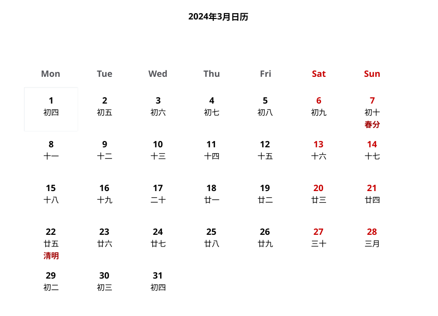
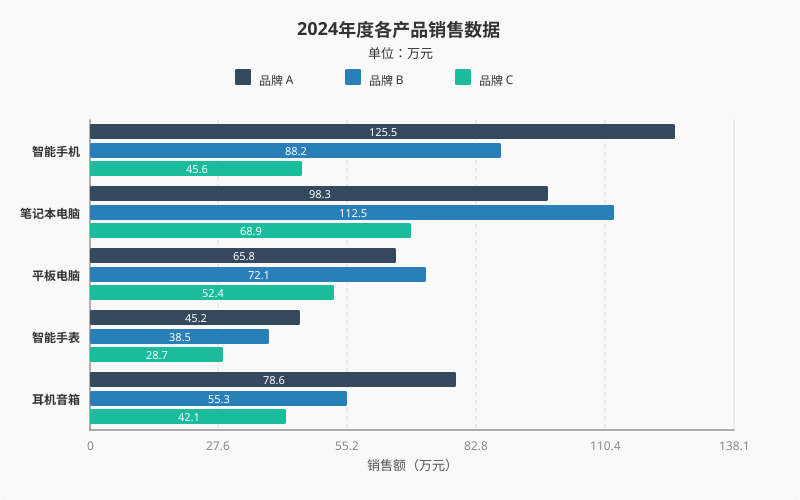
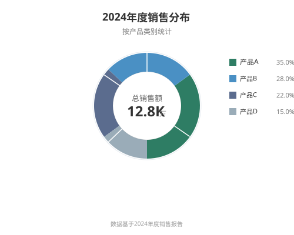
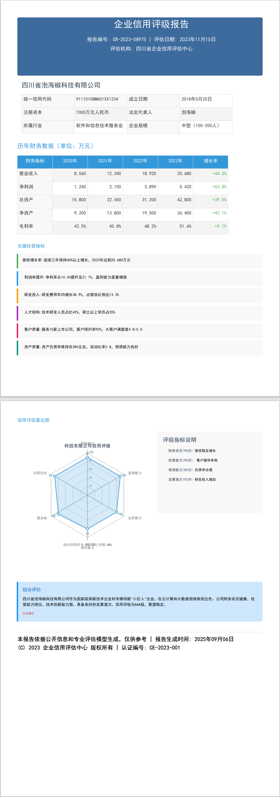

<p align="center">
  
</p>

<h1 align="center">jquick-pdf</h1>

<p align="center">
  纯 Java 的 PDF 工具库：把类 HTML/CSS 的模板直接渲染成 PDF —— 无需浏览器、无需 WebKit、无需任何外部渲染引擎。
</p>

<p align="center">
  <a href="./README.md">English</a> | <b>简体中文</b>
</p>

<p align="center">
  <a href="https://central.sonatype.com/artifact/io.github.paohaijiao/jquick-pdfx"></a>
  <a href="#版本对照表"></a>
  <a href="https://github.com/paohaijiao/jquick-pdf"></a>
  <a href="https://github.com/paohaijiao/jquick-pdf/issues"></a>
</p>

<p align="center">
  
  
  
</p>

⭐ 本项目已被 [Awesome Java](https://github.com/akullpp/awesome-java) 列表收录。

---

## 目录

- [项目简介](#项目简介)
- [核心特性](#核心特性)
- [快速开始](#快速开始)
  - [环境要求](#环境要求)
  - [模块说明](#模块说明)
  - [Maven 依赖 —— 4.0.0 及以上（Apache-2.0）](#maven-依赖--401-及以上apache-20)
  - [Maven 依赖 —— 4.0.0 以下（AGPL-3.0，iText 7）](#maven-依赖--400-及以下agpl-30itext-7)
  - [Hello world](#hello-world)
- [Demo Gallery（演示画廊）](#demo-gallery演示画廊)
  - [图片索引：图片 → 测试类 → 方法](#图片索引图片--测试类--方法)
    - [1. 条形图](#1-条形图--imagesbarchartsvg)
    - [2. 折线图](#2-折线图--imagesline_chartsvg)
    - [3. 饼图](#3-饼图--imagespie-chartsvg)
    - [4. 雷达图](#4-雷达图--imagesradar_chartsvg)
    - [5. 盒须图](#5-盒须图--imagesboxchartsvg)
    - [6. 热力图](#6-热力图--imagesheatmapsvg)
    - [7. K 线图](#7-k-线图--imagesk_chartsvg)
    - [8. 散点图](#8-散点图--imagesscattersvg)
    - [9. 气泡图](#9-气泡图--imagesbubblesvg)
    - [10. 漏斗图](#10-漏斗图--imagesfunnelsvg)
    - [11. 仪表盘](#11-仪表盘--imagesgaugesvg)
    - [12. 甘特图](#12-甘特图--imagesganttsvg)
    - [13. 日历图](#13-日历图--imagescalendarsvg)
    - [14. 农历日历](#14-农历日历--imageslunarsvg)
    - [15. 词云](#15-词云--imageswordcloudsvg)
    - [16. 地图](#16-地图--imagesgeosvg)
    - [17. 关系图](#17-关系图--imagesrelation_chartsvg)
    - [18. 旭日图](#18-旭日图--imagessunburstsvg)
    - [19. 矩形树图](#19-矩形树图--imagestreemapsvg)
    - [20. 相关矩阵](#20-相关矩阵--imagesmatrixsvg)
    - [21. 区域堆叠图](#21-区域堆叠图--imagesareasvg)
    - [22. 折线 + 条形组合图](#22-折线--条形组合图--imageslinebarsvg)
    - [23. 多重折线图](#23-多重折线图--imagesmultiplelinesvg)
    - [24. 多重条形图](#24-多重条形图--imagesfourbarsvg)
    - [25. 横向条形图](#25-横向条形图--imageshorizontalbarsvg)
    - [26. 多重横向条形图](#26-多重横向条形图--imagesmhbarchartsvg)
    - [27. 双雷达图](#27-双雷达图--imagestworadarsvg)
    - [28. 折线 + 散点图](#28-折线--散点图--imageslineradarsvg)
    - [29. 环形图](#29-环形图--imagescircle-chartsvg)
    - [30. 时间线](#30-时间线--imagestimelinesvg)
    - [31. 高级拓扑图（微服务）](#31-高级拓扑图微服务--imagesadvance_topologysvg)
    - [32. 云服务架构拓扑](#32-云服务架构拓扑--imagestoplogycloud_architecturesvg)
    - [33. 数据中心拓扑](#33-数据中心拓扑--imagestoplogydatacenter_topologysvg)
    - [34. 企业网络拓扑](#34-企业网络拓扑--imagestoplogyenterprise_networksvg)
    - [35. 自定义布局拓扑](#35-自定义布局拓扑--imagestoplogymanual_layout_topologysvg)
    - [36. 信用报告页面](#36-信用报告页面--imagescredit_reportpng)
  - [Demo 1 —— 企业信用评级报告（综合示例）](#demo-1--企业信用评级报告综合示例)
  - [Demo 2 —— 柱状图（图表模块）](#demo-2--柱状图图表模块)
  - [Demo 3 —— SVG 图表嵌入 PDF 页面](#demo-3--svg-图表嵌入-pdf-页面)
  - [元素与样式参考](#元素与样式参考)
- [版本对照表](#版本对照表)
- [License（许可证）](#license许可证)
- [参与贡献](#参与贡献)

---

## 项目简介

**jquick-pdf** 是 JQuick 生态下的 PDF 工具库，面向 Java 场景提供 PDF 的**生成、渲染与导出**能力：你只需编写一份形似 HTML、内联 CSS 的模板，绑定数据，即可得到 `byte[]`、流或落盘的 PDF 文件。

模板由 ANTLR4 语法解析，再由 [Apache PDFBox](https://pdfbox.apache.org/) 直接绘制到页面上——整条链路里**没有浏览器、没有 headless Chrome、没有本地动态库**，因此非常适合嵌入服务端、定时任务或桌面应用。

工具库分为两层：

- **文档层**（`jquick-pdfx`）：类 HTML/CSS 的模板语言（标题、段落、块、列表、表格、表单、图片、SVG），支持数据绑定、分页控制、目录、水印与加密。
- **图表层**（`jquick-pdf-svg`）：30+ 种图表类型（柱状图、折线图、饼图、雷达图、散点图、箱线图、热力图、K 线、漏斗图、仪表盘、甘特图、词云、地图、旭日图、矩形树图、气泡图、日历图、时间轴、拓扑图等），以矢量图形渲染——在文档中用一个占位符即可绑定。

> **协议边界 —— 上线前请先阅读 [版本对照表](#版本对照表)。**
> **低于4.0.0** 版本为 **AGPL-3.0**（基于 iText 7）。**4.0.0 及以上**版本为 **Apache-2.0**（已迁移至 Apache PDFBox，移除 AGPL 依赖）。

## 核心特性

- **纯 Java，无外部引擎** —— 不需要 WebKit、不需要 Chrome、不依赖操作系统组件，一个 JVM 进程即可。
- **类 HTML/CSS 模板** —— 14 种元素，且每个元素都支持 `style="..."` 属性。
- **两种命名风格都接受** —— 驼峰（`minHeight`）与标准 CSS 连字符（`min-height`）互为别名，可在同一声明中混用。
- **数据绑定** —— `${variable}` 绑定变量，`&{resource}` 引用已注册资源（图表、模板、树）。
- **30+ 种图表** —— 完整图表画廊、预览图与生成每张图的测试类见 [Demo Gallery](#demo-gallery演示画廊)。
- **丰富的文档能力** —— 自动分页、目录、页眉页脚、页码、水印、PDF 加密。
- **中文开箱可用** —— 内置中文字体（`jquick-pdf-font`），CJK 文本无需额外配置即可渲染。
- **模块化、体积小** —— 只依赖解析/渲染核心，图表、CSS、字体按需追加。
- **兼容 Java 8** —— 发布的构件均为 Java 8 字节码。

## 快速开始

### 环境要求

| 项目 | 版本 |
|---|---|
| JDK | 8 或更高 |
| Maven | 3.6 或更高（仅从源码构建时需要） |
| 运行时依赖 | Apache PDFBox 3.0.x、ANTLR4 runtime、SLF4J API（由 Maven 传递引入） |

### 模块说明

| 模块（目录） | 构件 | 说明 |
|---|---|---|
| `jquick-pdfx` | `io.github.paohaijiao:jquick-pdfx` | 解析器、渲染器、布局引擎与入口类 `JQuickPdfFactory`。多数使用者只需这一个构件。 |
| `jquick-pdf-css` | `io.github.paohaijiao:jquick-pdf-css` | CSS 模型：样式属性、单位与颜色。 |
| `jquick-pdf-svg` | `io.github.paohaijiao:jquick-pdf-svg` | SVG / ECharts 风格图表生成（30+ 种图表）。 |
| `jquick-pdf-data` | `io.github.paohaijiao:jquick-pdf-data` | 图表配置模型（`JOption`、`JChart`、`JTitle`、`JLegend` 等）。 |
| `jquick-pdf-font` | `io.github.paohaijiao:jquick-pdf-font` | 内置 CJK 字体资源。 |

### Maven 依赖 —— 4.0.0 及以上（Apache-2.0）

```xml
<dependency>
    <groupId>io.github.paohaijiao</groupId>
    <artifactId>jquick-pdfx</artifactId>
    <version>4.0.0</version>
</dependency>
```

图表支持（可选）：

```xml
<dependency>
    <groupId>io.github.paohaijiao</groupId>
    <artifactId>jquick-pdf-svg</artifactId>
    <version>4.0.0</version>
</dependency>
```

### Maven 依赖 —— 4.0.0 以下（AGPL-3.0，iText 7）

```xml
<dependency>
    <groupId>io.github.paohaijiao</groupId>
    <artifactId>jquick-pdfx</artifactId>
    <version>4.0.0</version>
</dependency>
```

> **协议风险：** 4.0.0 及以下使用 **AGPL-3.0**，原因是其依赖 **iText 7 Core**。在闭源产品中使用这些版本，需要完全遵守 AGPL 条款，或向 iText Group NV 购买商业许可。这些版本产出的 PDF 会带有 `Powered by iText` 标识。
> 迁移到 **4.0.0 或更高版本**即可获得 **Apache-2.0** 并解除该义务——详见 [License](#license许可证)。

### Hello world

```java
import com.github.paohaijiao.executor.JQuickPdfFactory;

import java.nio.file.Files;
import java.nio.file.Paths;

public class HelloDemo {

    public static void main(String[] args) throws Exception {
        String template = ""
                + "<pdf>"
                + "  <body>"
                + "    <h1 style=\"fontSize:24;fontColor:blue\">'Hello jquick-pdf'</h1>"
                + "    <p>'Customer: '${customer}</p>"
                + "  </body>"
                + "</pdf>";

        byte[] pdf = JQuickPdfFactory.create()
                .bind("customer", "Martin")
                .executeContent(template);

        Files.write(Paths.get("hello.pdf"), pdf);
    }
}
```

三种传入模板的方式，均返回 `byte[]`：

| 方法 | 来源 |
|---|---|
| `executeContent(String)` | 内存中的模板文本 |
| `executeResource(String)` | classpath 资源，例如 `"report.txt"` |
| `executeFile(String)` | 磁盘文件，例如 `"D:/templates/report.txt"` |

文本节点始终使用单引号包裹（`'Hello jquick-pdf'`）；`<pdf>` 与 `<html>` 均可作为文档根元素。

## Demo Gallery（演示画廊）

`images/` 下的每一张图片都由本仓库中**真实的测试类**产出。下面每一条都**先展示预览图，再给出生成它的关键代码**；代码里的输出路径就是测试字面写入的路径（默认 `D:\test\`，见 `com.github.paohaijiao.demo.constant.JQuickConstant`）。较长的数据列表用 `// ...` 省略。

### 图片索引：图片 → 测试类 → 方法

先说两点：

1. `images/` 是整理后的副本：少数文件在入库时被重命名，因此文件名可能与测试字面写入的路径不同（例如 `images/linebar.svg` ← `d://test/custom_chart.svg`）。每个代码块里写的路径才是权威值。
2. `TreemapTest` 在源码中整段被注释，因此矩形树图的预览对应 `JTreemapRendererExample#main`。

#### 1. 条形图 — `images/barchart.svg`


**Test Class:** `com.github.paohaijiao.BarCharTest` (module `jquick-pdf-svg`) | **Method:** `testBarChar1()`

```java
JOption option = new JOption();
option.title().text("销售数据").subtext("2023年度");
option.tooltip().trigger(JTrigger.axis);
JCategoryAxis xAxis = new JCategoryAxis();
xAxis.data("衬衫", "羊毛衫", "雪纺衫", "裤子", "高跟鞋", "袜子");
option.xAxis(xAxis);
option.yAxis(new JValueAxis());
JBar bar = new JBar();
bar.name("销量").data(5, 20, 36, 10, 10, 20);
option.series(bar);
JBarChartsRenderer jBarChartsRenderer = new JBarChartsRenderer();
jBarChartsRenderer.render(option, "D://test//barchart.svg");
String str = jBarChartsRenderer.renderToString(option);
System.out.println(str);
```

#### 2. 折线图 — `images/line_chart.svg`


**Test Class:** `com.github.paohaijiao.LineCharTest` (module `jquick-pdf-svg`) | **Method:** `testBarChar1()`

```java
JOption option = new JOption();
option.title().text("销售数据折线图");
option.tooltip().trigger(JTrigger.axis);
JCategoryAxis xAxis = new JCategoryAxis();
xAxis.data("1月", "2月", "3月", "4月", "5月", "6月", "7月");
option.xAxis(xAxis);
option.yAxis(new JValueAxis());
JLine line = new JLine();
line.name("销售额").data(120, 132, 101, 134, 90, 230, 210);
option.series(line);
JLineChartsRenderer renderer = new JLineChartsRenderer();
renderer.render(option, "D://test//line_chart.svg");
```

#### 3. 饼图 — `images/pie-chart.svg`


**Test Class:** `com.github.paohaijiao.PieCharTest` (module `jquick-pdf-svg`) | **Method:** `testBarChar1()`

```java
JOption option = new JOption();
option.title().text("销售占比").subtext("2023年度");
option.tooltip().trigger(JTrigger.item);
JPie pie = new JPie("销售占比");
pie.data(
        new JData().name("衬衫").value(35),
        new JData().name("羊毛衫").value(20),
        new JData().name("雪纺衫").value(15),
        new JData().name("裤子").value(18),
        new JData().name("高跟鞋").value(8),
        new JData().name("袜子").value(4)
);
option.series(pie);
JPieChartsRenderer renderer = new JPieChartsRenderer();
renderer.render(option, "d://test//pie-chart.svg");
```

#### 4. 雷达图 — `images/radar_chart.svg`


**Test Class:** `com.github.paohaijiao.RadarCharTest` (module `jquick-pdf-svg`) | **Method:** `testBarChar1()`

```java
// 创建图表选项
JOption option = new JOption();
option.title().text("雷达图示例")
        .subtext("预算 vs 开销对比")
        .left("center")
        .textStyle(new JTextStyle().color("#333"));
// 设置提示框
option.tooltip().trigger(JTrigger.item);
// 设置雷达图指标
JRadar radar = new JRadar();
radar.indicator(
        new JRadar.Indicator().name("销售").max(6500),
        new JRadar.Indicator().name("管理").max(16000),
        new JRadar.Indicator().name("信息技术").max(30000),
        new JRadar.Indicator().name("客服").max(38000),
        new JRadar.Indicator().name("研发").max(52000),
        new JRadar.Indicator().name("市场").max(25000)
);
option.radar(radar);
// 添加雷达图系列数据
JRadarSeries budgetSeries = new JRadarSeries();
budgetSeries.name("预算")
        .type(JSeriesType.radar)
        .data(4300, 10000, 28000, 35000, 50000, 19000);
JRadarSeries actualSeries = new JRadarSeries();
actualSeries.name("实际开销")
        .type(JSeriesType.radar)
        .data(5000, 14000, 28000, 31000, 42000, 21000);
option.series(budgetSeries, actualSeries);
JRadarChartsRenderer renderer = new JRadarChartsRenderer();
renderer.render(option, "d://test//radar_chart.svg");
```

#### 5. 盒须图 — `images/boxchart.svg`


**Test Class:** `com.github.paohaijiao.BoxPlotTest` (module `jquick-pdf-svg`) | **Method:** `testBarChar1()`

```java
JOption option = new JOption();
option.title().text("销售数据分布");
option.xAxis(new JCategoryAxis().data("一季度", "二季度", "三季度", "四季度"));
option.series(new JBoxplot().data(
        new Object[]{10, 15, 20, 25, 30},
        new Object[]{12, 18, 22, 28, 35},
        new Object[]{8, 14, 19, 26, 32},
        new Object[]{11, 16, 21, 27, 33}
));
JBoxPlotChartRenderer jBarChartsRenderer = new JBoxPlotChartRenderer();
jBarChartsRenderer.render(option, "D://test//boxchart.svg");
```

#### 6. 热力图 — `images/heatmap.svg`


**Test Class:** `com.github.paohaijiao.HeatMapCharTest` (module `jquick-pdf-svg`) | **Method:** `testBarChar1()`

```java
JOption option = new JOption();
option.title("2023年月度温度分布热力图");
option.xAxis(new JCategoryAxis()
        .data("1月", "2月", "3月", "4月", "5月", "6月",
                "7月", "8月", "9月", "10月", "11月", "12月"));
option.yAxis(new JCategoryAxis()
        .data("凌晨(0-6)", "早晨(6-9)", "上午(9-12)",
                "中午(12-14)", "下午(14-18)", "晚上(18-24)"));
JHeatmap heatmap = new JHeatmap();
heatmap.data(
        new Object[]{0, 0, -5.2}, new Object[]{0, 1, -3.8}, new Object[]{0, 2, 1.5},
        new Object[]{0, 3, 4.2}, new Object[]{0, 4, 2.8}, new Object[]{0, 5, -2.1},
        // ... 其余数据点 {1,*} 至 {10,*}
        new Object[]{11, 0, -2.8}, new Object[]{11, 1, -0.5}, new Object[]{11, 2, 3.5},
        new Object[]{11, 3, 6.8}, new Object[]{11, 4, 4.2}, new Object[]{11, 5, 0.0}
);
option.series(heatmap);
JHeatMapChartRenderer renderer = new JHeatMapChartRenderer();
renderer.render(option, "d://test//heatmap.svg");
```

#### 7. K 线图 — `images/k_chart.svg`


**Test Class:** `com.github.paohaijiao.KCharTest` (module `jquick-pdf-svg`) | **Method:** `testBarChar1()`

```java
JOption option = new JOption();
option.title().text("股票K线图(含数据)");
option.tooltip().trigger(JTrigger.axis);
JCategoryAxis xAxis = new JCategoryAxis();
xAxis.data("01/01", "01/02", "01/03", "01/04", "01/05",
        "01/06", "01/07", "01/08", "01/09", "01/10");
option.xAxis(xAxis);
option.yAxis(new JValueAxis());
JCandlestick candlestick = new JCandlestick();
candlestick.name("股价")
        .data(
                new Object[]{105.2, 108.5, 104.8, 109.1},
                new Object[]{108.6, 107.8, 106.5, 109.5},
                new Object[]{107.9, 105.3, 104.2, 108.0},
                new Object[]{105.4, 106.1, 104.5, 107.2},
                new Object[]{106.2, 104.8, 103.0, 107.5},
                // ... 其余 K 线
                new Object[]{110.4, 112.1, 109.5, 112.8}
        );
option.series(candlestick);
JKChartsRenderer renderer = new JKChartsRenderer();
renderer.render(option, "d://test//k_chart.svg");
```

#### 8. 散点图 — `images/scatter.svg`


**Test Class:** `com.github.paohaijiao.ScatterCharTest` (module `jquick-pdf-svg`) | **Method:** `testBarChar1()`

```java
JData[] data = new JData[]{
        new JData().value(new Double[]{10.0, 8.04}),
        new JData().value(new Double[]{8.07, 6.95}),
        new JData().value(new Double[]{13.0, 7.58}),
        new JData().value(new Double[]{9.05, 8.81}),
        // ... 其余数据点
        new JData().value(new Double[]{7.08, 5.82}),
        new JData().value(new Double[]{5.02, 5.68})
};
JOption option = new JOption();
option.title().text("散点图示例");
option.tooltip().trigger(JTrigger.axis);
option.xAxis(new JValueAxis().scale(true));
option.yAxis(new JValueAxis().scale(true));
JScatter scatter = new JScatter();
scatter.symbolSize(20)
        .data(data);
option.series(scatter);
JScatterChartsRenderer renderer = new JScatterChartsRenderer();
renderer.render(option, "d://test//scatter.svg");
```

#### 9. 气泡图 — `images/bubble.svg`


**Test Class:** `com.github.paohaijiao.BubbleTest` (module `jquick-pdf-svg`) | **Method:** `testBarChar1()`

```java
JTitle title = new JTitle();
title.setText("空气质量指数 (AQI) 监测气泡图");
title.setSubtext("图表说明：本气泡图展示了空气质量指数(AQI)的时间变化趋势。X轴表示日期，Y轴表示AQI数值，气泡大小反映PM2.5浓度，气泡颜色表示AQI等级。");
JOption option = new JOption()
        .title(title)
        .legend("优", "良", "轻度污染", "中度污染", "重度污染")
        .xAxis(new CategoryAxis().name("日期"))
        .yAxis(new ValueAxis().name("AQI数值"));
ScatterSeries series = new ScatterSeries("空气质量监测");
List<Map<String, Object>> data = new ArrayList<>();
Random random = new Random(42); // 固定种子以便重现
String[] dates = {"01-01", "01-02", "01-03", "01-04", "01-05", "01-06", "01-07", "01-08", "01-09", "01-10", "01-11", "01-12", "01-13", "01-14", "01-15"};
for (int i = 0; i < dates.length; i++) {
    int aqi = 20 + random.nextInt(180); // AQI 20-200
    double pm25 = 10 + random.nextDouble() * 150; // PM2.5 10-160
    String category;
    if (aqi <= 50) category = "优";
    else if (aqi <= 100) category = "良";
    else if (aqi <= 150) category = "轻度污染";
    else if (aqi <= 200) category = "中度污染";
    else category = "重度污染";
    String name = String.format("日期:%s, AQI:%d, PM2.5:%.1f", dates[i], aqi, pm25);
    Map<String, Object> dataPoint = new HashMap<>();
    dataPoint.put("x", dates[i]);
    dataPoint.put("y", aqi);
    dataPoint.put("size", pm25);
    dataPoint.put("category", category);
    dataPoint.put("name", name);
    data.add(dataPoint);
}
series.data(data.toArray());
option.series(series);
JBubbleChartRenderer renderer = new JBubbleChartRenderer();
renderer.render(option, "d://test//bubble.svg");
```

#### 10. 漏斗图 — `images/funnel.svg`


**Test Class:** `com.github.paohaijiao.FunelTest` (module `jquick-pdf-svg`) | **Method:** `testBarChar1()`

```java
JFunnelOption option = JFunnelOption.createDefaultFunnel();
JFunnelOption customOption = option
        .title(new Title().text("销售漏斗").subtext("2024年数据"))
        .funnel(new Funnel()
                .width(600)
                .topY(80)
                .bottomY(200)
                .gap(2)
                .borderColor(Color.GRAY)
        )
        .series(Collections.singletonList(
                new Series()
                        .name("sales")
                        .type("funnel")
                        .data(Arrays.asList(
                                new DataItem("展现", 10000),
                                new DataItem("点击", 5000),
                                new DataItem("咨询", 2000),
                                new DataItem("订单", 500)
                        ))
        ))
        .colors(
                new Color(12, 168, 223),
                new Color(255, 153, 77),
                new Color(80, 112, 221),
                new Color(182, 214, 52)
        );
JFunnelChartRenderer renderer = new JFunnelChartRenderer();
JOption jOption = new JOption();
jOption.setFunnelOption(customOption);
renderer.render(jOption, "d://test/funnel.svg");
```

#### 11. 仪表盘 — `images/gauge.svg`


**Test Class:** `com.github.paohaijiao.JGaugeTest` (module `jquick-pdf-svg`) | **Method:** `testBarChar1()`

```java
// 创建配置
GuageConfig scoreConfig = GuageConfig.builder()
        .score(75)  // 设置分数为75
        .pointerColor(new Color(220, 80, 80))  // 红色指针
        .backgroundColor(new Color(240, 240, 245))  // 浅灰色背景
        .title("PERFORMANCE")
        .build();
JGuageOption option = JGuageOption.builder().scoreMeter(scoreConfig).build();
JGuageRenderer renderer = new JGuageRenderer();
JOption option1 = new JOption();
option1.setGuageOption(option);
renderer.render(option1, "d://test//gauge.svg");
```

#### 12. 甘特图 — `images/gantt.svg`


**Test Class:** `com.github.paohaijiao.JGanttTest` (module `jquick-pdf-svg`) | **Method:** `testBarChar1()`

```java
JGanttOption option = new JGanttOption();
option.setTitle(new JGanttOption.Title("Gantt of Airport Flight", "航班调度甘特图"));
option.setFlightData(Arrays.asList(
        new JGanttOption.FlightData("Y3683", "681", "X", 21, 0, 360, 0, 0.7),
        new JGanttOption.FlightData("EKXAD", "682I", "W", 21, 0, 360, 1, 0.7),
        new JGanttOption.FlightData("Y4682", "682O", "W", 21, 0, 360, 2, 0.7),
        new JGanttOption.FlightData("Y4393", "682", "X", 21, 0, 360, 3, 0.7),
        new JGanttOption.FlightData("Y2238", "683", "X", 21, 0, 360, 4, 0.7),
        // ... 其余航班
        new JGanttOption.FlightData("Y7421", "691", "X", 21, 0, 120, 8, 0.7),
        new JGanttOption.FlightData("Y4619", "692", "X", 21, 0, 300, 9, 0.7)
));
option.setChartStyle(new JGanttOption.ChartStyle(
        Color.WHITE,
        new Color(146, 154, 186),
        new Color(54, 140, 108),
        new Color(80, 112, 221),
        new Color(221, 179, 11),
        new Font("微软雅黑", Font.BOLD, 18),
        new Font("微软雅黑", Font.PLAIN, 12),
        872,
        282
));
option.setTimeRange(new JGanttOption.TimeRange(21, 3, new String[]{"21:00", "22:00", "23:00", "00:00", "01:00", "02:00", "03:00"}));
JChartRenderer renderer = new JGanttChartRenderer();
JOption jOption = new JOption();
jOption.setGanttOption(option);
renderer.render(jOption, "d://test//gantt.svg");
```

#### 13. 日历图 — `images/calendar.svg`


**Test Class:** `com.github.paohaijiao.CalendarTest` (module `jquick-pdf-svg`) | **Method:** `testBarChar1()`

```java
Map<LocalDate, Integer> data = new HashMap<>();
LocalDate startDate = LocalDate.of(2024, 1, 1);
for (int i = 0; i < 365; i++) {
    LocalDate date = startDate.plusDays(i);
    int value = (int) (Math.random() * 15);
    data.put(date, value);
}
JOption option = new JOption();
JCalendarOption calendarOption = new JCalendarOption("2024年活动日历", "类似GitHub贡献图", 2024, data,
        new Color(235, 237, 240),
        new Color(32, 125, 222),
        new Color(232, 235, 240),
        new Color(84, 85, 90),
        20,
        80
);
option.setJCalendarOption(calendarOption);
JChartRenderer renderer = new JCalendarChartRenderer();
renderer.render(option, "d://test//calendar.svg");
String svgContent = renderer.renderToString(option);
System.out.println("SVG内容长度: " + svgContent.length());
```

#### 14. 农历日历 — `images/lunar.svg`



**Test Class:** `com.github.paohaijiao.LunarTest` (module `jquick-pdf-svg`) | **Method:** `testBarChar1()`

```java
private static java.util.List<LunarCalendarOption.DayData> createDefaultDayData() {
    java.util.List<LunarCalendarOption.DayData> defaultData = new ArrayList<>();
    defaultData.add(new LunarCalendarOption.DayData(1, "初四", 0, 0));
    defaultData.add(new LunarCalendarOption.DayData(2, "初五", 0, 1));
    defaultData.add(new LunarCalendarOption.DayData(3, "初六", 0, 2));
    // ... 当月其余日期格
    defaultData.add(new LunarCalendarOption.DayData(31, "初四", 4, 2));
    return defaultData;
}

private static java.util.List<LunarCalendarOption.SpecialDay> createDefaultSpecialDays() {
    java.util.List<LunarCalendarOption.SpecialDay> specialDays = new ArrayList<>();
    specialDays.add(new LunarCalendarOption.SpecialDay("春分", 0, 6));
    specialDays.add(new LunarCalendarOption.SpecialDay("清明", 3, 0));
    return specialDays;
}

// 测试方法主体
LunarCalendarOption.CalendarDataConfig dataConfig = new LunarCalendarOption.CalendarDataConfig()
        .setDayDataList(createDefaultDayData())
        .setSpecialDays(createDefaultSpecialDays())
        .setWeekDays(new String[]{"Mon", "Tue", "Wed", "Thu", "Fri", "Sat", "Sun"})
        .setRows(5)
        .setCols(7);
LunarCalendarOption.ColorConfig colorConfig = new LunarCalendarOption.ColorConfig()
        .setBackgroundColor(null)
        .setSpecialDayColor(new Color(0, 100, 0));
JTitle title = new JTitle();
title.setText("2024年3月日历");
LunarCalendarOption option = LunarCalendarOption.of("2024", "三月", colorConfig, title, dataConfig);
JLunarCalendarRenderer renderer = new JLunarCalendarRenderer();
renderer.render(option, "d://test//lunar.svg");
```

#### 15. 词云 — `images/wordcloud.svg`


**Test Class:** `com.github.paohaijiao.WordsCloudTest` (module `jquick-pdf-svg`) | **Method:** `testBarChar1()`

```java
JOption option = new JOption()
.title(new JTitle().text("热门编程语言"))
.series(Arrays.asList(
   new JWordCloudSeries("语言热度")
       .data(Arrays.asList(
           new JData("Java", 100),
           new JData("Python", 85),
           new JData("JavaScript", 75),
           new JData("C++", 60),
           new JData("Go", 50),
           new JData("Rust", 45),
           new JData("Kotlin", 40),
           new JData("Swift", 35),
           new JData("TypeScript", 30),
           new JData("Scala", 25)
   ))
.minFontSize(20)
.maxFontSize(60)
.gridSize(10)
.rotationStep(15)
.rotationRange(90)
.textStyle(new JItemStyle().color(Color.BLUE))
));
JWordCloudRenderer renderer = new JWordCloudRenderer();
renderer.render(option, "d://test//wordcloud.svg");
```

#### 16. 地图 — `images/geo.svg`


**Test Class:** `com.github.paohaijiao.GeoTest` (module `jquick-pdf-svg`) | **Method:** `testBarChar1()`

```java
private static String readFile(String filePath) throws IOException {
    StringBuilder content = new StringBuilder();
    try (BufferedReader br = new BufferedReader(new FileReader(filePath))) {
        String line;
        while ((line = br.readLine()) != null) {
            content.append(line).append("\n");
        }
    }
    return content.toString();
}

// 测试方法主体
String geoJsonContent = readFile("d://sample//test.geojson");
GeoOption option = new GeoOption();
option.setGeoJsonContent(geoJsonContent);
JGeoJsonRenderer renderer = new JGeoJsonRenderer();
JOption jOption = new JOption();
jOption.setGeoOption(option);
renderer.render(jOption, "d://test/geo.svg");
```

#### 17. 关系图 — `images/relation_chart.svg`


**Test Class:** `com.github.paohaijiao.RelationTest` (module `jquick-pdf-svg`) | **Method:** `testBarChar1()`

```java
JGsonOption option = new JGsonOption();
option.title("Relationship Chart Test");
// 创建图系列
JGraph graph = new JGraph();
graph.name("关系图");
graph.layout(JLayout.force); // 使用力导向布局
graph.force().repulsion(100); // 设置排斥力
graph.draggable(true); // 节点可拖动
// 添加节点 - 修正了ID问题
List<JNode> nodes = new ArrayList<>();
nodes.add(new JNode("1", "Node A").symbolSize(30).category(0));//id 1
nodes.add(new JNode("2", "Node B").symbolSize(25).category(1));
nodes.add(new JNode("3", "Node C").symbolSize(20).category(2));
nodes.add(new JNode("4", "Node D").symbolSize(15).category(0));
nodes.add(new JNode("5", "Node E").symbolSize(35).category(1));
nodes.add(new JNode("6", "Node F").symbolSize(20).category(3));
nodes.add(new JNode("7", "Node G").symbolSize(25).category(2));
nodes.add(new JNode("8", "Node H").symbolSize(15).category(4));
nodes.add(new JNode("9", "Node I").symbolSize(30).category(3));
nodes.add(new JNode("10", "Node J").symbolSize(20).category(0));
graph.setData(nodes);
// ... 连线（14 条 JLink）与分类（5 条 JCategory）
option.series(graph);
option.legend().data("Category 1", "Category 2", "Category 3", "Category 4", "Category 5");
JRelationChartRenderer renderer = new JRelationChartRenderer();
renderer.render(option, "d://test//relation_chart.svg");
```

#### 18. 旭日图 — `images/sunburst.svg`


**Test Class:** `com.github.paohaijiao.SunBirdTest` (module `jquick-pdf-svg`) | **Method:** `testBarChar1()`

```java
JOption option = new JOption();
// 设置标题
JTitle title = new JTitle();
title.setText("咖啡风味分析");
option.setTitle(title);
JSunburstData root = new JSunburstData("总数据", 1.0);
JSunburstData main1 = new JSunburstData("电子产品", 0.4);
JSunburstData main2 = new JSunburstData("服装", 0.3);
JSunburstData main3 = new JSunburstData("食品", 0.3);
// 第二层：子分类
JSunburstData main1Sub1 = new JSunburstData("手机", 0.6);
JSunburstData main1Sub2 = new JSunburstData("电脑", 0.4);
JSunburstData main2Sub1 = new JSunburstData("男装", 0.5);
JSunburstData main2Sub2 = new JSunburstData("女装", 0.5);
JSunburstData main3Sub1 = new JSunburstData("生鲜", 0.4);
JSunburstData main3Sub2 = new JSunburstData("零食", 0.6);
// 第三层：孙分类
main1Sub1.addChild(new JSunburstData("智能手机", 0.7));
main1Sub1.addChild(new JSunburstData("功能手机", 0.3));
// ... 其余 addChild 调用
root.addChild(main1);
root.addChild(main2);
root.addChild(main3);
option.setSunburstData(root);
JSunburstChart chart = new JSunburstChart();
chart.render(option, "d://test//sunburst.svg");
```

#### 19. 矩形树图 — `images/treemap.svg`


**Test Class:** `com.github.paohaijiao.JTreemapRendererExample` (module `jquick-pdf-svg`) | **Method:** `main(String[])` —— 无 `@Test`，`TreemapTest` 全文被注释

```java
JTreeMapNode root = createTestData();
TreeMapOption treemapOption = new TreeMapOption();
treemapOption.setRoot(root);
treemapOption.setDepartmentColors(DEPARTMENT_COLORS);
treemapOption.setCategoryColors(CATEGORY_COLORS);
treemapOption.getDepartmentRules().add(new TreeMapMapping("开发", "技术部"));
// ... 其余 TreeMapMapping 规则
JOption option = new JOption();
option.setTreemapOption(treemapOption);
option.title("公司业务分布矩形树图（JTreemapRenderer）");
JTreeMapRenderer renderer = new JTreeMapRenderer();
String outputPath = "d://test//treemap.svg";
renderer.render(option, outputPath);
System.out.println("JTreemapRenderer 树形图生成成功！");
```

#### 20. 相关矩阵 — `images/Matrix.svg`


**Test Class:** `com.github.paohaijiao.JCollectionMatrixTest` (module `jquick-pdf-svg`) | **Method:** `testBarChar1()`

```java
double[][] correlationData = {
        {1.00, -0.20, 0.03, -0.62, -0.54, -0.21, 0.63, 0.30},
        {-0.20, 1.00, 0.36, -0.61, -0.26, 0.05, 0.16, 0.41},
        {0.03, 0.36, 1.00, -0.74, -0.94, 0.71, -0.90, -0.66},
        {-0.62, -0.61, -0.74, 1.00, 0.37, -0.66, 0.54, -0.66},
        {-0.54, -0.26, -0.94, 0.37, 1.00, -0.05, -0.46, 0.71},
        {-0.21, 0.05, 0.71, -0.66, -0.05, 1.00, -0.84, -0.40},
        {0.63, 0.16, -0.90, 0.54, -0.46, -0.84, 1.00, -0.55},
        {0.30, 0.41, -0.66, -0.66, 0.71, -0.40, -0.55, 1.00}
};
String[] dimensions = {"销售额", "广告费", "促销费", "竞品价", "季节指数", "GDP", "人口", "天气"};
JCorrelationMatrixOption option = JCorrelationMatrixOption.builder()
        .title("销售因素相关系数矩阵", "各因素之间的相关性分析")
        .dataset(correlationData)
        .build();
option.dataset().dimensions(dimensions);
JOption jOption = new JOption();
jOption.setCorrelationMatrixOption(option);
JCorrelationMatrixRenderer renderer = new JCorrelationMatrixRenderer();
renderer.render(jOption, "d://test//Matrix.svg");
```

#### 21. 区域堆叠图 — `images/area.svg`


**Test Class:** `com.github.paohaijiao.JAreaChartTest` (module `jquick-pdf-svg`) | **Method:** `testMutipleChar1()`

```java
List<Double> values = Arrays.asList(85.0, 120.0, 150.0, 210.0, 280.0, 350.0, 420.0, 400.0, 380.0, 450.0, 480.0, 520.0);
List<String> labels = Arrays.asList("1月", "2月", "3月", "4月", "5月", "6月", "7月", "8月", "9月", "10月", "11月", "12月");
JAreaChartData config = new JAreaChartData();
config.setWidth(800);
config.setHeight(500);
config.setTitle("2024年度销售趋势");
config.setSubtitle("数据来源：销售系统");
config.setXAxisTitle("月份");
config.setYAxisTitle("销售额（万元）");
config.setLegendText("销售额");
config.setShowDataLabels(true);
config.setSeriesList(Arrays.asList(new JSeriesData("销售额", values)));
config.setXAxisLabels(labels);
config.setTheme(JTheme.DEFAULT);      // 默认主题
JOption option = new JOption();
option.setData(config);
JAreaChartRenderer renderer = new JAreaChartRenderer();
renderer.render(option, "d://test//area.svg");
```

#### 22. 折线 + 条形组合图 — `images/linebar.svg`


**Test Class:** `com.github.paohaijiao.CombolTest` (module `jquick-pdf-svg`) | **Method:** `testBarChar1()`

注意：该文件在入库时被重命名——测试写入的是 `d://test/custom_chart.svg`，预览图存储为 `images/linebar.svg`。

```java
JOption jOption = new JOption();
List<Double> sales = Arrays.asList(120.0, 135.0, 148.0, 162.0, 175.0, 190.0);
List<Double> profits = Arrays.asList(15.0, 16.5, 18.0, 19.2, 21.0, 22.5);
List<String> months = Arrays.asList("1月", "2月", "3月", "4月", "5月", "6月");
JComboLineBarChartData config = JComboLineBarChartData.builder()
        .width(1000)
        .height(600)
        .title("2024年上半年销售分析", "半年度数据报告")
        .barData(sales)
        .lineData(profits)
        .xAxisLabels(months)
        .barColor(new Color(46, 204, 113))      // 绿色条形
        .lineColor(new Color(155, 89, 182))     // 紫色折线
        .leftAxisTitle("销售额（万元）")
        .rightAxisTitle("利润率（%）")
        .barLegendText("月销售额")
        .lineLegendText("利润率")
        .footerText("数据来源：财务系统")
        .build();
JComboLineBarChartRenderer customRenderer = new JComboLineBarChartRenderer();
jOption.setData(config);
customRenderer.render(jOption, "d://test/custom_chart.svg");
```

#### 23. 多重折线图 — `images/multipleLine.svg`


**Test Class:** `com.github.paohaijiao.MutipleLineChartTest` (module `jquick-pdf-svg`) | **Method:** `testMutipleChar1()`

```java
List<String> months = Arrays.asList("1月", "2月", "3月", "4月", "5月", "6月", "7月", "8月", "9月", "10月", "11月", "12月");
List<Double> productA = Arrays.asList(120.0, 135.0, 148.0, 162.0, 175.0, 190.0, 205.0, 218.0, 230.0, 245.0, 258.0, 270.0);
List<Double> productB = Arrays.asList(95.0, 108.0, 112.0, 130.0, 125.0, 145.0, 150.0, 168.0, 172.0, 185.0, 190.0, 200.0);
List<Double> productC = Arrays.asList(80.0, 82.0, 85.0, 88.0, 90.0, 92.0, 95.0, 98.0, 100.0, 102.0, 105.0, 108.0);
List<Double> productD = Arrays.asList(45.0, 58.0, 72.0, 89.0, 105.0, 128.0, 150.0, 175.0, 198.0, 225.0, 248.0, 275.0);
JMultiLineChartData chartData = new JMultiLineChartData();
chartData.setXAxisLabels(months);
chartData.setWidth(900);
chartData.setHeight(600);
chartData.setTitleText("2024年度产品销售趋势分析");
chartData.setSubtitleText("各产品线月度销售额对比（单位：万元）");
chartData.setYAxisTitle("销售额（万元）");
chartData.setFooterText("数据来源：销售系统报表 | 统计时间：2024年1月-12月");
chartData.setGridCount(6);
chartData.setShowDataLabels(false);
chartData.setShowInnerPoint(true);
chartData.setPointRadius(5);
chartData.setInnerPointRadius(2);
chartData.setChartAreaColor(new Color(248, 249, 250));
chartData.setAxisColor(Color.BLACK);
chartData.setGridColor(new Color(220, 220, 220));
chartData.setTextColor(Color.BLACK);
chartData.setFooterColor(new Color(128, 128, 128));
chartData.setValueWithPercent(false);
chartData.setAutoCalculateMax(true);
chartData.setRotateXAxisLabels(false);
JMultiLineChartData.LineData lineA = new JMultiLineChartData.LineData();
lineA.setName("产品A");
lineA.setLegendText("产品A - 高端系列");
lineA.setValues(productA);
lineA.setLineColor(new Color(66, 133, 244));
lineA.setLineWidth(2.5f);
// ... lineB / lineC / lineD 结构相同（产品B 中端系列、产品C 入门系列、产品D 创新系列）
chartData.setLineDataList(Arrays.asList(lineA, lineB, lineC, lineD));
chartData.updateMaxValues();
JOption option = new JOption();
JTitle title = new JTitle();
title.setText("2024年度产品销售趋势分析");
title.setSubtext("各产品线月度销售额对比");
option.setTitle(title);
option.setData(chartData);
JMultiLineChartRenderer renderer = new JMultiLineChartRenderer();
renderer.render(option, "d://test//multiple-line.svg");
```

#### 24. 多重条形图 — `images/fourBar.svg`


**Test Class:** `com.github.paohaijiao.MutipleBarChartTest` (module `jquick-pdf-svg`) | **Method:** `testMutipleChar5()`

```java
JMultiBarChartData regionalData = new JMultiBarChartData();
regionalData.setTitleText("2024年上半年各区域业绩对比（万元）");
regionalData.setSubtitleText("华东、华南、华北、西部四区表现");
regionalData.setXAxisLabels(Arrays.asList("1月", "2月", "3月", "4月", "5月", "6月"));
regionalData.setXAxisTitle("月份");
regionalData.setYAxisTitle("业绩（万元）");
// 华东区域
JMultiBarChartData.BarData eastChina = new JMultiBarChartData.BarData();
eastChina.setLegendText("华东");
eastChina.setBarColor(JMultiBarChartRenderer.COLOR_A);
eastChina.setValues(Arrays.asList(120.5, 135.2, 148.0, 162.5, 175.3, 190.8));
// ... southChina / northChina / westChina 结构相同（华南/华北/西部，COLOR_B / COLOR_C / new Color(80, 180, 120)）
regionalData.setBarDataList(Arrays.asList(eastChina, southChina, northChina, westChina));
JOption option = new JOption();
option.setData(regionalData);
JMultiBarChartRenderer renderer = new JMultiBarChartRenderer();
renderer.render(option, "d://test//fourBar.svg");
```

#### 25. 横向条形图 — `images/horizontalBar.svg`


**Test Class:** `com.github.paohaijiao.JHorizontalBarChart` (module `jquick-pdf-svg`) | **Method:** `testMutipleChar1()`

```java
JHorizontalBarChartData chartData = new JHorizontalBarChartData();
chartData.setTitleText("2024年度销售数据");
chartData.setSubtitleText("各产品线销售占比");
chartData.setXAxisTitle("销售额（万元）");
chartData.setYAxisTitle("产品类别");
chartData.setValueWithPercent(false);
chartData.setShowDataLabels(true);
chartData.addYAxisLabel("电子产品");
chartData.addYAxisLabel("服装服饰");
chartData.addYAxisLabel("家居用品");
chartData.addYAxisLabel("美妆个护");
chartData.addYAxisLabel("食品饮料");
java.util.List<Double> productAValues = Arrays.asList(85.5, 62.3, 45.8, 71.2, 93.6);
java.util.List<Double> productBValues = Arrays.asList(45.2, 78.9, 52.1, 38.5, 67.4);
chartData.addBarData(new JHorizontalBarChartData.BarData("产品A", productAValues, JHorizontalBarChartData.COLOR_A));
chartData.addBarData(new JHorizontalBarChartData.BarData("产品B", productBValues, JHorizontalBarChartData.COLOR_B));
JOption option = new JOption();
option.setData(chartData);
JHorizontalBarChartRenderer renderer = new JHorizontalBarChartRenderer();
renderer.render(option, "d://test//horizontalBarChart.svg");
```

#### 26. 多重横向条形图 — `images/mhBarChart.svg`



**Test Class:** `com.github.paohaijiao.JMutipleHorizontalBarChart` (module `jquick-pdf-svg`) | **Method:** `testMutipleChar1()`

```java
JHorizontalMultiBarChartData chartData = new JHorizontalMultiBarChartData();
chartData.setTitleText("2024年度各产品销售数据");
chartData.setSubtitleText("单位：万元");
chartData.setXAxisTitle("销售额（万元）");
chartData.setValueWithPercent(false);
chartData.setShowDataLabels(true);
chartData.setLegendAtTop(true);
chartData.setGroupSpacingRatio(0.15);
chartData.setBarSpacingRatio(0.2);
chartData.addCategory("智能手机");
chartData.addCategory("笔记本电脑");
chartData.addCategory("平板电脑");
chartData.addCategory("智能手表");
chartData.addCategory("耳机音箱");
List<Double> productAValues = Arrays.asList(125.5, 98.3, 65.8, 45.2, 78.6);
List<Double> productBValues = Arrays.asList(88.2, 112.5, 72.1, 38.5, 55.3);
List<Double> productCValues = Arrays.asList(45.6, 68.9, 52.4, 28.7, 42.1);
chartData.addSeries("品牌 A", productAValues, new Color(52, 73, 94));    // 深灰蓝 #34495e
chartData.addSeries("品牌 B", productBValues, new Color(41, 128, 185));   // 中蓝 #2980b9
chartData.addSeries("品牌 C", productCValues, new Color(26, 188, 156));   // 薄荷绿 #1abc9c
JOption option = new JOption();
option.setData(chartData);
JHorizontalMultiBarChartRenderer renderer = new JHorizontalMultiBarChartRenderer();
renderer.render(option, "d://test//mhBarChart.svg");
```

#### 27. 双雷达图 — `images/twoRadar.svg`


**Test Class:** `com.github.paohaijiao.JTwoRadarChart` (module `jquick-pdf-svg`) | **Method:** `testMutipleChar1()`

完整未删减的源码见 [Demo 3](#demo-3--svg-图表嵌入-pdf-页面)。

```java
JDoubleRadarChartData chartData = new JDoubleRadarChartData();
chartData.setWidth(1000);
chartData.setHeight(600);
chartData.setTitleText("多维度数据对比雷达图");
chartData.setSubtitleText("左右两组数据对比分析");
chartData.setLeftTitle("实验组数据");
chartData.setRightTitle("对照组数据");
List<String> dimensions = Arrays.asList("维度A", "维度B", "维度C", "维度D", "维度E");
chartData.setDimensions(dimensions);
JDoubleRadarChartData.RadarData leftRadar = new JDoubleRadarChartData.RadarData();
List<JDoubleRadarChartData.Series> leftSeriesList = new ArrayList<>();
JDoubleRadarChartData.Series series1 = new JDoubleRadarChartData.Series();
series1.setName("节点1");
List<Double> values1 = Arrays.asList(85.0, 70.0, 65.0, 80.0, 75.0);
series1.setValues(values1);
series1.setColor(new Color(84, 112, 198));  // 蓝色
leftSeriesList.add(series1);
// ... 节点2（黄色，左侧）与节点3 / 节点4（红色 / 绿色，右侧），结构相同
leftRadar.setSeriesList(leftSeriesList);
chartData.setLeftRadar(leftRadar);
chartData.setRightRadar(rightRadar);
chartData.setGridLevels(4);
chartData.setFillAlpha(70);
chartData.setLineWidth(2.0f);
chartData.setShowDataPoints(true);
chartData.setLegendAtTop(false);
chartData.setShowLegendSide(true);
chartData.setFooterText("数据来源：示例数据");
JOption option = new JOption();
option.setData(chartData);
JDoubleRadarChartRenderer renderer = new JDoubleRadarChartRenderer();
renderer.render(option, "d://test//mutipleRadar.svg");
```

#### 28. 折线 + 散点图 — `images/lineRadar.svg`


**Test Class:** `com.github.paohaijiao.JLineScatterrChartTest` (module `jquick-pdf-svg`) | **Method:** `testMutipleChar1()`

```java
List<String> categories = Arrays.asList("1月", "2月", "3月", "4月", "5月", "6月",
        "7月", "8月", "9月", "10月", "11月", "12月");
List<Double> lineValues = Arrays.asList(100.0, 120.0, 140.0, 160.0, 70.0, 200.0,
        290.0, 240.0, 130.0, 330.0, 100.0, 320.0);
List<Double> scatterValues = Arrays.asList(85.0, 145.0, 20.0, 195.0, 155.0, 400.0,
        180.0, 210.0, 40.0, 245.0, 275.0, 450.0);
JLineScatterChartData data = new JLineScatterChartData();
data.setTitleText("计划销售额 vs 实际完成额");
data.setSubtitleText("2024年度销售趋势分析");
data.setFooterText("数据来源：销售部月度报表");
data.setCategories(categories);
data.setLineValues(lineValues);
data.setScatterValues(scatterValues);
data.setLineSeriesName("计划销售额");
data.setScatterSeriesName("实际完成额");
data.setMaxValue(500);
data.setGridCount(5);
data.setShowDataLabels(true);
JOption option = new JOption();
option.setData(data);
JLineScatterChartRenderer renderer = new JLineScatterChartRenderer();
renderer.render(option, "d://test//lineRadar.svg");
```

#### 29. 环形图 — `images/circle-chart.svg`



**Test Class:** `com.github.paohaijiao.JCircleChartTest` (module `jquick-pdf-svg`) | **Method:** `testCircleChar1()`

```java
JCircleChartData chartData = new JCircleChartData();
chartData.setWidth(500);
chartData.setHeight(400);
chartData.setTitleText("2024年度销售分布");
chartData.setSubtitleText("按产品类别统计");
chartData.setCenterTitle("总销售额");
chartData.setCenterUnit("万");
chartData.setFooterText("数据基于2024年度销售报告");
List<JCircleChartData.SectorData> sectors = new ArrayList<>();
sectors.add(new JCircleChartData.SectorData("产品A", 4480, new Color(46, 125, 100)));
sectors.add(new JCircleChartData.SectorData("产品B", 3584, new Color(74, 144, 196)));
sectors.add(new JCircleChartData.SectorData("产品C", 2816, new Color(91, 108, 142)));
sectors.add(new JCircleChartData.SectorData("产品D", 1920, new Color(154, 172, 184)));
chartData.setSectorDataList(sectors);
JOption option = new JOption();
option.setData(chartData);
JCircleChartRenderer renderer = new JCircleChartRenderer();
renderer.render(option, "d://test//circle-chart.svg");
```

#### 30. 时间线 — `images/timeline.svg`


**Test Class:** `com.github.paohaijiao.JMilestoneGraphTest` (module `jquick-pdf-svg`) | **Method:** `testStandardFlow()`

```java
JTimeLineData data = new JTimeLineData();
List<JTimeLineData.FlowNode> nodes = new java.util.ArrayList<>();
nodes.add(new JTimeLineData.FlowNode("项目启动", "•团队组建与立项|•市场调研完成|•战略规划制定", new Color(31, 78, 121), new Color(31, 78, 121)));
nodes.add(new JTimeLineData.FlowNode("1000", "500", new Color(68, 114, 196), new Color(68, 114, 196)));
nodes.add(new JTimeLineData.FlowNode("500", "里程碑达成", new Color(112, 173, 71), new Color(112, 173, 71)));
nodes.add(new JTimeLineData.FlowNode("150%", "100%增长", new Color(237, 125, 49), new Color(237, 125, 49)));
nodes.add(new JTimeLineData.FlowNode("100%", "50%完成率", new Color(79, 129, 189), new Color(79, 129, 189)));
data.setNodes(nodes);
data.setMainTitle("MILESTONE TIMELINE");
data.setSubtitle("2021-2023 关键里程碑节点");
data.setFooterText("数据来源：年度报告 | 更新日期：2024年1月");
data.setHeight(1300);
data.setBoxWidth(200);
data.setBoxHeight(90);
data.setStartX(100);
data.setEndX(100);
JOption option = new JOption();
option.setData(data);
JTimeLineRenderer renderer = new JTimeLineRenderer();
renderer.render(option, "d://test//alternate_flow_1.svg");
```

#### 31. 高级拓扑图（微服务） — `images/advance_topology.svg`


**Test Class:** `com.github.paohaijiao.JNetworkTopologyGraphTest` (module `jquick-pdf-svg`) | **Method:** `generateMicroserviceTopology()`

```java
JAdvancedTopologyData data = new JAdvancedTopologyData();
data.setTitleText("微服务架构拓扑图");
data.setSubtitleText("服务调用链路图");
data.setFooterText("服务网格 | Istio");
data.setWidth(1200);
data.setHeight(800);
data.setAutoLayout(true);
data.setLayoutIterations(120);
data.setCurvedLinks(true);
data.setShowDataFlow(true);
data.setFlowAnimationDuration(2000);
// ... 节点与连线（createNode(...) / addLink(...)）
JOption option = new JOption();
JTitle title = new JTitle();
title.setText("微服务架构拓扑");
title.setSubtext("服务调用链路");
option.setTitle(title);
option.setData(data);
JAdvancedTopologyRenderer renderer = new JAdvancedTopologyRenderer();
renderer.render(option, "d://test//microservice_topology.svg");
```

#### 32. 云服务架构拓扑 — `images/toplogy/cloud_architecture.svg`


**Test Class:** `com.github.paohaijiao.JNetworkTopologyGraphTest` (module `jquick-pdf-svg`) | **Method:** `generateCloudArchitectureTopology()`

```java
JAdvancedTopologyData data = new JAdvancedTopologyData();
data.setTitleText("云服务架构拓扑图");
data.setSubtitleText("多区域高可用架构");
data.setFooterText("AWS 云架构 | 生产环境");
data.setWidth(1100);
data.setHeight(750);
data.setAutoLayout(true);
data.setLayoutIterations(60);
data.setBackgroundColor(new Color(245, 245, 250));
// ... 节点与连线（createNode(...) / addLink(...)）
JOption option = new JOption();
JTitle title = new JTitle();
title.setText("云服务架构拓扑");
title.setSubtext("生产环境");
option.setTitle(title);
option.setData(data);
JAdvancedTopologyRenderer renderer = new JAdvancedTopologyRenderer();
renderer.render(option, "d://test//cloud_architecture.svg");
```

#### 33. 数据中心拓扑 — `images/toplogy/datacenter_topology.svg`


**Test Class:** `com.github.paohaijiao.JNetworkTopologyGraphTest` (module `jquick-pdf-svg`) | **Method:** `generateDataCenterTopology()`

```java
JAdvancedTopologyData data = new JAdvancedTopologyData();
data.setTitleText("数据中心网络拓扑图");
data.setSubtitleText("典型的三层网络架构");
data.setFooterText("© 2025 数据中心运维团队");
data.setWidth(1000);
data.setHeight(700);
data.setAutoLayout(true);
data.setLayoutIterations(80);
// ... 节点与连线（createNode(...) / addLink(...)）
JOption option = new JOption();
JTitle title = new JTitle();
title.setText("数据中心网络拓扑");
title.setSubtext("三层网络架构");
option.setTitle(title);
option.setData(data);
JAdvancedTopologyRenderer renderer = new JAdvancedTopologyRenderer();
renderer.render(option, "d://test//datacenter_topology.svg");
```

#### 34. 企业网络拓扑 — `images/toplogy/enterprise_network.svg`


**Test Class:** `com.github.paohaijiao.JNetworkTopologyGraphTest` (module `jquick-pdf-svg`) | **Method:** `generateEnterpriseNetworkTopology()`

```java
JAdvancedTopologyData data = new JAdvancedTopologyData();
data.setTitleText("企业网络拓扑图");
data.setSubtitleText("总部-分支机构网络架构");
data.setFooterText("VPN连接 | MPLS专线");
data.setWidth(1000);
data.setHeight(650);
data.setAutoLayout(true);
data.setLayoutIterations(100);
// ... 节点与连线（createNode(...) / addLink(...)）
JOption option = new JOption();
JTitle title = new JTitle();
title.setText("企业网络拓扑");
title.setSubtext("总部-分支机构");
option.setTitle(title);
option.setData(data);
JAdvancedTopologyRenderer renderer = new JAdvancedTopologyRenderer();
renderer.render(option, "d://test//enterprise_network.svg");
```

#### 35. 自定义布局拓扑 — `images/toplogy/manual_layout_topology.svg`


**Test Class:** `com.github.paohaijiao.JNetworkTopologyGraphTest` (module `jquick-pdf-svg`) | **Method:** `generateManualLayoutTopology()`

```java
JAdvancedTopologyData data = new JAdvancedTopologyData();
data.setTitleText("自定义布局网络拓扑");
data.setSubtitleText("手动控制节点位置");
data.setFooterText("网络监控系统");
data.setWidth(900);
data.setHeight(600);
data.setAutoLayout(false);  // 关闭自动布局
data.setShowGrid(true);
data.setGridSize(30);
data.setCurvedLinks(false);
data.setShowArrows(true);
// ... 指定坐标的节点与连线（createNode(...) / addLink(...)）
JOption option = new JOption();
JTitle title = new JTitle();
title.setText("自定义布局拓扑");
title.setSubtext("手动控制节点位置");
option.setTitle(title);
option.setData(data);
JAdvancedTopologyRenderer renderer = new JAdvancedTopologyRenderer();
renderer.render(option, "d://test//manual_layout_topology.svg");
```

#### 36. 信用报告页面 — `images/credit_report.png`



**Test Class:** `com.github.paohaijiao.demo.creditreport.JQuickCreditReportTest` (module `jquick-pdfx`) | **Method:** `reportByContent()`

完整模板与元素清单见 [Demo 1](#demo-1--企业信用评级报告综合示例)。

```java
FileOutputStream fileOutputStream = new FileOutputStream(path + "test.pdf");
JPdfConfig config = new JPdfConfig();
// 开启 flex 行布局：宽度足够时，雷达图与其右侧的指标面板并排显示，
// 而不是上下堆叠。
config.getLayoutConfig().setFlexLayout(true);
JReader fileReader = new JReSourceFileReader("report.txt");   // 文档模板
JAdaptor adaptor = new JAdaptor(fileReader);
JReader svgReader = new JReSourceFileReader("radar.txt");     // 图表的内联 SVG
JAdaptor svgAdaptor = new JAdaptor(svgReader);
JQuickPdfFactory factory = new JQuickPdfFactory(config);
factory.bind("svg", svgAdaptor.getRuleContent());             // ${svg} 占位符
byte[] bytes = factory.executeContent(adaptor.getRuleContent());
fileOutputStream.write(bytes);
```

```xml
<dependency>
    <groupId>io.github.paohaijiao</groupId>
    <artifactId>jquick-banner</artifactId>
    <version>1.3.0</version>
</dependency>
```

### Demo 1 —— 企业信用评级报告（综合示例）


**Test Class:** `com.github.paohaijiao.demo.creditreport.JQuickCreditReportTest` | **Method:** `reportByContent()`

一份完整的业务文档：横幅区块、键值表格、财务表格、带项目符号的指标列表、内嵌 SVG 雷达图、flex 双栏布局，以及页脚——全部来自同一份模板。

```java
package com.github.paohaijiao.demo.creditreport;

import com.github.paohaijiao.adaptor.JAdaptor;
import com.github.paohaijiao.config.JPdfConfig;
import com.github.paohaijiao.demo.constant.JQuickConstant;
import com.github.paohaijiao.executor.JQuickPdfFactory;
import com.github.paohaijiao.resouce.JReader;
import com.github.paohaijiao.resouce.impl.JReSourceFileReader;
import org.junit.Test;

import java.io.FileOutputStream;
import java.io.IOException;

public class JQuickCreditReportTest {

    public static final String path = JQuickConstant.path;   // "D:\\test\\"

    @Test
    public void reportByContent() throws IOException {
        FileOutputStream fileOutputStream = new FileOutputStream(path + "test.pdf");
        JPdfConfig config = new JPdfConfig();
        // 开启 flex 行布局：宽度足够时，雷达图与其右侧的指标面板并排显示，
        // 而不是上下堆叠。
        config.getLayoutConfig().setFlexLayout(true);
        JReader fileReader = new JReSourceFileReader("report.txt");   // 文档模板
        JAdaptor adaptor = new JAdaptor(fileReader);
        JReader svgReader = new JReSourceFileReader("radar.txt");     // 图表的内联 SVG
        JAdaptor svgAdaptor = new JAdaptor(svgReader);
        JQuickPdfFactory factory = new JQuickPdfFactory(config);
        factory.bind("svg", svgAdaptor.getRuleContent());             // ${svg} 占位符
        byte[] bytes = factory.executeContent(adaptor.getRuleContent());
        fileOutputStream.write(bytes);
    }
}
```

两份模板随测试源码一同发布：

- `jquick-pdfx/src/test/resources/report.txt` —— 文档模板（下方为节选）
- `jquick-pdfx/src/test/resources/radar.txt` —— 绑定到 `${svg}` 的内联 SVG

```html
<pdf>
  <body>
    <div style="textAlignment:center; marginBottom:5px; paddings:5px 5px 60px 70px; background:#3E6B9D; color:white; borderRadius:4px; position:relative">
      <h1 style="textAlignment:center;color:white; marginBottom:8px; fontSize:20; fontWeight:bold">'企业信用评级报告'</h1>
      <p style="textAlignment:center;color:rgba(255,255,255,0.9); fontSize:11; margin:2px">'报告编号: CR-2023-08975 | 评估日期: 2023年11月15日'</p>
    </div>

    <table style="width:600px;verticalAlignment:center; fontSize:10">
      <tr>
        <td style="backgroundColor:#f8f9fa;padding:5px; textAlign:left;width:150px;">'统一信用代码'</td>
        <td style="backgroundColor:#f8f9fa;padding:5px;width:150px;">'91110108MA01XX1234'</td>
      </tr>
    </table>

    <list style="list-style-type:none; padding-left:0; font-size:11px">
      <li style="margin-bottom:8px; padding:10px; background-color:#f8f9fa; border-left:4px solid #4CAF50; border-radius:0 4px 4px 0">
        '营收增长率:连续三年保持40%以上增长，2023年达到25,680万元'
      </li>
    </list>

    <div style="display:flex; justify-content:space-between; margin-top:10px">
      <svg style="width:400px;height:400px">${svg}</svg>
      <div style="width:300px">
        <div style="backgroundColor:#f8f9fa; padding:15px; borderRadius:4px; height:230px; overflow-y:auto">
          <h3 style="color:#2c3e50; margin-top:0; fontSize:12; marginBottom:8px">'评级指标说明'</h3>
        </div>
      </div>
    </div>
  </body>
</pdf>
```

**本 Demo 用到的元素及其支持的完整属性**

| 元素 | 在本 Demo 中的作用 | 支持的属性 |
|---|---|---|
| `<pdf>` / `<body>` | 文档根与正文容器 | 模板根属性；`pageSize`、`margins` 通过 `JPdfConfig` 配置 |
| `<div>` | 横幅、面板、flex 行 | `marginLeft`、`marginRight`、`marginTop`、`marginBottom`、`commonMargin`/`margins`、`paddingLeft`、`paddingRight`、`paddingTop`、`paddingBottom`、`commonPadding`/`paddings`、`width`、`height`、`minWidth`、`maxWidth`、`minHeight`、`maxHeight`、`backgroundColor`、`backgroundImage`、`border`、`borderTop`、`borderRight`、`borderBottom`、`borderLeft`、`borderRadius`、`borderTopLeftRadius`、`borderTopRightRadius`、`borderBottomRightRadius`、`borderBottomLeftRadius`、`opacity`、`strokeColor`、`strokeWidth`、`angleInRadians`、`textAlignment`、`verticalAlignment`、`relativePosition`、`spacingRatio`、`keepTogether`、`keepWithNext`、`display`、`flexDirection`、`justifyContent` |
| `<h1>` `<h2>` `<h3>` | 报告标题与章节标题 | `font`、`fontFamilyNames`、`fontSize`、`fontColor`、`bold`、`italic`、`underline`、`lineThrough`、`textAlignment`、`characterSpacing`、`wordSpacing`、`margin*`、`padding*`、`backgroundColor`、`border*`，以及 `<p>` 的全部属性 |
| `<p>` | 段落、副标题 | `font`、`fontFamilyNames`、`fontSize`、`fontColor`、`fontKerning`、`fontScript`、`bold`、`italic`、`underline`、`lineThrough`、`textAlignment`、`characterSpacing`、`wordSpacing`、`splitCharacters`、`textRenderingMode`、`baseDirection`、`margin*`、`padding*`、`backgroundColor`、`border*` |
| `<span>` | 列表项中的行内文本片段 | `font`、`fontColor`、`fontSize`、`bold`、`italic`、`underline`、`lineThrough`、`characterSpacing`、`wordSpacing`、`backgroundColor`、`border*`、`padding*`、`margin*` |
| `<table>` `<tr>` `<th>` `<td>` | 键值区块与财务表格 | `width`、`height`、`fontSize`、`fontColor`、`textAlignment`、`verticalAlignment`、`backgroundColor`、`padding*`、`margin*`、`border`、`borderTop`、`borderRight`、`borderBottom`、`borderLeft`、`borderRadius`、`bold`、`italic` |
| `<list>` `<li>` | 带项目符号的指标列表 | `list-style-type`、`paddingLeft`、`marginBottom`、`backgroundColor`、`background-color`、`borderLeft`、`borderRadius`、`fontSize`、`fontColor`、`padding*` |
| `<svg>` | 内嵌雷达图 | `width`、`height`、`margin*`、`padding*`；内容来自 `${svg}`（绑定值）或 `&{svg}`（已注册资源） |

### Demo 2 —— 柱状图（图表模块）


**Test Class:** `com.github.paohaijiao.BarCharTest`（模块 `jquick-pdf-svg`）| **Method:** `testBarChar1()`

与文档 DEMO 使用同一套图表 API，由 `jquick-pdf-svg` 模块单独渲染为 SVG 文件。

```java
package com.github.paohaijiao;

import com.github.paohaijiao.axis.JCategoryAxis;
import com.github.paohaijiao.axis.JValueAxis;
import com.github.paohaijiao.bar.JBarChartsRenderer;
import com.github.paohaijiao.code.JTrigger;
import com.github.paohaijiao.series.JBar;
import org.junit.Test;

import java.io.IOException;

public class BarCharTest {

    @Test
    public void testBarChar1() throws IOException {
        JOption option = new JOption();
        option.title().text("销售数据").subtext("2023年度");
        option.tooltip().trigger(JTrigger.axis);
        JCategoryAxis xAxis = new JCategoryAxis();
        xAxis.data("衬衫", "羊毛衫", "雪纺衫", "裤子", "高跟鞋", "袜子");
        option.xAxis(xAxis);
        option.yAxis(new JValueAxis());
        JBar bar = new JBar();
        bar.name("销量").data(5, 20, 36, 10, 10, 20);
        option.series(bar);
        JBarChartsRenderer jBarChartsRenderer = new JBarChartsRenderer();
        jBarChartsRenderer.render(option, "D://test//barchart.svg");
        String str = jBarChartsRenderer.renderToString(option);
        System.out.println(str);
    }
}
```

**本 Demo 用到的元素及其支持的完整属性**

| 元素 | 在本 Demo 中的作用 | 支持的属性 |
|---|---|---|
| `<pdf>` / `<body>` | 此处未使用——渲染器直接写出 SVG；需要嵌入文档时只需 `<svg>&{svg}</svg>` | 见 Demo 1 |
| `<svg>` | 嵌入文档时的图表占位符 | `width`、`height`、`margin*`、`padding*` |
| `JOption`（图表配置，非 DSL 元素） | 图表配置的容器 | `title()`、`subtext()`、`tooltip()`、`legend()`、`xAxis()`、`yAxis()`、`series()`、`setData()` |
| `JCategoryAxis` / `JValueAxis` | 坐标轴 | `data(...)`；轴类型由具体类决定 |
| `JBar`（系列） | 柱状系列 | `name(...)`、`data(...)`；每种图表类型有对应子类（`JLine`、`JPie`、`JScatter` 等） |
| `JBarChartsRenderer` | 该图表类型的 SVG 渲染器 | `render(option, path)`、`renderToString(option)` |

### Demo 3 —— SVG 图表嵌入 PDF 页面


**Test Class:** `com.github.paohaijiao.JTwoRadarChart`（模块 `jquick-pdf-svg`）| **Method:** `testMutipleChar1()`

`<svg>` 元素把 `jquick-pdf-svg` 生成的图表以矢量图形绘制到文档中——一张图、一个占位符，不需要图片文件中转。分两步：先构建图表，再注册并在模板中引用。

**第一步 —— 构建图表并渲染为 SVG 文件：**

```java
package com.github.paohaijiao;

import com.github.paohaijiao.combol.JDoubleRadarChartData;
import com.github.paohaijiao.combol.JDoubleRadarChartRenderer;
import org.junit.Test;

import java.awt.*;
import java.io.IOException;
import java.util.ArrayList;
import java.util.Arrays;
import java.util.List;

public class JTwoRadarChart {
    @Test
    public void testMutipleChar1() throws IOException {
        JDoubleRadarChartData chartData = new JDoubleRadarChartData();
        chartData.setWidth(1000);
        chartData.setHeight(600);
        chartData.setTitleText("多维度数据对比雷达图");
        chartData.setSubtitleText("左右两组数据对比分析");
        chartData.setLeftTitle("实验组数据");
        chartData.setRightTitle("对照组数据");
        List<String> dimensions = Arrays.asList("维度A", "维度B", "维度C", "维度D", "维度E");
        chartData.setDimensions(dimensions);
        JDoubleRadarChartData.RadarData leftRadar = new JDoubleRadarChartData.RadarData();
        List<JDoubleRadarChartData.Series> leftSeriesList = new ArrayList<>();
        JDoubleRadarChartData.Series series1 = new JDoubleRadarChartData.Series();
        series1.setName("节点1");
        List<Double> values1 = Arrays.asList(85.0, 70.0, 65.0, 80.0, 75.0);
        series1.setValues(values1);
        series1.setColor(new Color(84, 112, 198));  // 蓝色
        leftSeriesList.add(series1);
        JDoubleRadarChartData.Series series2 = new JDoubleRadarChartData.Series();
        series2.setName("节点2");
        List<Double> values2 = Arrays.asList(70.0, 85.0, 80.0, 65.0, 70.0);
        series2.setValues(values2);
        series2.setColor(new Color(250, 200, 88));  // 黄色
        leftSeriesList.add(series2);

        leftRadar.setSeriesList(leftSeriesList);
        chartData.setLeftRadar(leftRadar);
        JDoubleRadarChartData.RadarData rightRadar = new JDoubleRadarChartData.RadarData();
        List<JDoubleRadarChartData.Series> rightSeriesList = new ArrayList<>();
        JDoubleRadarChartData.Series series3 = new JDoubleRadarChartData.Series();
        series3.setName("节点3");
        List<Double> values3 = Arrays.asList(90.0, 85.0, 88.0, 92.0, 87.0);
        series3.setValues(values3);
        series3.setColor(new Color(238, 102, 102));  // 红色
        rightSeriesList.add(series3);
        JDoubleRadarChartData.Series series4 = new JDoubleRadarChartData.Series();
        series4.setName("节点4");
        List<Double> values4 = Arrays.asList(75.0, 80.0, 72.0, 78.0, 82.0);
        series4.setValues(values4);
        series4.setColor(new Color(80, 180, 150));  // 绿色
        rightSeriesList.add(series4);

        rightRadar.setSeriesList(rightSeriesList);
        chartData.setRightRadar(rightRadar);
        chartData.setGridLevels(4);
        chartData.setFillAlpha(70);
        chartData.setLineWidth(2.0f);
        chartData.setShowDataPoints(true);
        chartData.setLegendAtTop(false);
        chartData.setShowLegendSide(true);
        chartData.setFooterText("数据来源：示例数据");
        JOption option = new JOption();
        option.setData(chartData);

        JDoubleRadarChartRenderer renderer = new JDoubleRadarChartRenderer();
        renderer.render(option, "d://test//mutipleRadar.svg");
    }
}
```

**第二步 —— 把同一张图放到 PDF 页面上：**

**Test Class:** `com.github.paohaijiao.demo.radar.JQuickTwoRadarTest`（模块 `jquick-pdfx`）| **Method:** `radar()`

```java
package com.github.paohaijiao.demo.radar;

import com.github.paohaijiao.JOption;
import com.github.paohaijiao.combol.JDoubleRadarChartData;
import com.github.paohaijiao.config.JGraphConfig;
import com.github.paohaijiao.config.JPdfConfig;
import com.github.paohaijiao.data.JGraphContainer;
import com.github.paohaijiao.enums.JChartType;
import com.github.paohaijiao.executor.JQuickPdfFactory;
import org.junit.Test;

import java.awt.*;
import java.io.FileOutputStream;
import java.io.IOException;
import java.util.ArrayList;
import java.util.Arrays;
import java.util.List;

public class JQuickTwoRadarTest {

    @Test
    public void radar() throws IOException {
        JGraphContainer graphContainer = new JGraphContainer();
        graphContainer.setType(JChartType.DoubleRadar);        // 指定绘制哪种图表
        JDoubleRadarChartData chartData = new JDoubleRadarChartData();
        chartData.setWidth(1000);
        chartData.setHeight(600);
        chartData.setTitleText("多维度数据对比雷达图");
        chartData.setSubtitleText("左右两组数据对比分析");
        chartData.setLeftTitle("实验组数据");
        chartData.setRightTitle("对照组数据");
        List<String> dimensions = Arrays.asList("维度A", "维度B", "维度C", "维度D", "维度E");
        chartData.setDimensions(dimensions);
        JDoubleRadarChartData.RadarData leftRadar = new JDoubleRadarChartData.RadarData();
        List<JDoubleRadarChartData.Series> leftSeriesList = new ArrayList<>();
        JDoubleRadarChartData.Series series1 = new JDoubleRadarChartData.Series();
        series1.setName("节点1");
        List<Double> values1 = Arrays.asList(85.0, 70.0, 65.0, 80.0, 75.0);
        series1.setValues(values1);
        series1.setColor(new Color(84, 112, 198));  // 蓝色
        leftSeriesList.add(series1);
        JDoubleRadarChartData.Series series2 = new JDoubleRadarChartData.Series();
        series2.setName("节点2");
        List<Double> values2 = Arrays.asList(70.0, 85.0, 80.0, 65.0, 70.0);
        series2.setValues(values2);
        series2.setColor(new Color(250, 200, 88));  // 黄色
        leftSeriesList.add(series2);

        leftRadar.setSeriesList(leftSeriesList);
        chartData.setLeftRadar(leftRadar);
        JDoubleRadarChartData.RadarData rightRadar = new JDoubleRadarChartData.RadarData();
        List<JDoubleRadarChartData.Series> rightSeriesList = new ArrayList<>();
        JDoubleRadarChartData.Series series3 = new JDoubleRadarChartData.Series();
        series3.setName("节点3");
        List<Double> values3 = Arrays.asList(90.0, 85.0, 88.0, 92.0, 87.0);
        series3.setValues(values3);
        series3.setColor(new Color(238, 102, 102));  // 红色
        rightSeriesList.add(series3);
        JDoubleRadarChartData.Series series4 = new JDoubleRadarChartData.Series();
        series4.setName("节点4");
        List<Double> values4 = Arrays.asList(75.0, 80.0, 72.0, 78.0, 82.0);
        series4.setValues(values4);
        series4.setColor(new Color(80, 180, 150));  // 绿色
        rightSeriesList.add(series4);

        rightRadar.setSeriesList(rightSeriesList);
        chartData.setRightRadar(rightRadar);
        chartData.setGridLevels(4);
        chartData.setFillAlpha(70);
        chartData.setLineWidth(2.0f);
        chartData.setShowDataPoints(true);
        chartData.setLegendAtTop(false);
        chartData.setShowLegendSide(true);
        chartData.setFooterText("数据来源：示例数据");
        JOption option = new JOption();
        option.setData(chartData);
        graphContainer.setOption(option);                     // 挂载数据模型

        JGraphConfig graphConfig = new JGraphConfig();
        graphConfig.put("svg", graphContainer);               // 注册到名为 "svg" 的资源
        JPdfConfig config = new JPdfConfig();
        config.setGraphConfig(graphConfig);

        FileOutputStream fileOutputStream = new FileOutputStream("D:/test/two-radar.pdf");
        JQuickPdfFactory factory = new JQuickPdfFactory(config);
        byte[] bytes = factory.executeResource("sample/svg2.txt");
        fileOutputStream.write(bytes);
    }
}
```

它渲染的模板只有三行——占位符名字 `svg` 与 `JGraphConfig` 中注册的名字一致：

```html
<pdf>
<body>
<svg>&{svg}</svg>
</body>
</pdf>
```

`&{svg}` 读取**已注册资源**（`JGraphConfig.put("svg", container)`，本 Demo 用这种方式）；`${svg}` 读取**绑定字符串**（`factory.bind("svg", svgText)`，Demo 1 用这种方式）。两者在 `<svg>` 中都可用。

**图表类型** —— `JGraphContainer.setType(...)` 接受的全部取值：

| 图表 | `JChartType` 取值 | 渲染器（模块 `jquick-pdf-svg`） |
|---|---|---|
| 条形图 | `BAR` | `JBarChartsRenderer` |
| 盒须图 | `BOXPLOT` | `JBoxPlotChartRenderer` |
| 热力图 | `HEATMAP` | `JHeatMapChartRenderer` |
| K 线图 | `K` | `JKChartsRenderer` |
| 折线图 | `LINE` | `JLineChartsRenderer` |
| 饼状图 | `PIE` | `JPieChartsRenderer` |
| 雷达图 | `RADAR` | `JRadarChartsRenderer` |
| 关系图 | `RELATION` | `JRelationChartRenderer` |
| 散点图 | `SCATTER` | `JScatterChartsRenderer` |
| 旭日图 | `SUNBURST` | `JSunburstChart` |
| 词云 | `WORDCLOUD` | `JWordCloudRenderer` |
| 矩形树图 | `TREEMAP` | `JTreeMapRenderer` |
| 气泡图 | `Bubble` | `JBubbleChartRenderer` |
| 日历图 | `Calendar` | `JCalendarChartRenderer` |
| 农历日历 | `Lunar` | `JLunarCalendarRenderer` |
| 漏斗图 | `Funnel` | `JFunnelChartRenderer` |
| 相关矩阵 | `CorrectionMatrix` | `JCorrelationMatrixRenderer` |
| 甘特图 | `Gantt` | `JGanttChartRenderer` |
| 仪表盘（已废弃） | `Guage` | `JGuageRenderer` |
| 地图 | `Geo` | `JGeoJsonRenderer` |
| 折线条形图 | `LineBar` | `JComboLineBarChartRenderer` |
| 多重折线图 | `MultipleLine` | `JMultiLineChartRenderer` |
| 多重条形图 | `MultipleBar` | `JMultiBarChartRenderer` |
| 区域堆叠图 | `AREA` | `JAreaChartRenderer` |
| 横向条形图 | `HorizontalBar` | `JHorizontalBarChartRenderer` |
| 多重横向条形图 | `MutipleHorizontalBar` | `JHorizontalMultiBarChartRenderer` |
| 双雷达图 | `DoubleRadar` | `JDoubleRadarChartRenderer` |
| 折线雷达图 | `LineRadar` | `JLineScatterChartRenderer` |
| 环形图 | `Circle` | `JCircleChartRenderer` |
| 高级拓扑图 | `AdvancedTopology` | `JAdvancedTopologyRenderer` |
| 时间线 | `TimeLine` | `JTimeLineRenderer` |
| 树 | `Tree` | `JTreeChartRenderer` |

任意类型也可以不经过文档，直接渲染成 SVG 文件或字符串：

```java
JOption option = new JOption();
option.setData(chartData);                                  // 与上面的数据模型相同

// 渲染到 SVG 文件
JChartRendererFactory.renderChart(JChartType.DoubleRadar, option, "D:/test/chart.svg");

// 渲染为 SVG 字符串（可用于存储，或通过 ${svg} 绑定）
String svg = JChartRendererFactory.renderChart(JChartType.DoubleRadar, option);
```

**本 Demo 用到的元素与 API**

| 元素 / API | 作用 | 支持的属性 / 方法 |
|---|---|---|
| `<svg>` | 模板中的图表占位符 | `width`、`height`、`margin*`、`padding*`；内容来自 `&{svg}`（注册资源）或 `${svg}`（绑定值） |
| `JGraphContainer` | 承载图表类型与数据模型 | `setType(JChartType)`、`setOption(JOption)` |
| `JGraphConfig` | 文档的资源注册表 | `put("svg", container)`——键名即占位符名字 |
| `JPdfConfig` | 文档配置 | `setGraphConfig(JGraphConfig)` |
| `JOption` | 图表配置对象 | `setData(...)`，以及链式的 `title()`、`legend()`、`tooltip()`、`xAxis()`、`yAxis()`、`series()` |
| `JChartRendererFactory` | 不依赖文档，直接渲染任意类型 | `renderChart(JChartType, JOption)` → SVG 字符串，`renderChart(JChartType, JOption, String path)` |
| `JDoubleRadarChartData` | 本图的数据模型 | `setWidth`、`setHeight`、`setTitleText`、`setSubtitleText`、`setLeftTitle`、`setRightTitle`、`setDimensions`、`setLeftRadar`、`setRightRadar`、`setGridLevels`、`setFillAlpha`、`setLineWidth`、`setShowDataPoints`、`setLegendAtTop`、`setShowLegendSide`、`setFooterText` |

### 元素与样式参考

**元素**（`jquick-pdfx`，已与语法核对）：

| 元素 | 说明 |
|---|---|
| `<h1>` … `<h6>` | 标题，共六级 |
| `<p>` | 段落 |
| `<span>` | 行内文本片段 |
| `<br>` / `<tab>` | 换行 / 制表符 |
| `<div>` | 块容器：背景、边框、内边距、尺寸、旋转、flex |
| `<list>` / `<li>` | 列表容器与列表项 |
| `<table>` / `<tr>` / `<th>` / `<td>` | 表格，支持逐单元格样式 |
| `<image src="..." alt="...">` | 位图图片 |
| `<svg>` | 矢量图形，`${svg}` / `&{svg}` |
| `<tree>` | 树形结构 |
| `<button>` / `<checkbox>` / `<comboBoxField>` / `<textArea>` | 交互式表单域 |
| `<areaBreak>` / `<htmlPageBreak>` / `<lineSeparator>` | 强制分页 / HTML 风格分页 / 水平分隔线 |
| `<template>` | 可复用模板片段 |

**样式属性** —— 可用于任意元素；驼峰与连字符写法可互换：

| 属性名 | 值 | 用法和描述 |
|---|---|---|
| `width` | `"300px"` | 元素宽度。`<div style="width:300px">内容</div>` |
| `height` | `"300px"` | 元素高度。`<div style="height:300px">内容</div>` |
| `maxHeight` | `"300px"` | 元素高度上限。`<div style="maxHeight:300px">内容</div>` |
| `minHeight` | `"300px"` | 元素高度下限。`<div style="minHeight:300px">内容</div>` |
| `minWidth` | `"300px"` | 元素宽度下限。`<div style="minWidth:300px">内容</div>` |
| `maxWidth` | `"300px"` | 元素宽度上限。`<div style="maxWidth:300px">内容</div>` |
| `relativePosition` | `"30px 30px 30px 30px"` | 元素相对自身盒子的偏移，依次为「左 上 右 下」。`<div style="relativePosition:30px 30px 30px 30px">内容</div>` |
| `font` | `"HELVETICA"` | 字体类型，取值参考 `JFontEnum`。`<span style="font:HELVETICA">文本</span>` |
| `fontFamilyNames` | `"Helvetica,Arial"` | 字体家族名称，逗号分隔。`<p style="fontFamilyNames:Helvetica,Arial">文本</p>` |
| `fontColor` | `"red"` | 字体颜色，取值参考 `JColorEnums`。`<span style="fontColor:red">红色文本</span>` |
| `fontSize` | `"34"` | 字体大小。`<p style="fontSize:34">大号文本</p>` |
| `fontKerning` | `"yes"` | 是否启用字距调整。`<p style="fontKerning:yes">调整字距文本</p>` |
| `fontScript` | `"common"` | 文本的 Unicode 脚本类型。`<p style="fontScript:common">文本</p>` |
| `textAlignment` | `"left"` | 文本水平对齐方式，取值参考 `JTextAlignment`。`<div style="textAlignment:left">左对齐文本</div>` |
| `characterSpacing` | `"30"` | 字符间距。`<p style="characterSpacing:30">文本</p>` |
| `wordSpacing` | `"30"` | 单词间距。`<p style="wordSpacing:30">文本</p>` |
| `splitCharacters` | `"24"` | `characterSpacing` 的别名。`<p style="splitCharacters:24">文本</p>` |
| `textRenderingMode` | `"24"` | 文本渲染模式（填充、描边、裁剪等）。`<p style="textRenderingMode:24">文本</p>` |
| `baseDirection` | `"no_bidi"` | 双向文本的基础方向。`<p style="baseDirection:no_bidi">文本</p>` |
| `bold` | `"true"` | 文本是否加粗。`<span style="bold:true">粗体文本</span>` |
| `italic` | `"true"` | 文本是否斜体。`<span style="italic:true">斜体文本</span>` |
| `lineThrough` | `"true"` | 文本是否加删除线。`<span style="lineThrough:true">删除线文本</span>` |
| `underline` | `"true"` | 文本是否加下划线。`<span style="underline:true">下划线文本</span>` |
| `backgroundColor` | `"red"` | 元素背景填充色，取值参考 `JColorEnums`。`<div style="backgroundColor:red">内容</div>` |
| `backgroundImage` | `"D:/pdf/image.png"` | 背景图片路径。`<div style="backgroundImage:D:/pdf/image.png">内容</div>` |
| `border` | `"solid 32px red"` | 边框简写，写法为「类型 宽度 颜色」。`<div style="border:solid 32px red">内容</div>` |
| `borderTop` | `"solid 2px red"` | 仅上边框，语法同 `border`。`<div style="borderTop:solid 2px red">内容</div>` |
| `borderRight` | `"solid 2px red"` | 仅右边框，语法同 `border`。`<div style="borderRight:solid 2px red">内容</div>` |
| `borderLeft` | `"solid 2px red"` | 仅左边框，语法同 `border`。`<div style="borderLeft:solid 2px red">内容</div>` |
| `borderBottom` | `"solid 2px red"` | 仅下边框，语法同 `border`。`<div style="borderBottom:solid 2px red">内容</div>` |
| `borderRadius` | `"32px 24px"` | 圆角半径，支持 1~4 个值。`<div style="borderRadius:32px 24px">内容</div>` |
| `borderBottomLeftRadius` | `"12px"` | 左下角圆角半径。`<div style="borderBottomLeftRadius:12px">内容</div>` |
| `borderBottomRightRadius` | `"12px"` | 右下角圆角半径。`<div style="borderBottomRightRadius:12px">内容</div>` |
| `borderTopRightRadius` | `"12px"` | 右上角圆角半径。`<div style="borderTopRightRadius:12px">内容</div>` |
| `borderTopLeftRadius` | `"12px"` | 左上角圆角半径。`<div style="borderTopLeftRadius:12px">内容</div>` |
| `opacity` | `"0.5"` | 元素透明度，取值范围 `0`~`1`。`<div style="opacity:0.5">半透明内容</div>` |
| `strokeColor` | `"red"` | 元素描边颜色。`<div style="strokeColor:red">内容</div>` |
| `strokeWidth` | `"24"` | 元素描边宽度。`<div style="strokeWidth:24">内容</div>` |
| `destination` | `"hello"` | 元素锚点名称，供内部链接跳转。`<div style="destination:hello">内容</div>` |

单位：`px`（96 DPI，`1px = 0.75pt`）、`pt`、`mm`、`cm`、`in`。颜色：颜色名（`red`、`blue`、`lightgray` 等）、`#RRGGBB`、`rgb()` / `rgba()`、`background:linear-gradient(...)`。

## 版本对照表

| 版本区间                         | PDF 引擎 | 许可证 | 闭源 / 商业使用 |
|------------------------------|---|---|---|
| **≥ 4.0.0**                  | Apache PDFBox 3.x | **Apache License 2.0** | 允许，无传染性义务 |
| **4.0.0 及以下**（含 1.x、2.x、3.x） | iText 7 Core | **AGPL-3.0** | 需向 iText Group NV 购买商业许可，或完全遵守 AGPL |

## License（许可证）

> **许可证取决于你使用的版本——这是本文档最重要的一节。**

**4.0.0 以下版本 —— AGPL-3.0。**
4.0.0 以下所有更早版本都构建于 **iText 7 Core** 之上，而 iText 7 Core 以 **AGPL-3.0** 传染性许可证分发。AGPL-3.0 会传染到衍生作品，因此任何内含 iText 7 的版本都必须同样以 AGPL-3.0 分发。部分早期版本曾声明的 Apache-2.0 许可证，**对 < 4.0.0 的全部版本予以撤回**。这里保留 AGPL-3.0 是刻意的：这正是 iText 7 依赖所要求的。

**4.0.0 及以上版本 —— Apache-2.0。**
从 4.0.0 起，渲染内核由 iText 7 迁移到 **Apache PDFBox 3**，后者使用 Apache-2.0 许可。正是移除了 AGPL 依赖，才使 jquick-pdf 自身能够以 **Apache-2.0** 发布——因此 **4.0.0 及其后续所有版本均为 Apache-2.0**。

这次迁移为什么重要：

| 影响 | < 4.0.0（iText 7，AGPL-3.0）  | ≥ 4.0.0（PDFBox，Apache-2.0） |
|---|----------------------------|----------------------------|
| 链接进闭源产品 | 需要遵守 AGPL，或购买 iText 商业许可   | 允许，无源码披露义务                 |
| 网络 / SaaS 使用 | AGPL 第 13 条要求向用户提供源码       | 无此义务                       |
| 输出 PDF 标识 | 带有 `Powered by iText` 归属声明 | 不涉及 iText 代码，无 iText 标识    |
| 建议动作 | 升级                         | 新项目直接选用此版本线                |

从 `< 4.0.0` 升级到 `≥ 4.0.0` 会**解除** AGPL 义务；降级则会重新引入。完整文本见 [LICENSE](./LICENSE) 与 [NOTICE](./NOTICE)。

## 参与贡献

欢迎任何形式的贡献——缺陷报告、功能建议与 Pull Request。

1. Fork 仓库并创建主题分支：`git checkout -b feature/my-feature`。
2. 本地构建并测试：

   ```bash
   mvn clean install
   mvn -pl jquick-pdfx -am test
   ```

   在无图形界面的机器上（CI、容器）：

   ```bash
   mvn -pl jquick-pdfx -am test \
     -DargLine="-Djava.awt.headless=true -Dsun.java2d.d3d=false -Dsun.java2d.opengl=false"
   ```

3. 保持既有风格：纯 Java、不引入新的强制第三方运行时依赖、公开 API 需有 javadoc。
4. 在 `jquick-pdfx/src/test/java` 下新增或更新测试；示例模板放在 `jquick-pdfx/src/test/resources/sample/`。若你的改动新增了演示图片，请把图片放入 `images/`，并在 [Demo Gallery](#demo-gallery演示画廊) 中登记「图片 → 测试类 → 方法」一行。
5. 提交 PR，说明动机与行为变化。

报告缺陷时，请尽量附上可复现的模板、jquick-pdf 版本，以及生成的 PDF。

---

<p align="center">
  仓库：<a href="https://github.com/paohaijiao/jquick-pdf">github.com/paohaijiao/jquick-pdf</a> ·
  Issues：<a href="https://github.com/paohaijiao/jquick-pdf/issues">issues</a> ·
  Maven Central：<a href="https://central.sonatype.com/artifact/io.github.paohaijiao/jquick-pdfx">jquick-pdfx</a> ·
  作者：Martin (goudingcheng@gmail.com)
</p>
